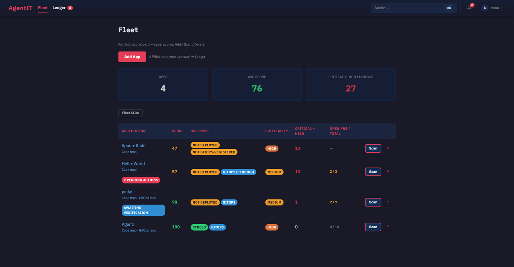
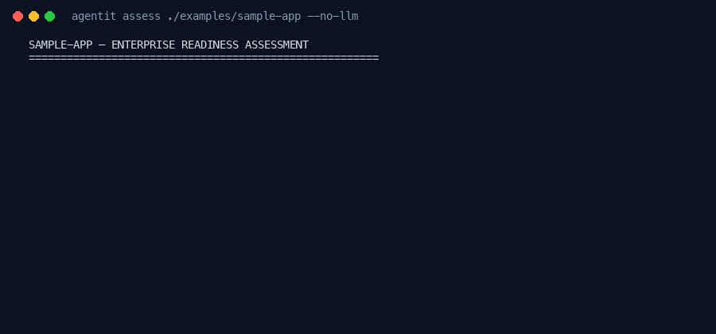
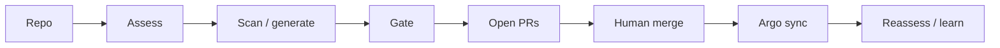
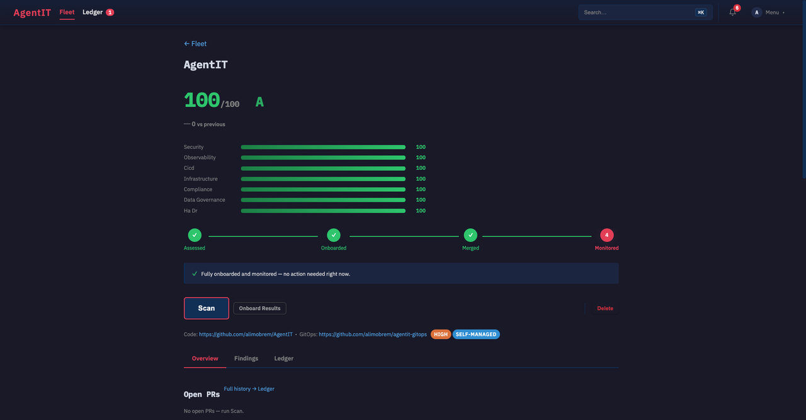
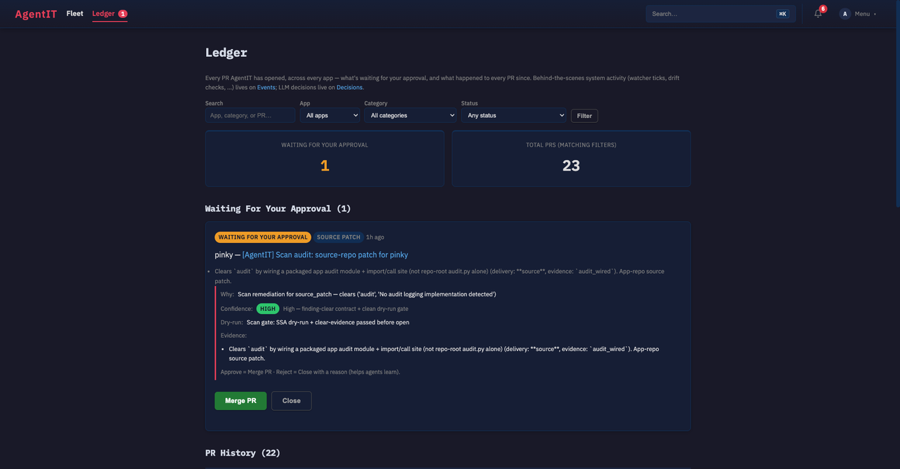
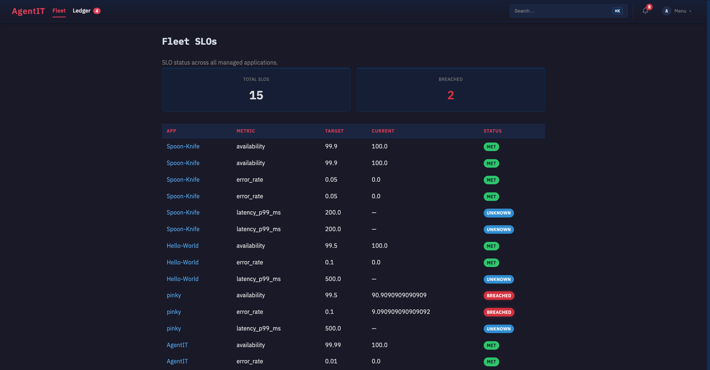
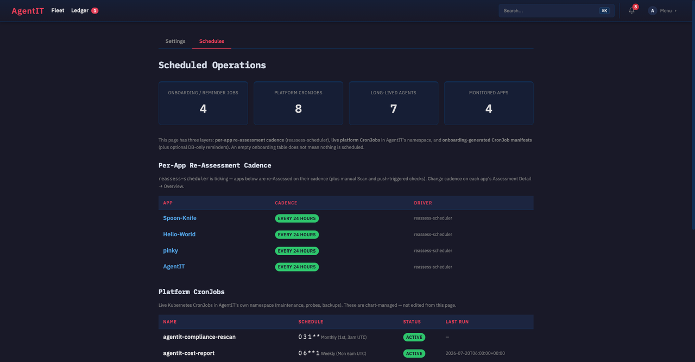
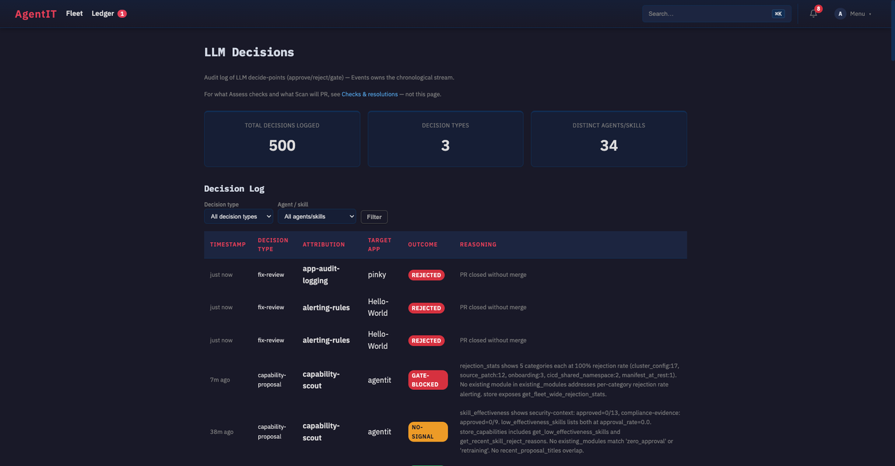
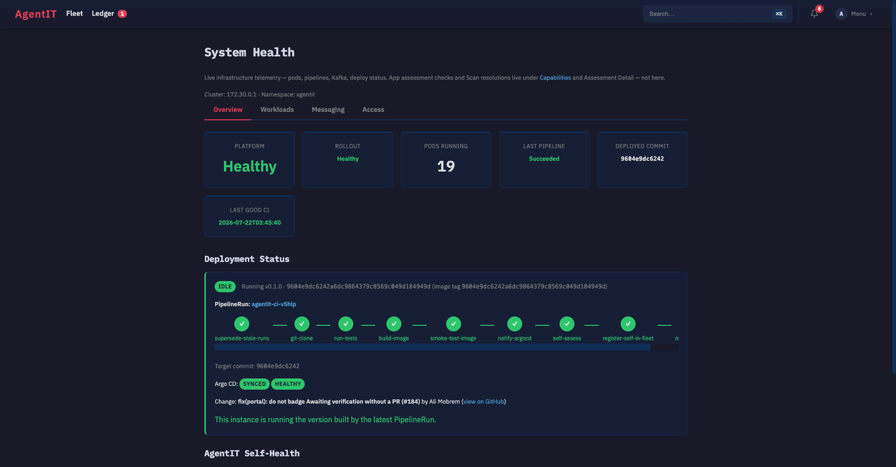
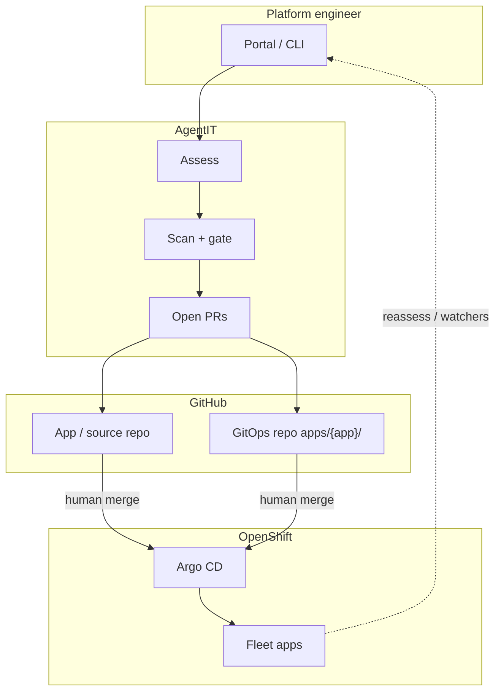

<p align="center">
  
</p>

<p align="center">
  <a href="https://github.com/alimobrem/AgentIT/actions/workflows/tests.yml"></a>
  <a href="https://github.com/alimobrem/AgentIT/actions/workflows/security.yml"></a>
  
  
  
  
</p>

# AgentIT

**Score a repo’s enterprise readiness, open quality-filtered GitOps PRs, and let humans merge so Argo CD deploys.**

Built for **OpenShift + Argo GitOps platform engineers** who want Assess → Scan → Deliver PR → merge → Argo → reassess — without silent cluster mutations or catalog dump PRs.

<p align="center">
  
</p>

<p align="center"><em>Fleet — portfolio scores, GitOps sync state, open PRs, Scan.</em></p>

## Table of contents

- [Demo](#demo)
- [Who it’s for](#who-its-for)
- [How it works](#how-it-works)
- [Portal highlights](#portal-highlights)
- [Quick start](#quick-start)
- [Honest scope (Phase A)](#honest-scope-phase-a)
- [Works on plain Kubernetes?](#works-on-plain-kubernetes)
- [Deploy to OpenShift](#deploy-to-openshift)
- [Architecture](#architecture)
- [Docs](#docs)
- [License](#license)

## Demo

**CLI happy path** (no cluster, no LLM) — score the checked-in sample app:

```bash
uv sync --extra dev
uv run agentit assess ./examples/sample-app --no-llm --format terminal
```

<p align="center">
  
</p>

Static frame (SVG): [`docs/assets/readme/cli-assess.svg`](docs/assets/readme/cli-assess.svg) · Sample write-up: [`examples/sample-assessment.md`](examples/sample-assessment.md)

**Portal dogfood** (internal OpenShift Route; OpenShift SSO — not a public sandbox):

`https://agentit-agentit.apps.aws-jb-acsacm-1.dev05.red-chesterfield.com`

Screenshots below were taken against that environment at tip `9604e9dc` (Health → Deployed commit). To refresh media later: `oc port-forward -n agentit pod/<portal-pod> 18080:8080` and capture `/fleet`, `/ledger`, `/schedules`, `/decisions`, `/health` (app port bypasses oauth-proxy).

## Who it’s for

| You… | AgentIT helps you… |
| --- | --- |
| Run OpenShift + Argo CD for many apps | See fleet scores, sync state, and open remediation PRs in one place |
| Own platform standards (security, probes, GitOps, SLOs) | Assess repos with seven dimensions + detect skills |
| Want automation without surprise applies | Get finding-tied PRs; **you** merge; Argo syncs |

## How it works

1. **Assess** — clone a repo, run analyzers + `mode: detect` skills → scores and findings  
2. **Scan** — SkillEngine matches findings → remediations (SSA dry-run + clear-evidence gate)  
3. **Deliver PR** — open GitOps / source PRs that are finding-tied (Phase A `finding_gate`)  
4. **Human merge** — never auto-merge ([ADR 0001](docs/adr/0001-gitops-scan-hitl.md))  
5. **Argo operate** — ApplicationSet / Application syncs after merge  
6. **Reassess** — cadence + watchers (drift, vulns, SLOs) feed the next loop  



| Step | What happens |
| --- | --- |
| **Assess** | 7 dimensions → findings + scores |
| **Scan / generate** | Skills match findings; Scan/onboard produces remediations |
| **Gate** | Finding-tied PRs only on auto delivery **and** manual `/deliver`; SSA dry-run + clear-evidence (refuses theater stubs / destructive Containerfile rewrites) |
| **Operate** | Human merges on GitHub; Argo CD deploys. **Awaiting verification** only when a PR was actually opened |
| **Learn** | Watchers surface drift/CVEs/SLOs; Decisions audit LLM approve/reject; repeated theater cools down. Security-analyzer fixtures use short `EXAMPLE…` placeholders + `# notsecret`; historical hex allowlisted via root `.gitleaks.toml` top-level `[allowlist].regexes` (InfoSec / PwnedAlert Generic Secret FP; never real credentials). |

Fleet apps land under `apps/{app}/` in the gitops repo (ApplicationSet). AgentIT itself deploys from this repo’s Helm `chart/` via Application `agentit`.

## Portal highlights

Real dogfood UI (not mockups):

| Surface | What you see |
| --- | --- |
| **Fleet** | Portfolio scoreboard — scores, deploy/GitOps badges, open PRs, Scan |
| **Assessment** | Dimension scores, Assessed → Onboarded → Merged → Monitored |
| **Ledger** | PRs waiting for your approval — Merge / Close (HITL) |
| **Fleet SLOs** | Availability / error-rate / latency across apps |
| **Schedules** | Re-assess cadence + platform CronJobs + onboarding manifests |
| **Decisions** | LLM decide-point audit (approve / reject / gate) |
| **Health** | Tekton pipeline, Argo Synced/Healthy, deployed tip SHA |

<p align="center">
  
</p>
<p align="center"><em>Assessment Detail — score, dimension bars, lifecycle stepper.</em></p>

<p align="center">
  
</p>
<p align="center"><em>Ledger — quality-gated PR with Merge PR (human-in-the-loop).</em></p>

<details>
<summary><b>More screenshots</b> — Fleet SLOs, Schedules, Decisions, Health</summary>

<p align="center">
  
</p>
<p align="center"><em>Fleet SLOs — breached vs met across the portfolio.</em></p>

<p align="center">
  
</p>
<p align="center"><em>Schedules — reassess cadence + live platform CronJobs.</em></p>

<p align="center">
  
</p>
<p align="center"><em>Decisions — LLM approve/reject/gate audit trail.</em></p>

<p align="center">
  
</p>
<p align="center"><em>Health — CI PipelineRun, Argo Synced/Healthy, tip <code>9604e9dc</code>.</em></p>

</details>

**Primary spine:** Fleet → Assessment Detail → Ledger. Operate surfaces (menu): Health, Insights, Events, Decisions, DLQ, Schedules. See [`docs/portal-experience-design-language.md`](docs/portal-experience-design-language.md) and [ADR 0007](docs/adr/0007-decision-card.md).

## Quick start

Requires **Python ≥ 3.12** and [`uv`](https://docs.astral.sh/uv/).

```bash
git clone https://github.com/alimobrem/AgentIT.git
cd AgentIT
uv sync --extra dev

# 1) Score a repo (no cluster)
uv run agentit assess https://github.com/some-org/some-app --format terminal

# 2) Assess + generate hardening manifests locally
uv run agentit onboard https://github.com/some-org/some-app --output-dir ./out

# 3) Local portal (needs Postgres: AGENTIT_DB_DSN)
uv run agentit portal --port 8080
# open http://localhost:8080
```

Useful commands: `self-assess`, `watch`, `learn`, `test-skill`, `activate-skill`. Full list: `uv run agentit --help`.

Scoring details: [`docs/score-methodology.md`](docs/score-methodology.md). Shareable badge: `GET /badge/{app}.svg`.

<details>
<summary><b>Environment variables</b></summary>

| Variable | Purpose |
|---|---|
| `AGENTIT_DB_DSN` | Postgres DSN (**required** for portal / fleet / watchers) |
| `AGENTIT_TEST_PG_DSN` | Throwaway Postgres for pytest / capability-scout `tests-pass` (never the fleet DB — fixtures truncate). Chart sidecar default; CI sets its own. |
| `ANTHROPIC_API_KEY` or Vertex (`ANTHROPIC_VERTEX_PROJECT_ID` + `CLOUD_ML_REGION`) | Optional LLM |
| `GITHUB_TOKEN` | PR create / infra-repo / webhooks |
| `AGENTIT_KAFKA_BOOTSTRAP` | Kafka (optional; no-op if unset) |
| `AGENTIT_EXTERNAL_URL` | Public base URL for outbound registrations |
| `AGENTIT_AGENT_MODE` | `local` (default) or `kubernetes` Jobs |
| `AGENTIT_OFFLINE` | `1` — hard-stop kube client (tests/review) |

</details>

## Honest scope (Phase A)

AgentIT is a **GitOps assistant**, not an auto-apply bot.

- **No catalog dumps** — auto delivery and manual `/deliver` only open finding-tied PRs (`finding_gate`)
- **Human merge required** — AgentIT opens PRs; it does not merge them
- **No silent cluster applies** for app remediations — path is PR → merge → Argo
- **Clear-evidence gate** — refuses theater stubs, root-only `audit.py` without package wire-up, destructive Containerfile rewrites
- **Awaiting verification** only when a delivery actually produced a `pr_url`
- Treat outputs as drafts until you validate against your sources of record (cluster, GitHub, Argo)

Quality rules: [`docs/plan-quality-helpful-prs.md`](docs/plan-quality-helpful-prs.md). Product contract: [`docs/release-notes.md`](docs/release-notes.md).

## Works on plain Kubernetes?

| Capability | OpenShift (supported) | Plain Kubernetes |
| --- | --- | --- |
| `agentit assess` / local CLI | Yes | Yes — no cluster needed |
| Portal + Postgres store | Yes (bundled chart) | Possible with your own Postgres; chart targets OpenShift |
| Browser auth (`auth.enabled`) | OpenShift oauth-proxy + Route | Not the same path — bring your own ingress/IdP |
| GitOps deploy | Argo CD Application / ApplicationSet | Argo CD works; chart assumes OpenShift-friendly defaults |
| Self-deploy (Rollouts, Tekton `agentit-ci`, ImageStreams) | Hard-requires OpenShift Pipelines / Rollouts as charted | Degrades — use your own CI promote path |
| Watchers (drift, vuln, SLO, self-health) | Designed for this stack | Partial — kube client works; OpenShift-only APIs/CRDs skip or warn |

**Bottom line:** scoring and local generation are cluster-agnostic. Full operate loop (portal, Scan → PR → Argo, watchers) is built and tested for OpenShift.

## Deploy to OpenShift

Helm chart in `chart/` + Argo CD Application in `argocd/application.yaml`. Argo is the deployer: merge to `main` alone does not move the portal — Tekton `agentit-ci` builds, smokes, then pins `image.tag`. Confirm rollout via Health → deploy-status (or `AGENTIT_IMAGE_TAG` on the portal pod) matching the tip SHA — green GitHub Actions alone is not a deploy.

Ops: [`docs/deployment.md`](docs/deployment.md). **Merge gate + post-merge tip:** [`docs/ci-deploy.md`](docs/ci-deploy.md) (`scripts/ci-merge-gate.sh` — never merge on queued checks). Topology: [`docs/architecture.md`](docs/architecture.md).

## Architecture



Full diagrams: [`docs/architecture.md`](docs/architecture.md) · Self-managed vs fleet: [`docs/architecture-agentit-vs-fleet-gitops.md`](docs/architecture-agentit-vs-fleet-gitops.md).

## Docs

| Doc | Role |
| --- | --- |
| [`docs/score-methodology.md`](docs/score-methodology.md) | Score dimensions, weights, PR impact |
| [`docs/architecture.md`](docs/architecture.md) | System diagrams, Scan pipeline |
| [`docs/ci-deploy.md`](docs/ci-deploy.md) | Merge gate + post-merge Tekton/rollout tip |
| [`docs/plan-quality-helpful-prs.md`](docs/plan-quality-helpful-prs.md) | Quality PR rules (finding-tied, no theater) |
| [`docs/adr/`](docs/adr/) | Architecture Decision Records (HITL, Postgres, …) |
| [`docs/release-notes.md`](docs/release-notes.md) | Product contract (Scan HITL, portal IA) |
| [`docs/portal-experience-design-language.md`](docs/portal-experience-design-language.md) | Portal EDL |
| [`docs/deployment.md`](docs/deployment.md) | OpenShift / Argo / Tekton ops |
| [`CHANGELOG.md`](CHANGELOG.md) | Version history |
| [`docs/README.md`](docs/README.md) | Docs index |
| [`docs/history/`](docs/history/) | Session notes (not product truth) |

Issues and PRs welcome on GitHub. Prefer small, focused changes; run `uv run pytest` before opening a PR. Maintainers use [`docs/ci-deploy.md`](docs/ci-deploy.md) before merging to `main`.

## License

[MIT](LICENSE)
