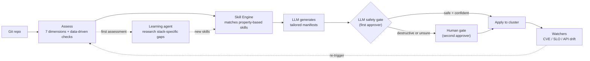

<p align="center">
  
</p>

<p align="center">
  
  
  
  
</p>

<p align="center"><b>An agent-powered platform that assesses, hardens, and continuously operates applications on Red Hat OpenShift — turning an MVP repo into an enterprise-ready, self-healing workload.</b></p>

---

Point AgentIT at a Git repository and it will:

1. **Assess** the repo across 7 enterprise-readiness dimensions and produce a scored report.
2. **Generate** Kubernetes/Helm/Tekton/Argo manifests to close the gaps — via property-based skills (LLM-tailored) backed by a fleet of specialized agents.
3. **Onboard** the app onto the cluster through a human-gated or (optionally) fully autonomous apply pipeline, with an LLM safety gate that fails closed.
4. **Operate** it going forward — watching for CVEs, SLO breaches, API drift, and GitOps drift, then closing the loop by re-assessing, re-generating, and re-applying fixes.
5. **Learn** from outcomes — the learning agent researches CVEs and best practices, generates new skills, and deprecates ineffective ones.

## Table of Contents

- [Why AgentIT](#why-agentit)
- [Architecture, at a glance](#architecture-at-a-glance)
- [Skills & check engine](#skills--check-engine)
- [The agent fleet](#the-agent-fleet)
- [Self-improvement loop](#self-improvement-loop)
- [Web portal](#web-portal)
- [Getting started](#getting-started)
  - [CLI](#cli)
  - [Portal (local)](#portal-local)
- [Configuration](#configuration)
- [Deploying to OpenShift](#deploying-to-openshift)
- [Testing](#testing)
- [Security notes](#security-notes)
- [Repository layout](#repository-layout)
- [License](#license)

## Why AgentIT

AI makes building software trivial — a team can go from idea to working MVP in days. But that MVP is a liability: no security posture, no observability, no compliance evidence, no CI/CD. The gap between "it works" and "it's enterprise-ready" takes 10x longer than building the app itself and requires specialized expertise most organizations can't scale.

AgentIT treats that work as something a fleet of specialized agents and property-based skills can plan and generate, with a human (or an LLM safety gate) approving anything destructive before it touches a live cluster.

It is built to run **on** OpenShift, **for** OpenShift: Argo CD for GitOps, Argo Rollouts for canary delivery, Tekton for CI, Argo Events + Kafka for the event-driven loop, and OLM Subscriptions for any operator dependencies the generated manifests need.

## Architecture, at a glance



The real system has more moving parts — an event-driven path via Kafka + Argo Events, platform context discovery, canary delivery via Argo Rollouts, and conflict resolution. **See [`docs/architecture.md`](docs/architecture.md) for full diagrams.**

## Skills & check engine

AgentIT uses two complementary systems for assessment and remediation:

### Property-based skills (40 skills across 11 domains)

Skills are Markdown files with YAML frontmatter that define **what must be true** (properties), not how to generate manifests. The skill engine matches skills to assessment findings; the LLM generates tailored fixes using the skill's constraints and the app's platform context. `FleetOrchestrator` builds and passes an LLM client into the skill engine on every run (CLI, portal, and webhook onboarding alike) whenever `ANTHROPIC_API_KEY`/`ANTHROPIC_VERTEX_PROJECT_ID` is configured, so LLM-only skills (no template block — e.g. `network-policy`, `containerfile`, `tekton-pipeline`) actually produce tailored output in production, not just template substitution.

```
skills/
├── security/       # network-policy, rbac, containerfile, security-context, resource-limits, image-scan-task
├── observability/   # service-monitor, grafana-dashboard, alerting-rules, otel-collector
├── cicd/            # tekton-pipeline, argocd-application, argo-rollout
├── compliance/      # kyverno-policies, audit-policy, sbom-task, compliance-evidence, image-registry-policy, compliance-cronjob
├── infrastructure/  # hpa, pdb, resourcequota, limitrange, namespace
├── cost/            # vpa, cost-labels, cost-cronjob
├── dependency/      # renovate-config, dependabot-config, dependency-cronjob
├── incident/        # runbook, pagerduty-config, alertmanager-config
├── release/         # analysis-template, rollout-patch, rollback-policy, release-runbook
├── retirement/      # decommission-plan, cleanup-task, data-archive-job
└── custom/          # learning-agent-generated skills
```

Skills have lifecycle management: `draft` → `active` → `deprecated` → `retired`. The API drift detector auto-deprecates skills when their target APIs are removed from the cluster. Low-effectiveness skills (< 30% human approval rate) are flagged for review.

### Data-driven checks (20 checks across 7 dimensions)

YAML check files in `checks/` define declarative rules that supplement the Python analyzers. Check types: `file_exists`, `file_contains`, `file_missing`, `yaml_kind_exists`, `yaml_kind_missing`. The learning agent can create new checks without touching Python code.

```
checks/
├── security/         # containerfile, network-policy, secrets-scanning
├── observability/    # health-check, metrics-endpoint, structured-logging
├── cicd/             # ci-pipeline, dockerfile, gitops
├── compliance/       # admission-policies, license, sbom
├── infrastructure/   # helm-chart, k8s-manifests, resource-quota
├── ha_dr/            # hpa, pdb, replicas
└── data_governance/  # backup-config, retention-policy
```

### Catalog change tracking

Additions and removals to the `skills/`/`checks/` catalog are no longer only visible via `git log` — `skill_inventory.py` snapshots the catalog (by `(domain, name)` / `(dimension, name)` identity, so status-only transitions like `active → deprecated` aren't double-counted alongside the existing `skill-activated` event) and diffs it against the last saved snapshot once an hour from the portal's background maintenance loop. Every skill/check added or removed is logged as a `skill-added` / `skill-removed` / `check-added` / `check-removed` event, which shows up automatically on the **Events** feed (`/events`) and in a "Recent Catalog Changes" section on the **Capabilities** page.

## The agent fleet

**3 one-shot onboarding agents and 3 long-lived watchers.** Skills run **first**, unconditionally, as the primary generation path for every domain; the 3 remaining Python agents supplement for capabilities skills can't (or don't yet fully) replace. This is a smaller fleet than earlier versions of this doc described — `security`, `observability`, `cicd`, `compliance`, `infrastructure`, `incident`, `release`, `retirement`, and `chaos` used to each have a dedicated hardcoded Python agent; all nine were removed once skills (`skills/**/*.md`, template-fallback verified with no LLM required) reached full parity for every artifact those agents used to generate. See [`docs/agent-removal-readiness.md`](docs/agent-removal-readiness.md) for the domain-by-domain readiness audit this removal was executed against.

| Agent | Category | Always runs? | Generates | Why it's still a Python agent |
|---|---|---|---|---|
| **DependencyAgent** | `dependency` | high/critical | Renovate/Dependabot config, CVE-scan CronWorkflow, **plus** a narrative `dependency-report.md` | Its *manifest* outputs are also skill-covered, but `dependency-report.md` needs real runtime-computed data (detected ecosystems, CVE package matches against `report.architecture.external_dependencies`) that a static skill template has no access to — faking it would violate this project's "no mock data" rule. `FleetOrchestrator` never skips this agent for skill coverage of its manifest outputs, specifically so the report keeps generating. |
| **CostOptimizationAgent** | `cost` | high/critical | VPA, cost labels, cost CronWorkflow, **plus** a narrative `cost-report.md` | Same reasoning as `dependency` — `cost-report.md` needs a computed deployment tier (`_tier()`, from service/language count) and cost-lookup-table result a template can't produce. |
| **CodeChangeAgent** | `codechange` | high/critical or score < 50 | `.gitignore`, health endpoints, OTel/structured-logging instrumentation — as source patches to the **app's own repo** | Fundamentally not skill-shaped: skills generate K8s manifests to apply to a cluster; they have no concept of "the application's source tree" and no PR/patch-application machinery. |

Conflict detection only flags *real* collisions between agent outputs — a known-conflicting resource-kind pair actually being generated for the same workload (e.g. an actively-resizing VPA alongside an HPA), or two agents writing a file at the same output path — not merely "both agents succeeded". `plan.auto_approve` (computed from score/criticality at plan time) is downgraded to `False` if a real conflict is found during the actual run, so it can be trusted end-to-end.

Long-lived watchers (deployed as separate pods):

| Watcher | Loop | Role |
|---|---|---|
| **vuln-watcher** | 6h | Fleet CVE monitoring, triggers remediation |
| **slo-tracker** | 5m | Collects fresh `availability`/`error_rate` metrics from the cluster (via `slo_collector`; `latency_p99_ms` has no collector yet and is skipped/logged, not silently ignored) for every tracked SLO, checks breaches with the correct per-metric direction (`availability` = higher is better; `error_rate`/`latency_p99_ms` = lower is better), publishes breach alerts, and opens rollback gates |
| **drift-detector** | 10m | Argo CD sync monitoring, API drift detection, auto-deprecation of affected skills, reports still-in-use deprecated APIs (`PlatformContext.deprecated_apis`) |
| **skill-learner** | 24h | Researches CVEs via LLM, drafts new skills for human review — opt-in via `agents.skillLearner.enabled` (chart default: disabled; enabled on the live deployment via `argocd/application.yaml`), requires an LLM connection |

Every watcher records real tick telemetry after each loop iteration — a `tick-complete`/`tick-failed` event plus an `AssessmentStore.agent_heartbeat()` call (`agentit/watchers/__init__.py::record_tick`) — so "last seen" on the **Agents** and **Schedules** pages reflects an actual heartbeat instead of a static "—". A Prometheus gauge, `agentit_watcher_last_success_timestamp{watcher=...}`, backs an `AgentITWatcherStale` alert (one rule per watcher, threshold = 2x its expected interval) in the chart's `PrometheusRule`.

## Self-improvement loop

AgentIT improves itself through three tiers of learning. The loop is now closed end-to-end — `record_skill_outcome()` fires from every real production path, not just the CLI `self-fix` command, and the learning agent actually reads that data back before deciding what to research next:

1. **Feedback loop, wired into every real apply path.** `record_skill_outcome()` — previously only called from `self-fix` — now fires from onboarding apply (`routes/assessments.py::apply_to_cluster`), gate resolve (`routes/gates.py::resolve_gate`, both approve and reject), and auto-mode's successful auto-apply (`automode.py::AutoMode.execute`), via the shared `skill_engine.record_skill_outcomes()` helper. Each generated file's producing skill is recovered from `SkillEngine.generate()`'s `{app_name}-{skill.name}.yaml` naming convention (`skill_engine.skill_name_from_path()`) since neither `AgentResult` nor `onboarding_results.files_json` carry a structured skill-name field; `GeneratedFile.skill_name` (set directly by `SkillEngine.generate()`) gives the CLI's `self-fix` path exact attribution instead of the previous "app-name-skill-name" bug. Effectiveness is a **recency-weighted** rate (`AssessmentStore.get_skill_effectiveness()`/`get_low_effectiveness_skills()`, half-life ~90 days) so a skill that was bad months ago and has since improved can recover off the "Skills Needing Review" list on Insights, rather than being stuck flagged forever by outcomes that no longer reflect its current behavior. `SkillEngine.run_all()` now actually uses its `store` parameter: a skill whose domain has been rejected 3+ times for an app is skipped outright (mirroring the same threshold `webhooks.py` already used for auto-fix), and a human's most recent correction for that app+domain is passed to LLM generation as extra guidance (`get_human_override()`). Skill activation (`capabilities.py`'s "Activate" button) now runs a real functional check (`skill_engine.verify_skill()` — frontmatter completeness plus an actual generation smoke test against a synthetic fixture, validated with `agents/base.py::validate_manifest()`) before flipping `status: draft` → `active`, instead of a blind string replace; a skill that can't produce valid output is blocked, not silently activated.
   - **Known gap:** the portal has no edit-before-apply flow (manifests are approve-as-is or reject-and-regenerate only), so there's no "diff between generated and applied content" to capture yet — that's a prerequisite gap, not something this pass could wire in without building a materially bigger editing feature.

2. **Learning agent, now reading its own effectiveness data.** The research cycle (`SkillLearner.research_once()`, and the portal's "Research CVEs & Generate Skills" button) checks `get_low_effectiveness_skills()` **first**: if any skill is flagged, the LLM is asked specifically to propose a replacement (`learning_agent.research_skill_improvement()`) for each flagged skill (up to the configured limit), and only falls back to the generic CVE sweep when nothing's flagged. This is the wiring that actually closes the loop — before it, the learning agent was blind to which of its own already-shipped skills humans kept rejecting. Runs automatically every 24h via the `skill-learner` watcher (chart default: disabled — enable with `agents.skillLearner.enabled=true`; currently enabled on the live deployment via `argocd/application.yaml`), and can also be triggered on demand from the Capabilities page or via `agentit learn` / `agentit learn-for` on the CLI. Draft skills get an "Activate" button right next to them on the Capabilities page — the full research → draft → human-review → active loop runs end-to-end in the portal, no CLI required.
   - **Persistence:** the `skill-learner` watcher runs in its own pod, so drafts it writes previously vanished on every restart *and* were never visible to the portal's Capabilities page at all (different pod, different filesystem). A dedicated, single-consumer PVC (`agents.skillLearner.persistence`, default on, mounted at `/data/skills` via `AGENTIT_SKILLS_DIR`) now makes drafts survive **that pod's own** restarts. It does *not* make them visible to the portal — that needs shared/RWX storage across two Deployments (risky with this chart's default `ReadWriteOnce` storage class) or a git write-back pipeline, neither of which shipped here; `SkillLearner.run()` logs a loud warning every cycle so this remains visible rather than a silent gap. Until one of those lands, prefer the portal's own "Research CVEs & Generate Skills" button or `agentit learn`/`learn-for` run against the portal's own data volume — both run in-process, so drafts are immediately visible and persisted.
   - **Documented future idea (not built):** auto-triggering `agentit learn-for` when a new/uncommon stack pattern is detected 3+ times across onboardings would need new cross-onboarding stack-signature detection logic — flagged here as a real idea, deliberately not built under this pass's time constraints rather than shipped as a rushed heuristic.

3. **Platform awareness** — `PlatformContext` discovers the cluster's K8s version, available APIs, CRDs, and operators. Every skill generation includes this context. The API drift detector auto-deprecates a skill specifically when the API kind it generates has been removed from the cluster (a narrower guarantee than the effectiveness-based flagging in tier 1).

**Loop visibility.** The Capabilities page's skill table links each skill to a per-skill lifecycle page (`/capabilities/skills/{name}/history`) showing its full effectiveness trend (every recorded outcome, most recent first) and its activation/deprecation history (matched from the `events` table by skill name — `skill-added`/`skill-removed`/`skill-activated`/`skill-deprecated`/`skipped-rejected`/`skill-improvement-drafted`). The Insights page adds one loop-health meta-metric: of the skills currently flagged low-effectiveness, what percentage have had an improvement actually drafted for them in the last 30 days (`AssessmentStore.get_loop_health()`) — a live snapshot of whether the loop is actually turning, not just theoretically closed, using data that's only non-trivially populated now that tier 1's wiring exists.

**Auditing LLM decisions.** Two places the LLM's output directly gates an outcome (not just generates content) persist a real, attributed record today, surfaced on the **Decisions** page: `self-fix`'s Step 3 first-approver gate (`LLMClient.review_fix`) — attributed by real skill name via `skill_effectiveness` — and auto-mode's safety classification (`LLMClient.classify_action`, `AutoMode.execute`) — attributed by the real originating agent when the caller knows it (e.g. the dispatcher's `result["agent"]`), otherwise the generic `auto-mode` component name, which is still the common case since most callers apply a whole bundle of manifests spanning several agents at once. A third real decision point — the security analyzer's LLM-based secret false-positive filter (`classify_secret`) — decides per match whether to keep or drop a finding but persists nothing today; see `llm_decisions.py`'s module docstring.

## Web portal

`agentit portal` launches a FastAPI + Jinja2 app (htmx + Alpine.js for interactivity, no frontend framework). 56+ routes.

Key pages:

| Page | Purpose |
|---|---|
| **Fleet** | Dashboard of all managed apps with scores and lifecycle stage |
| **Assessment Detail** | 7-dimension scores, lifecycle stepper, score trend + a rendered score-history table with deltas, timeline, remediation items |
| **Gates** | Human approval queue with LLM reasoning, confirm/reject with reason |
| **Insights** | Fleet stats, agent performance (from real `agent_runs` records), low-effectiveness skills, fleet-wide check compliance (pass rate per data-driven check across every recorded assessment), and fleet-wide learning feedback |
| **Decisions** | Audit of every real LLM *decision* point (fix-review, auto-mode classify — not just LLM-generated content), attributed by the agent or skill that triggered it, with the LLM's actual reasoning and a per-agent/skill approve/reject/gate breakdown. See `llm_decisions.py` for exactly what's covered and what isn't. |
| **Capabilities** | Skills/checks catalog, onboarding agents, watchers, and the "Research CVEs & Generate Skills" trigger. Tabbed with **Agents** (live registry of who's actually run, their real success rate, and a per-agent run-history table with duration/resource tier/error) |
| **Events** | Activity feed with a `correlation_id` "Chain" column (click through to trace a single assess → onboard → apply run end to end) and a DLQ for failed events that now actually populates from Kafka dead-letters and republishes to the original topic on retry |
| **Health** | Rollout/pod/pipeline status, Kafka topic/consumer-group stats, and live circuit breaker (LLM/Kubernetes) open/closed state |
| **SLOs** | SLO definitions and error budgets |
| **Settings** | Auto-mode toggle, decision matrix, configuration. Tabbed with **Schedules** (watcher status — now backed by real heartbeats — and cron jobs) |

Webhook endpoints power the event-driven loop: `/api/webhook/assess`, `/api/webhook/github-push`, `/api/webhook/onboard`, `/api/webhook/auto-apply`, `/api/webhook/remediate`. All but `github-push` require the shared-secret `X-Internal-Webhook-Token` header (see [Security notes](#security-notes)).

### Self-observability

AgentIT's own SQLite store and `/metrics` endpoint are the source of truth for "what is the platform actually doing", not just what it can do:

- **`agent_runs` table** — `FleetOrchestrator` writes one structured row (agent, mode, status, duration, resource tier, error, assessment_id) per agent execution, local or Kubernetes-Job. `AssessmentStore.get_agent_stats()` and the new `list_agent_runs()` read from this table instead of pattern-matching event `action` strings, so the Agents/Insights pages reflect real run history.
- **`check_results` table** — every data-driven check run during an assessment (`check_engine.run_checks_by_dimension_with_status`) is snapshotted pass/fail, keyed by assessment. `get_check_compliance()` aggregates this into a fleet-wide pass-rate view on the Insights page.
- **`correlation_id` on events** — `AssessmentStore.log_event()` accepts a `correlation_id` (populated with the `assessment_id` by `save()`, `save_onboarding()`, and `FleetOrchestrator`), matching the same id already used for Kafka's `correlationId`. The Events page's new "Chain" column links straight to `/events?correlation_id=...` to trace an assess → onboard → apply run end to end.
- **DLQ end-to-end** — `EventConsumer._dead_letter()` now persists to the SQLite `events` table (not just the Kafka `agentit-dlq` topic) so `/events/dlq` actually shows failures, and `retry_dlq_message()` republishes the original message to its original topic via the Kafka producer instead of only relabelling the row.
- **Circuit breaker visibility** — `portal/helpers.py::get_circuit_breaker_states()` exposes live LLM/Kubernetes breaker state, shown on the Health page and set on the `agentit_circuit_breaker_open{name=...}` gauge every time `/health` is polled.
- **Prometheus gauges actually set** — `agentit_active_gates` updates on every gate create/resolve/expire; `agentit_build` is populated once at startup (package version + `AGENTIT_GIT_COMMIT`/`AGENTIT_IMAGE_TAG` if the environment provides them); `agentit_db_size_bytes` / `agentit_db_rows_total{table=...}` / `agentit_event_buffer_backlog` refresh every 5 minutes from the portal's background maintenance loop; `agentit_watcher_last_success_timestamp{watcher=...}` backs the `AgentITWatcherStale` alert described above.
- **Audit log** — `agentit/audit.py::audit_log()` is now wired into every privileged action call site: apply-to-cluster, gate approve/reject, auto-mode toggle, and data purge.

Deferred by design (see [`docs/architecture.md`](docs/architecture.md) if you want to pick this up): distributed tracing (OpenTelemetry spans across the Kafka event chain) and a unified Kafka→SQLite ingestion path (today, watchers and the portal write to the shared `AssessmentStore` directly rather than all events flowing through one consumer) — both are real architectural additions, not incremental fixes, and are intentionally out of scope until the above is stable.

## Getting started

Requires **Python >= 3.12**. Uses [`uv`](https://docs.astral.sh/uv/) for dependency management (a `pyproject.toml` + `uv.lock` are provided; plain `pip install -e ".[dev]"` also works).

```bash
git clone https://github.com/alimobrem/AgentIT.git
cd AgentIT
uv sync --extra dev
```

### CLI

```bash
# Score a repo across all 7 dimensions
uv run agentit assess https://github.com/some-org/some-app --format terminal

# Full pipeline: assess + plan + run agents + skills + validate + summarize
uv run agentit orchestrate https://github.com/some-org/some-app --output-dir ./out

# assess + orchestrate + write assessment.json
uv run agentit onboard https://github.com/some-org/some-app --output-dir ./out

# Continuously re-assess on an interval
uv run agentit watch https://github.com/some-org/some-app --interval 3600

# Re-assess every currently-tracked fleet app once and exit (for CronJobs --
# the CronJob's own schedule controls periodicity, not an internal loop).
# Works on both `watch` and `assess`; `--dimension` optionally scopes the
# per-app finding count reported (e.g. only compliance findings).
uv run agentit watch --rescan
uv run agentit assess --rescan --dimension compliance

# Dogfood: assess AgentIT's own repo
uv run agentit self-assess

# Self-fix loop: assess → skill engine generates → LLM reviews → verify → PR
uv run agentit self-fix . --create-pr

# Learn new skills from CVE/best-practice research
uv run agentit learn --source cves --limit 5

# Targeted learning from an app's specific stack
uv run agentit learn-for https://github.com/some-org/some-app

# Test a skill loads, matches, and generates valid output
uv run agentit test-skill skills/security/network-policy.md

# Promote a draft skill to active
uv run agentit activate-skill skills/custom/new-skill.md
```

Add `--llm` to enable Claude-backed reasoning, or `--no-llm` to force it off (otherwise auto-detected from `ANTHROPIC_API_KEY` / `ANTHROPIC_VERTEX_PROJECT_ID`).

Agent containerization: agents can run as K8s Jobs with `--profile lightweight|standard|full` and `--agents` filter. Set `AGENTIT_AGENT_MODE=kubernetes` to dispatch agents as Jobs instead of local threads.

### Portal (local)

```bash
uv run agentit portal --port 8080
# open http://localhost:8080
```

The portal uses a local SQLite file (`agentit.db` by default) — **still no external database required for local use; this remains the default and only active backend today.** A migration to an HA Postgres backend (async, via `asyncpg`) is in progress: `portal/store_pg.py` is a full async counterpart to `store.py`, schema and all, verified against a real Postgres instance, and every store caller in the codebase (CLI, watchers, and the portal — `app.py`, `routes/*.py`, `helpers.py`, and now `FleetOrchestrator`/`AutoMode`/`RemediationDispatcher`/`RemediationLoop`, all genuinely `async def` throughout) has been converted to the `store_factory.create_store()` async access pattern, selectable via `AGENTIT_DB_BACKEND` (`sqlite` default, `postgres` opt-in) — but that env var is intentionally unset everywhere today. The structural blocker described in earlier revisions of this doc (those four classes staying permanently synchronous) is resolved; what's left is a real Postgres instance the cluster can reach plus the single coordinated cutover across all 5 Deployments, not any further code conversion. See [`docs/postgres-migration-plan.md`](docs/postgres-migration-plan.md) for exactly what's done vs. remaining, and the `postgres.bundled.enabled` chart flag below for the bundled-Postgres instance AgentIT deploys and maintains itself (no operator).

## Configuration

All configuration is via environment variables (no config file). Nothing here belongs in `values.yaml` or any committed file — see [Security notes](#security-notes).

<details>
<summary><b>Environment variables</b> (click to expand)</summary>

| Variable | Used by | Purpose |
|---|---|---|
| `ANTHROPIC_API_KEY` | `llm.py` | Direct Anthropic API auth (alternative to Vertex) |
| `ANTHROPIC_VERTEX_PROJECT_ID` + `CLOUD_ML_REGION` | `llm.py` | Use Claude via Vertex AI instead of the direct API |
| `AGENTIT_LLM_MODEL` | `llm.py` | Override LLM model (default from env) |
| `GITHUB_TOKEN` | `portal/github_pr.py` | Required for PR creation, infra-repo management, webhook registration |
| `AGENTIT_DB_PATH` | `portal/store.py` | SQLite file path (default `agentit.db`) |
| `AGENTIT_KAFKA_BOOTSTRAP` | `events.py`, `consumer.py` | Kafka bootstrap servers; publisher/consumer no-op gracefully if unset |
| `AGENTIT_AUTO_MODE` | `automode.py` | `1`/`true`/`on` to enable autonomous apply (also togglable at runtime via `/settings`) |
| `AGENTIT_PORTAL_URL` | `remediation_loop.py` | Base URL the remediation loop calls back into (default `http://localhost:8080`) |
| `AGENTIT_EXTERNAL_URL` | `portal/routes/assessments.py` | Trusted externally-reachable base URL for outbound registrations (e.g. the GitHub webhook URL). Optional — if unset, the app looks up its own OpenShift Route; only falls back to the request's Host header if neither is available. Never derived from client input. |
| `AGENTIT_AGENT_MODE` | `orchestrator.py` | `local` (default) or `kubernetes` — run agents as K8s Jobs. Falls back to the undocumented `AGENT_MODE` if `AGENTIT_AGENT_MODE` is unset, for backward-compat. |
| `GOOGLE_APPLICATION_CREDENTIALS` | Vertex SDK | Path to mounted GCP credentials JSON |

</details>

## Deploying to OpenShift

AgentIT deploys itself the same way it onboards other apps — via the Helm chart in `chart/` and the Argo CD `Application` in `argocd/application.yaml`. **Argo CD is the sole deployer**; see [`docs/deployment.md`](docs/deployment.md) for the full operational runbook.

- Change behavior: edit `argocd/application.yaml` Helm parameters, commit, push. The CI pipeline's `notify-argocd` task re-applies this file to the live `Application` object on every run (before re-pinning `image.tag`), so the parameter list stays in sync automatically — no manual `oc apply` needed. See [`docs/deployment.md`](docs/deployment.md) for the details and why this exists.
- Change a secret: `oc create secret` on-cluster, then reference it via a Helm parameter. Never in Git.
- Never `helm upgrade` manually or `oc edit` the `Rollout`.

Key `chart/values.yaml` feature flags: `rollout.enabled` (canary via Argo Rollouts), `kafka.enabled` / `argoEvents.enabled` (event-driven loop), `tektonCI.enabled` (build pipeline), `cronJobs.cveScan.enabled`, `agents.{vulnWatcher,sloTracker,driftDetector}.enabled`, `monitoring.enabled` (ServiceMonitor + PrometheusRule + Grafana dashboard — chart default: disabled; **enabled on the live deployment via `argocd/application.yaml`**, so AgentIT scrapes and alerts on its own `/metrics`), `postgres.bundled.enabled` (AgentIT's own bundled, non-operator Postgres instance — chart-only prep until `AGENTIT_DB_BACKEND` is flipped, see [`docs/postgres-migration-plan.md`](docs/postgres-migration-plan.md)), and `auth.enabled` (OpenShift `oauth-proxy` sidecar in front of the portal — see [Security notes](#security-notes) and [`docs/deployment.md#authentication`](docs/deployment.md#authentication)).

The chart includes: NetworkPolicy, ResourceQuota, LimitRange, PodDisruptionBudget, anti-affinity, backup CronJob, dedicated ServiceAccount (not `default`), and a self-assess step in the CI pipeline.

The `Route` sets `haproxy.router.openshift.io/timeout: 200s` because `/capabilities/learn` runs synchronous CVE research that can take up to 180s server-side — the router's 30s default would otherwise kill the connection with a 504 before the backend responds.

See the full deployment topology diagram: [`docs/architecture.md#deployment-topology-openshift`](docs/architecture.md#deployment-topology-openshift).

## Testing

```bash
uv run pytest -q
```

1,490+ tests across 84 test files (grows continuously; the counts below are a representative breakdown, not an exact partition):

| Suite | Tests | What it covers |
|---|---|---|
| Unit tests | ~600 | Analyzers, agents, orchestrator conflict/gate logic, portal routes, SQLite store, Helm templates |
| LLM evals | 17 | Safety classification, fix review quality, generation correctness, learning agent, architecture summary |
| Browser tests | 49 | Playwright end-to-end tests for all portal pages |
| Performance tests | 22 | Response time assertions on portal endpoints |
| API contract tests | 14 | JSON response shape validation |
| Template rendering | 16 | HTML rendering correctness |
| Webhook security | 18 | GitHub HMAC signature, internal webhook shared-secret token, SSRF, replay protection |
| CSRF & identity | 11 | Double-submit-cookie enforcement/exemptions, `get_current_user` oauth-proxy header fallback |
| Fleet tests | 5 | Multi-app fleet operations |
| Containerization | 22 | K8s Job agent dispatch |
| Futureproof | 16 | Platform context, skill lifecycle, API drift |
| Durability | 12 | Circuit breaker, TTL cache, error recovery |
| Check engine | ~15 | Data-driven check loading, each check type, integration |
| Skill validation | ~15 | All 40 skills load, valid frontmatter, generate valid YAML |
| Self-observability | ~50 | `agent_runs`/`check_results` persistence, DLQ republish, correlation-id tracing, circuit-breaker/DB-size/event-buffer/watcher-staleness metrics, watcher tick telemetry (`tests/test_watchers_telemetry.py`, `tests/test_durability.py`, extensions to `tests/test_store_extended.py`) |

Additional test markers: `--run-real-repos` (clone live GitHub repos), `--live-cluster` (e2e against OpenShift), `--browser-tests` (Playwright), `--run-llm-evals` (requires API key).

## Security notes

- **Browser authentication is opt-in (`auth.enabled`, default `false`).** An OpenShift `oauth-proxy` sidecar can front the portal's Route with the cluster's built-in OAuth login — see [`docs/deployment.md#authentication`](docs/deployment.md#authentication). Off by default so this doesn't change behavior for any existing deployment; flip it on deliberately. Login needs no custom UI — the proxy redirects unauthenticated requests to the cluster OAuth login automatically, before they ever reach the app. The nav bar (`base.html`) shows a "Logged in as {{ current_user }}" + Logout link (pointed at oauth-proxy's `/oauth/sign_out`) only when a real `X-Forwarded-User` header is present on the request — never a fake "logged in" state when `auth.enabled=false`.
- **CSRF protection is always on.** Every browser-originated `POST`/`PUT`/`PATCH`/`DELETE` route requires a matching double-submit-cookie token (`src/agentit/portal/csrf.py`) — auto-attached by htmx for every form, no per-template changes needed.
- **`/api/webhook/*` requires a shared-secret token.** These routes are called only by in-cluster Argo Events Sensors, never a browser, so neither of the above protects them — `verify_internal_token` (`src/agentit/portal/routes/webhooks.py`) checks an `X-Internal-Webhook-Token` header against an auto-generated Secret instead. GitHub's push webhook keeps its own pre-existing HMAC-SHA256 signature check against `GITHUB_WEBHOOK_SECRET`.
- **None of the above is a substitute for network boundaries.** Run the portal behind a trusted network until `auth.enabled` is turned on; even then, `--openshift-sar` only requires "any authenticated user with a role binding in this namespace" unless tightened further.
- **Secrets never belong in Git.** See [Configuration](#configuration) and `docs/deployment.md`.
- **Destructive actions are LLM-gated and fail closed.** `automode.py` only auto-applies when the orchestrator approves *and* the LLM classifies the change as non-destructive with >= 0.8 confidence; if the LLM is unavailable, unconfident, or flags a risk, the change is gated for human review.
- **Manifests are validated before being trusted.** `agents/base.py::validate_manifest()` checks every generated YAML, and `cluster_apply.py` runs a `--dry-run=client` pass before any real apply.
- **SSRF prevention.** `cloner.py` rejects private IPs, localhost, and internal DNS suffixes. `portal/helpers.py::safe_url()` rejects protocol-relative URLs.
- **Circuit breakers.** LLM and Kubernetes API clients use circuit breakers (`CircuitBreaker` in `portal/helpers.py`) to prevent cascading failures.
- **Cross-namespace apply needs `rbac.clusterWideApply` (default `true`).** "Apply to Cluster" onboards an app into its *own* namespace (e.g. a repo named `pinky` gets namespace `pinky`), which usually doesn't exist yet when onboarding starts. `kube.namespace_exists()` does a cluster-scoped `GET` on that namespace, and the SA's own namespace-scoped RoleBinding (`{{ .Release.Name }}-edit`, to ClusterRole `edit`) can't grant that — only a `ClusterRoleBinding` can. `chart/templates/rbac.yaml` has one gated behind `rbac.clusterWideApply`; if it's disabled, every apply into a not-yet-existing namespace 403s before it reaches manifest application, surfacing on `/onboard-results` as "Cluster apply failed — check server logs" (applying into an already-existing namespace, like this app's own self-assessment, doesn't hit this). Note `edit` still doesn't grant `patch` on `ResourceQuota`/`LimitRange`/`Namespace` even cluster-wide — those three continue to show up as apply errors by design, not a bug.
- **Operator installs use a narrowly scoped grant, not `edit`.** The onboard-results "Install Operator" button (`cluster_apply.install_operator`) needs to create a Namespace+OperatorGroup for OwnNamespace-only operators (VPA, ODF, RHBK/Keycloak) or a Subscription in the shared `openshift-operators` namespace for everything else. Even with `clusterWideApply` on, the "edit" ClusterRole only grants get/list/watch on namespaces (not create), so this is gated behind its own `rbac.operatorInstall` flag (default `true`) with a dedicated 4-rule `ClusterRole`. If installs fail with a permissions error, check that this flag is enabled on the release.

## Repository layout

<details>
<summary><b>Full source tree</b> (click to expand)</summary>

```
AgentIT/
├── src/agentit/                    # ~21K lines across 71 Python files
│   ├── cli.py                      # click CLI: 15+ commands (assess, onboard, orchestrate,
│   │                               #   watch, portal, self-assess, self-fix, learn, learn-for,
│   │                               #   test-skill, activate-skill, run-agent, vuln-watch, slo-track,
│   │                               #   drift-detect, consume)
│   ├── runner.py                   # run_assessment(): stack detection + analyzers + check engine
│   ├── skill_engine.py             # Property-based skill matching, lifecycle, LLM generation
│   ├── check_engine.py             # Data-driven YAML check loader and runner
│   ├── skill_inventory.py          # Snapshot/diff skills+checks catalog, log added/removed events
│   ├── learning_agent.py           # CVE/best-practice research, skill generation
│   ├── platform_context.py         # Cluster API discovery (K8s version, CRDs, operators)
│   ├── api_drift_detector.py       # Snapshot-based API surface comparison
│   ├── assessment_diff.py          # Compare two reports, find new/resolved findings
│   ├── property_verifier.py        # Verify skill properties hold after generation
│   ├── dependency_manager.py       # Dependency lifecycle management
│   ├── resource_tuner.py           # Resource right-sizing recommendations
│   ├── llm.py                      # Claude client (Anthropic/Vertex), safety gate, fail-open
│   ├── automode.py                 # LLM-gated auto-apply (fail-closed)
│   ├── remediation_loop.py         # detect → assess → onboard → apply → verify pipeline
│   ├── cloner.py                   # Shallow git clone with SSRF prevention
│   ├── models.py                   # Pydantic models
│   ├── events.py / consumer.py     # Kafka publisher/consumer (no-op if unavailable)
│   ├── image_builder.py            # Tekton-driven image build
│   ├── kube.py                     # K8s client with TTL cache, Job dispatch — the single,
│   │                               #   mockable interface for cluster ops (core/apps/batch/custom
│   │                               #   objects); `apply_yaml` is the one remaining `oc` subprocess
│   ├── analyzers/                  # 7 read-only analyzers + stack detector + shared base
│   ├── agents/                     # 3 agents (dependency, cost, codechange) +
│   │                               #   orchestrator + capabilities registry --
│   │                               #   security/observability/cicd/compliance/
│   │                               #   infrastructure/incident/release/
│   │                               #   retirement/chaos are skill-only domains now
│   │   ├── orchestrator.py         # FleetOrchestrator: skills-first, agents supplement
│   │   ├── capabilities.py         # Agent registry with resource tiers
│   │   └── base.py                 # Shared contract: Agent(report, output_dir).run()
│   ├── watchers/                   # Long-lived watcher agents
│   └── portal/
│       ├── app.py                  # FastAPI app setup, CSRF middleware, background maintenance
│       │                           #   loop, lifecycle hooks, template filters — routes live in
│       │                           #   routes/*.py, included via app.include_router(...)
│       ├── routes/                 # 56+ routes (64 handlers), one APIRouter per domain
│       │   ├── fleet.py            # Fleet dashboard, fleet-wide SLOs/remediations
│       │   ├── assessments.py      # Assess/onboard/apply lifecycle, PR creation, verification
│       │   ├── gates.py            # Human approval gate queue: list, resolve, cancel
│       │   ├── capabilities.py     # Skills/checks catalog, learning agent, agents/watchers
│       │   ├── settings.py         # Auto-mode toggle, retention/purge, settings API
│       │   ├── insights.py         # Fleet insights, LLM decision audit, events feed + DLQ
│       │   ├── remediations.py     # Per-assessment remediation items and recommendations
│       │   ├── slos.py             # Per-assessment SLO definitions and error budgets
│       │   ├── webhooks.py         # /api/webhook/* (internal-token-gated) + GitHub push
│       │   ├── health.py           # /health, /healthz, /readyz, platform drift
│       │   └── schedules.py        # Watcher/cron schedule management
│       ├── store.py                # SQLite persistence (12+ tables: assessments, events, gates,
│       │                           #   SLOs, remediations, skill_effectiveness, agent_feedback,
│       │                           #   processed_webhooks)
│       ├── store_pg.py             # Async Postgres counterpart to store.py (asyncpg) — schema +
│       │                           #   all methods ported and tested; selectable but not the
│       │                           #   active backend (AGENTIT_DB_BACKEND unset everywhere)
│       ├── store_factory.py        # create_store(): async store access for every caller (CLI,
│       │                           #   watchers, portal) — sqlite (default) or postgres, per
│       │                           #   AGENTIT_DB_BACKEND
│       ├── helpers.py              # CircuitBreaker, clone_assess_cleanup, safe_url, async get_store()
│       ├── cluster_apply.py        # oc/kubectl apply with pre-flight checks
│       ├── github_pr.py            # GitHub REST API integration
│       └── templates/              # 25 Jinja2 templates (htmx + Alpine.js)
├── skills/                         # 40 property-based skill definitions (11 domains)
├── checks/                         # 20 data-driven YAML check files (7 dimensions)
├── chart/                          # Helm chart (30+ templates: Rollout, Services, Route, RBAC,
│                                   #   NetworkPolicy, ResourceQuota, LimitRange, PDB, Tekton,
│                                   #   Kafka, Argo Events, watcher agents, backup CronJob,
│                                   #   bundled non-operator Postgres)
├── argocd/application.yaml         # Argo CD Application for self-deployment
├── docs/
│   ├── architecture.md             # System diagrams, pipeline, event loop, agent fleet
│   ├── deployment.md               # GitOps operational rules
│   └── postgres-migration-plan.md  # Deferred SQLite → HA Postgres/asyncpg migration plan
├── Containerfile                   # UBI9 Python 3.12, HEALTHCHECK, non-root
└── tests/                          # 787 tests across 65 files
```

</details>

## License

[MIT](LICENSE)
