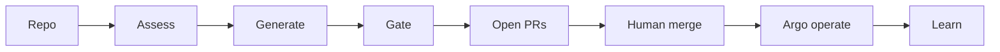

<p align="center">
  
</p>

<p align="center">
  
  
  
  
</p>

# AgentIT

**AgentIT scores a repo’s enterprise readiness and opens quality-filtered GitOps PRs so humans merge and Argo CD deploys.**

## Table of contents

- [Score any repo in 30 seconds](#score-any-repo-in-30-seconds-no-cluster-required)
- [Core loop](#core-loop)
- [Quick start](#quick-start)
- [Works on plain Kubernetes?](#works-on-plain-kubernetes)
- [Portal journey](#portal-journey)
- [Deploy to OpenShift](#deploy-to-openshift)
- [Docs](#docs)
- [License](#license)

## Score any repo in 30 seconds (no cluster required)

```bash
uv sync --extra dev
uv run agentit assess https://github.com/some-org/some-app --format terminal
```

Clones the repo, runs seven analyzers (+ `mode: detect` skills), prints an overall score and findings. No OpenShift cluster, no Postgres, no LLM required (`--no-llm` forces heuristics; LLM is used only when credentials are present unless you pass `--llm` / `--no-llm`).

How scoring works: [`docs/score-methodology.md`](docs/score-methodology.md). Sample output (no install): [`examples/sample-assessment.md`](examples/sample-assessment.md). Shareable badge: `GET /badge/{app}.svg` (see methodology).

## Core loop

Point AgentIT at a git repo → **assess** → **generate** remediations → **gate** (quality + SSA dry-run) → open PRs → human **operates** (merge) → Argo syncs → watchers / learning **learn**.



| Step | What happens |
| --- | --- |
| **Assess** | 7 dimensions → findings + scores |
| **Generate** | SkillEngine matches findings to skills; Scan/onboard produces remediations |
| **Gate** | Finding-tied PRs only; SSA dry-run + clear-evidence simulation (refuses theater stubs; hand-rolled store DDL passes `migration`) |
| **Operate** | Human merges on GitHub; Argo CD deploys (Scan HITL — no auto-merge) |
| **Learn** | Watchers surface drift/CVEs/SLOs; learning drafts skills for human activation |

Fleet apps land under `apps/{app}/` in the gitops repo (ApplicationSet). AgentIT itself deploys from this repo’s Helm `chart/` via Application `agentit`.

## Quick start

Requires **Python ≥ 3.12** and [`uv`](https://docs.astral.sh/uv/).

```bash
git clone https://github.com/alimobrem/AgentIT.git
cd AgentIT
uv sync --extra dev

# 1) Score a repo (no cluster)
uv run agentit assess https://github.com/some-org/some-app --format terminal

# 2) Assess + generate hardening manifests locally
uv run agentit onboard https://github.com/some-org/some-app --output-dir ./out

# 3) Local portal (needs Postgres: AGENTIT_DB_DSN)
uv run agentit portal --port 8080
# open http://localhost:8080
```

Useful commands: `self-assess`, `watch`, `learn`, `test-skill`, `activate-skill`. Full list: `uv run agentit --help`.

<details>
<summary><b>Environment variables</b></summary>

| Variable | Purpose |
|---|---|
| `AGENTIT_DB_DSN` | Postgres DSN (**required** for portal / fleet / watchers) |
| `ANTHROPIC_API_KEY` or Vertex (`ANTHROPIC_VERTEX_PROJECT_ID` + `CLOUD_ML_REGION`) | Optional LLM |
| `GITHUB_TOKEN` | PR create / infra-repo / webhooks |
| `AGENTIT_KAFKA_BOOTSTRAP` | Kafka (optional; no-op if unset) |
| `AGENTIT_EXTERNAL_URL` | Public base URL for outbound registrations |
| `AGENTIT_AGENT_MODE` | `local` (default) or `kubernetes` Jobs |
| `AGENTIT_OFFLINE` | `1` — hard-stop kube client (tests/review) |

</details>

## Works on plain Kubernetes?

| Capability | OpenShift (supported) | Plain Kubernetes |
| --- | --- | --- |
| `agentit assess` / local CLI | Yes | Yes — no cluster needed |
| Portal + Postgres store | Yes (bundled chart) | Possible with your own Postgres; chart targets OpenShift |
| Browser auth (`auth.enabled`) | OpenShift oauth-proxy + Route | Not the same path — bring your own ingress/IdP |
| GitOps deploy | Argo CD Application / ApplicationSet | Argo CD works; chart assumes OpenShift-friendly defaults |
| Self-deploy (Rollouts, Tekton `agentit-ci`, ImageStreams) | Hard-requires OpenShift Pipelines / Rollouts as charted | Degrades — use your own CI promote path |
| Watchers (drift, vuln, SLO, self-health) | Designed for this stack | Partial — kube client works; OpenShift-only APIs/CRDs skip or warn |

**Bottom line:** scoring and local generation are cluster-agnostic. Full operate loop (portal, Scan → PR → Argo, watchers) is built and tested for OpenShift.

## Portal journey

**Primary spine:** Fleet → Assessment Detail → Ledger (assess → findings → merge PR → operate). Empty fleets land on Fleet’s guided empty state; once apps exist, `/` redirects to Ledger.

**Operate (Menu):** Health, Insights, Events, Decisions, DLQ, Schedules. The fixed footer is an action-status strip (not a second nav). Ledger / Findings share one **decision card** (why · confidence · dry-run · evidence · merge/close). See [`docs/portal-experience-design-language.md`](docs/portal-experience-design-language.md) and [ADR 0007](docs/adr/0007-decision-card.md).

## Deploy to OpenShift

Helm chart in `chart/` + Argo CD Application in `argocd/application.yaml`. Argo is the deployer: merge to `main` alone does not move the portal — Tekton `agentit-ci` builds, smokes, then pins `image.tag`.

Ops: [`docs/deployment.md`](docs/deployment.md). Topology: [`docs/architecture.md`](docs/architecture.md).

## Docs

| Doc | Role |
| --- | --- |
| [`docs/score-methodology.md`](docs/score-methodology.md) | **Score dimensions, weights, PR impact** |
| [`docs/architecture.md`](docs/architecture.md) | System diagrams, Scan pipeline |
| [`docs/architecture-agentit-vs-fleet-gitops.md`](docs/architecture-agentit-vs-fleet-gitops.md) | Self-managed vs fleet delivery |
| [`docs/release-notes.md`](docs/release-notes.md) | Product contract (Scan HITL, contracts, portal IA) |
| [`CHANGELOG.md`](CHANGELOG.md) | Version history (Keep a Changelog); recent: Tekton `run-tests` 20m timeout + LLM fail-soft |
| [`docs/adr/`](docs/adr/) | Architecture Decision Records |
| [`docs/portal-experience-design-language.md`](docs/portal-experience-design-language.md) | Portal EDL |
| [`docs/plan-quality-helpful-prs.md`](docs/plan-quality-helpful-prs.md) | Quality PR rules |
| [`docs/compare.md`](docs/compare.md) | Short differentiators |
| [`docs/history/`](docs/history/) | Session notes, plans, audits (not product truth) |
| [`docs/README.md`](docs/README.md) | Docs index |

## License

[MIT](LICENSE)
