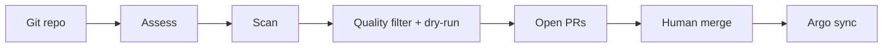

<p align="center">
  
</p>

<p align="center">
  
  
  
  
</p>

# AgentIT

AgentIT assesses OpenShift apps, matches findings to property-based skills, and opens **quality-filtered** GitOps pull requests. Humans merge on GitHub; Argo CD deploys. Scan is the only PR creator — no auto-merge, no Direct Apply to the cluster.

It runs **on** OpenShift **for** OpenShift (Argo CD, Rollouts, Tekton, optional Kafka / Argo Events). Watchers surface CVEs, SLO breaches, drift, and self-health; a learning loop drafts new skills for human activation.

## Table of contents

- [Core loop](#core-loop)
- [Quick start](#quick-start)
- [Deploy to OpenShift](#deploy-to-openshift)
- [Testing](#testing)
- [Security](#security)
- [Docs](#docs)
- [License](#license)

## Core loop

1. **Assess** — analyzers + `mode: detect` skills → findings and scores.
2. **Scan / Onboard** — SkillEngine generates remediations; quality gates open finding-tied PRs (SSA dry-run + clear-evidence simulation).
3. **Human merge** — review and merge on GitHub.
4. **Argo deploys** — fleet apps via ApplicationSet → `apps/{app}/` in the gitops repo; AgentIT itself via Application `agentit` → Helm `chart/` in this repo.



| | Fleet apps | AgentIT itself |
| --- | --- | --- |
| Desired state | `agentit-gitops` `apps/{app}/` | This repo: `chart/`, `skills/`, `src/` |
| Argo | ApplicationSet (`directory.recurse`) | Application `agentit` (Helm) |

Product contract detail, solution contracts, and portal IA notes: [`docs/release-notes.md`](docs/release-notes.md).

## Quick start

Requires **Python >= 3.12** and [`uv`](https://docs.astral.sh/uv/). **Postgres is required** — set `AGENTIT_DB_DSN`.

```bash
git clone https://github.com/alimobrem/AgentIT.git
cd AgentIT
uv sync --extra dev

# Assess a repo
uv run agentit assess https://github.com/some-org/some-app --format terminal

# Full pipeline (assess + skills + validate)
uv run agentit onboard https://github.com/some-org/some-app --output-dir ./out

# Local portal
uv run agentit portal --port 8080
# open http://localhost:8080
```

Add `--llm` for Claude-backed reasoning (or set `ANTHROPIC_API_KEY` / Vertex env). Useful CLI: `orchestrate`, `watch`, `self-assess`, `self-fix`, `learn`, `test-skill`, `activate-skill`, `propose-watch`.

**Portal:** Ledger (`/`) is ops home; Fleet is the scoreboard; Assessment Detail drives Assess → Scan; Capabilities holds Checks & resolutions / Skills / Activity. Fixed masthead + footer. Assessment Notices auto-open for `success`/`warning` query flashes (e.g. Register for GitOps). EDL: [`docs/portal-experience-design-language.md`](docs/portal-experience-design-language.md).

<details>
<summary><b>Environment variables</b></summary>

| Variable | Purpose |
|---|---|
| `AGENTIT_DB_DSN` | Postgres DSN (required) |
| `ANTHROPIC_API_KEY` or Vertex (`ANTHROPIC_VERTEX_PROJECT_ID` + `CLOUD_ML_REGION`) | LLM |
| `GITHUB_TOKEN` | PR create / infra-repo / webhooks |
| `AGENTIT_KAFKA_BOOTSTRAP` | Kafka (optional; no-op if unset) |
| `AGENTIT_EXTERNAL_URL` | Trusted public base URL for outbound registrations |
| `AGENTIT_AGENT_MODE` | `local` (default) or `kubernetes` Jobs |
| `AGENTIT_OFFLINE` | `1` — hard-stop kube client (tests/review) |

</details>

## Deploy to OpenShift

Helm chart in `chart/` + Argo CD Application in `argocd/application.yaml`. **Argo is the sole deployer** — never `helm upgrade` or `oc edit` the Rollout by hand. Merge to `main` alone does not move the portal: Tekton `agentit-ci` builds, smokes, then `notify-argocd` pins `image.tag`.

Ops runbook: [`docs/deployment.md`](docs/deployment.md). Topology: [`docs/architecture.md`](docs/architecture.md).

## Testing

```bash
uv run pytest -q
uv run pytest tests/test_portal_edl.py -q
uv run python scripts/check_portal_edl.py
```

Browser-critical journeys (Playwright) run in GitHub Actions; locally: `uv sync --extra browser && uv run playwright install chromium && uv run pytest tests/test_browser_critical.py --browser-tests -q`.

## Security

- Opt-in browser auth via `auth.enabled` (oauth-proxy). CSRF always on for browser mutations.
- Internal `/api/webhook/*` requires `X-Internal-Webhook-Token`; GitHub push uses HMAC.
- Secrets never in Git. Delivery always stops at a PR — human merge only.
- Details: [`docs/deployment.md#authentication`](docs/deployment.md#authentication).

## Docs

| Doc | Role |
| --- | --- |
| [`docs/README.md`](docs/README.md) | Docs index |
| [`docs/architecture.md`](docs/architecture.md) | System diagrams, Scan pipeline |
| [`docs/architecture-agentit-vs-fleet-gitops.md`](docs/architecture-agentit-vs-fleet-gitops.md) | Self-managed vs fleet delivery |
| [`docs/plan-quality-helpful-prs.md`](docs/plan-quality-helpful-prs.md) | Quality PR Phases A–F |
| [`docs/portal-experience-design-language.md`](docs/portal-experience-design-language.md) | Portal EDL |
| [`docs/release-notes.md`](docs/release-notes.md) | **Release notes** (contracts, portal IA, promotion) |
| [`docs/changelog-dogfood-notes.md`](docs/changelog-dogfood-notes.md) | Dated dogfood / session writeups |

Skills live under `skills/` (~67 across 14 domains; ~20 `mode: detect`). Optional source patches: CodeChangeAgent. Capability-scout: [`docs/self-improvement-for-agentit.md`](docs/self-improvement-for-agentit.md).

## License

[MIT](LICENSE)
