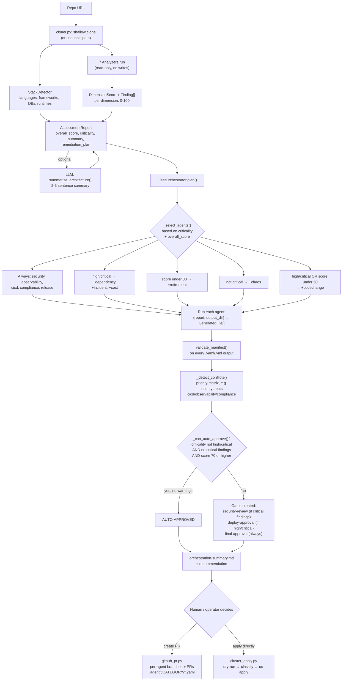
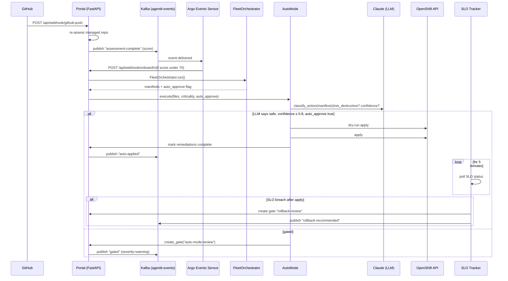
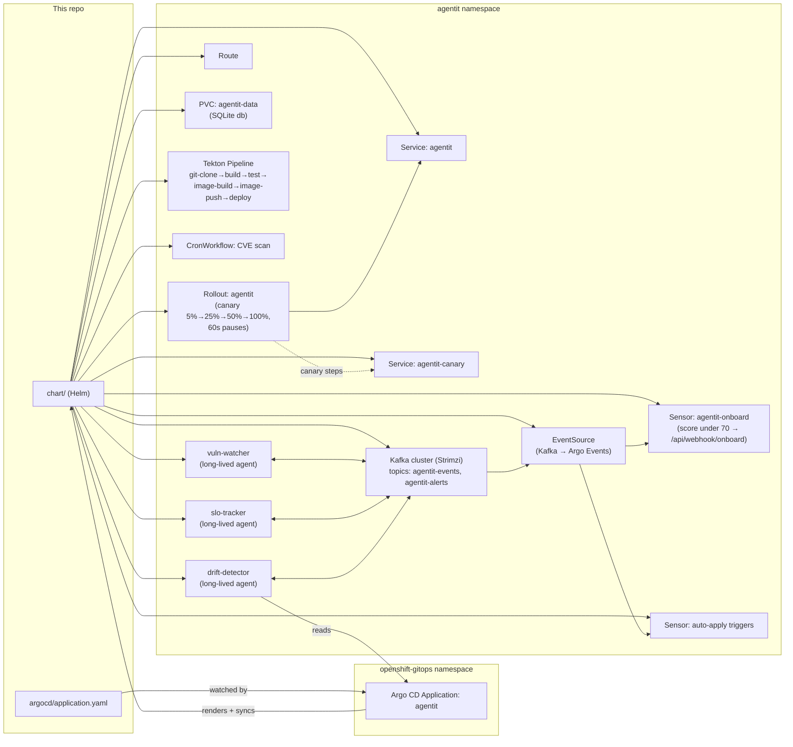

# AgentIT

**An agent fleet that assesses, hardens, and continuously operates applications on Red Hat OpenShift — turning an MVP repo into an enterprise-ready, GitOps-managed, self-healing workload.**

Point AgentIT at a Git repository and it will:

1. **Assess** the repo across 7 enterprise-readiness dimensions and produce a scored report.
2. **Generate** the Kubernetes/Helm/Tekton/Argo manifests needed to close the gaps, via a fleet of specialized agents.
3. **Onboard** the app onto the cluster through a human-gated or (optionally) fully autonomous apply pipeline.
4. **Operate** it going forward — watching for CVEs, SLO breaches, and GitOps drift, and closing the loop by re-assessing, re-generating, and re-applying fixes.

---

## Table of Contents

- [Why AgentIT](#why-agentit)
- [Architecture](#architecture)
  - [System overview](#system-overview)
  - [Assessment → onboarding pipeline](#assessment--onboarding-pipeline)
  - [Autonomous remediation loop](#autonomous-remediation-loop)
  - [Deployment topology (OpenShift)](#deployment-topology-openshift)
- [The agent fleet](#the-agent-fleet)
- [Assessment dimensions](#assessment-dimensions)
- [Web portal](#web-portal)
- [Repository layout](#repository-layout)
- [Getting started](#getting-started)
  - [CLI](#cli)
  - [Portal (local)](#portal-local)
- [Configuration](#configuration)
- [Deploying to OpenShift](#deploying-to-openshift)
- [Testing](#testing)
- [Security notes](#security-notes)
- [License](#license)

---

## Why AgentIT

Most "enterprise readiness" work — NetworkPolicies, RBAC, SLOs, GitOps wiring, dependency scanning, chaos testing, cost tagging — is repetitive, well-understood, and rarely the reason a team built their MVP in the first place. AgentIT treats that work as something a fleet of specialized agents can plan and generate, with a human (or an LLM safety gate) approving anything destructive before it touches a live cluster.

It is built to run **on** OpenShift, **for** OpenShift: Argo CD for GitOps, Argo Rollouts for canary delivery, Tekton for CI, Argo Events + Kafka for the event-driven loop, and OLM Subscriptions for any operator dependencies the generated manifests need.

## Architecture

### System overview

```mermaid
graph TB
    subgraph Sources["Sources"]
        Repo["Target Git repo\n(the app being onboarded)"]
        GH["GitHub API\n(PRs, webhooks)"]
    end

    subgraph Core["AgentIT Core (src/agentit)"]
        CLI["CLI\n(click)"]
        Portal["Portal\nFastAPI + Jinja2"]
        Cloner["cloner.py\nshallow git clone"]
        Runner["runner.py\nrun_assessment()"]
        Analyzers["7 Analyzers\n(stack, security, cicd,\ninfra, compliance,\ndata-gov, ha/dr)"]
        Orchestrator["FleetOrchestrator\nagents/orchestrator.py"]
        Agents["Agent Fleet\n(10 specialized agents)"]
        AutoMode["automode.py\nLLM safety gate"]
        RemLoop["remediation_loop.py\ndetect→fix→apply→verify"]
        LLM["llm.py\nClaude (Anthropic / Vertex)"]
        Store[("SQLite\nportal/store.py")]
    end

    subgraph Cluster["OpenShift Cluster"]
        ArgoCD["Argo CD\n(GitOps sync)"]
        Rollout["Argo Rollouts\n(canary Deployment)"]
        Kafka["Kafka\n(Strimzi, topics:\nagentit-events / -alerts)"]
        ArgoEvents["Argo Events\n(EventSource + Sensors)"]
        Tekton["Tekton\n(build/push pipeline)"]
        Watchers["Long-lived watcher agents\nvuln-watcher / slo-tracker\ndrift-detector"]
        Target["Onboarded app\nDeployment/Rollout"]
    end

    Repo -->|clone| Cloner --> Runner --> Analyzers --> Runner
    CLI --> Runner
    Portal --> Runner
    Runner -->|AssessmentReport| Orchestrator
    Orchestrator --> Agents
    Agents -->|GeneratedFile[]| Store
    Agents -.->|classify secrets /\nsummarize / classify actions| LLM
    Orchestrator -->|plan + gates| Store
    Portal --> Store
    Portal -->|create PR| GH
    Portal -->|dry-run + apply| Cluster
    AutoMode -->|LLM-gated apply| Cluster
    RemLoop -->|calls portal webhooks| Portal

    ArgoCD -->|renders chart/| Target
    ArgoCD --> Rollout
    Tekton -->|build & push image| Target
    Kafka <--> ArgoEvents
    ArgoEvents -->|"score under 70 → onboard"| Portal
    Portal -->|publish events| Kafka
    Watchers <--> Kafka
    Watchers -->|CVE / SLO / drift alerts| Portal
```

### Assessment → onboarding pipeline

This is what happens for a single `assess` / `onboard` run (CLI, portal form, or webhook — same code path).



### Autonomous remediation loop

When Kafka + Argo Events + auto-mode are all enabled, AgentIT can close the loop without a human in it — but every apply still goes through an LLM safety gate that **fails closed** (gates for human review) if the LLM is unavailable, unconfident, or flags the change as destructive.



### Deployment topology (OpenShift)

AgentIT deploys **itself** the same way it onboards other apps: Argo CD is the sole deployer (see [`docs/deployment.md`](docs/deployment.md) — never `helm upgrade` manually against a running install).



## The agent fleet

Every agent shares the same contract (`agents/base.py`): `Agent(report: AssessmentReport, output_dir: Path).run() -> Result` where `Result.files` is a `list[GeneratedFile]`. The `FleetOrchestrator` decides which agents run for a given assessment (see the pipeline diagram above) and resolves overlaps via a priority matrix.

| Agent | Category | Always runs? | Generates |
|---|---|---|---|
| **HardeningAgent** | `security` | Yes | Deny-all `NetworkPolicy`, hardened `Containerfile`, minimal RBAC (`ServiceAccount`/`Role`/`RoleBinding`), `SecurityContext` patches |
| **ObservabilityAgent** | `observability` | Yes | `ServiceMonitor`, Grafana dashboard JSON, Prometheus alerting rules, OpenTelemetry Collector config |
| **CICDAgent** | `cicd` | Yes | Tekton `Pipeline`, Argo CD `Application`/`ApplicationSet`, Argo `Rollout` canary manifest |
| **ComplianceAgent** | `compliance` | Yes | Kyverno `ClusterPolicy` set (require-labels, require-limits, restrict-registries, disallow-`:latest`), SBOM generation script, compliance evidence doc |
| **ReleaseCoordinatorAgent** | `release` | Yes | Argo Rollouts `AnalysisTemplate`, rollout patch, rollback policy, release runbook; also seeds default SLOs by criticality |
| **DependencyAgent** | `dependency` | high/critical | Dependency risk report, Renovate config, weekly CVE-scan `CronWorkflow` |
| **IncidentAgent** | `incident` | high/critical | Incident runbook, PagerDuty service config, Alertmanager routing |
| **CostOptimizationAgent** | `cost` | high/critical | Cost report, right-sizing recommendations, cost-attribution labels, weekly cost `CronWorkflow` |
| **ChaosAgent** | `chaos` | not critical | LitmusChaos experiments: pod-kill recovery, network-latency injection, CPU-stress vs. HPA |
| **RetirementAgent** | `retirement` | score < 30 | Decommission plan, cleanup script, pre-deletion data-archive `Job` |
| **CodeChangeAgent** | `codechange` | high/critical or score < 50 | LLM-generated **source-level** patches (e.g., health-check endpoints, `.gitignore`, OTel instrumentation) — the only agent that touches app code rather than infra |
| **FleetOrchestrator** | — | meta-agent | Selects agents, resolves conflicts, decides auto-approve, writes `orchestration-summary.md` |

Three additional agents run as **long-lived processes** (via `agentit vuln-watch` / `slo-track` / `drift-detect`, deployed as their own Deployments in the chart) rather than one-shot onboarding agents:

| Long-lived agent | Loop | Role |
|---|---|---|
| **vuln-watcher** | every 6h (default) | Consumes Kafka events, checks fleet for critical findings, triggers `RemediationLoop` when auto-mode is on |
| **slo-tracker** | every 5m (default) | Polls SLO status per assessment, publishes breach alerts, opens a `rollback-review` gate if a breach follows a recent apply |
| **drift-detector** | every 10m (default) | Polls Argo CD `Applications` for `OutOfSync`, publishes drift alerts, auto-syncs if auto-mode is on |

## Assessment dimensions

`runner.py` runs the `StackDetector` plus 7 analyzers over the cloned repo (read-only — analyzers never write to the repo). Each produces a `DimensionScore` (0–100) with `Finding`s at `critical`/`high`/`medium`/`low`/`info` severity, which feed both the overall score and the `RemediationItem` plan.

| Dimension | Analyzer | Checks (examples) |
|---|---|---|
| `security` | `SecurityAnalyzer` | Hardcoded secrets (regex + LLM false-positive filtering), root containers, missing `HEALTHCHECK`, `:latest` tags, missing `NetworkPolicy`, missing vuln scanning in CI, non-UBI base images |
| `observability` | `ObservabilityAnalyzer` | Metrics/tracing/logging instrumentation, health probes |
| `cicd` | `CICDAnalyzer` | CI pipeline presence, GitOps wiring, deployment automation |
| `infrastructure` | `InfrastructureAnalyzer` | IaC presence, manifest completeness |
| `compliance` | `ComplianceAnalyzer` | Policy-as-code, labeling, SBOM/provenance |
| `data_governance` | `DataGovernanceAnalyzer` | Data handling, retention, PII exposure signals |
| `ha_dr` | `HADRAnalyzer` | Replica counts, backup/restore, multi-AZ signals |

Findings are sorted by severity into a prioritized `remediation_plan`, each with an estimated effort (`critical` → 2 agent-hours … `info` → 5 agent-minutes) and the agent responsible for fixing it.

## Web portal

`agentit portal` launches a FastAPI + Jinja2 app (no frontend framework — server-rendered HTML, styling centralized in `base.html`, no inline styles per project convention). Pages:

| Page | Route | Purpose |
|---|---|---|
| Fleet | `/`, `/fleet` | Dashboard of all assessed apps and their latest scores |
| Assess | `/assess` | Submit a repo URL for a new assessment |
| Assessment detail | `/assessments/{id}` | Score breakdown, findings, remediation plan |
| Onboarding | `/assessments/{id}/onboard`, `/onboard-results` | Trigger the Fleet Orchestrator, view generated manifests, create GitHub PRs |
| Gates | `/gates` | Pending human-approval gates (security review, deploy approval, auto-mode review, rollback review) |
| Events | `/events` | Event stream (assessment/agent/webhook activity) |
| Agents | `/agents`, `/agents/{name}` | Per-agent run history and generated files |
| Schedules | `/schedules` | Long-lived watcher agent status and intervals |
| Health | `/health`, `/health/pods/{name}`, `/health/pipelines/{name}` | Rollout status, deployed commit, pipeline/pod detail |
| SLOs | `/assessments/{id}/slos` | Per-app SLO targets and breach status |
| Remediations | `/assessments/{id}/remediations` | Tracked remediation items with completion state |
| Settings | `/settings` | Auto-mode toggle and other runtime settings |

Webhook endpoints used by the event-driven loop: `/api/webhook/assess`, `/api/webhook/github-push`, `/api/webhook/onboard`, `/api/webhook/auto-apply`, `/api/webhook/remediate`.

## Repository layout

```
AgentIT/
├── src/agentit/
│   ├── cli.py                 # click CLI: assess, harden, onboard, orchestrate,
│   │                          #   watch, portal, vuln-watch, slo-track, drift-detect, self-assess
│   ├── runner.py               # run_assessment(): stack detection + analyzers → AssessmentReport
│   ├── cloner.py                # shallow git clone helper
│   ├── reporter.py              # JSON / terminal report rendering
│   ├── models.py                # Pydantic models: Finding, DimensionScore, AssessmentReport, ...
│   ├── llm.py                    # Claude client (Anthropic direct or Vertex AI), fail-open design
│   ├── automode.py               # LLM-gated auto-apply decision engine (fail-closed)
│   ├── remediation_loop.py       # detect → assess → onboard → apply → verify pipeline
│   ├── events.py / consumer.py   # Kafka publisher / consumer (no-op if Kafka unavailable)
│   ├── image_builder.py          # Tekton-driven image build (auto-generates Dockerfile if missing)
│   ├── analyzers/                # 7 read-only analyzers + stack_detector + shared base utilities
│   ├── agents/                   # 10 manifest/code-generating agents + orchestrator + shared base
│   └── portal/
│       ├── app.py                # FastAPI routes (dashboard, onboarding, gates, health, settings, webhooks)
│       ├── store.py               # SQLite persistence (assessments, events, gates, SLOs, remediations)
│       ├── cluster_apply.py       # oc/kubectl apply with pre-flight CRD/namespace checks, operator install
│       ├── github_pr.py            # GitHub REST API: PR creation, infra-repo management, webhooks
│       └── templates/              # Jinja2 templates for every portal page
├── chart/                       # Helm chart (Deployment/Rollout, Services, Route, RBAC, PVC,
│                                #   Tekton pipeline/trigger, Kafka + Argo Events, watcher agents)
├── argocd/application.yaml       # Argo CD Application definition for self-deployment
├── docs/deployment.md             # GitOps operational rules (Argo CD is the sole deployer)
├── scripts/pre-commit-secrets-check.sh  # optional local pre-commit hook against committed secrets
├── Containerfile                  # UBI9 Python 3.12 image, installs oc/kubectl, runs the portal
└── tests/                          # pytest suite (502 tests)
```

## Getting started

Requires **Python ≥ 3.12**. Uses [`uv`](https://docs.astral.sh/uv/) for dependency management (a `pyproject.toml` + `uv.lock` are provided; plain `pip install -e ".[dev]"` also works).

```bash
git clone https://github.com/alimobrem/AgentIT.git
cd AgentIT
uv sync --extra dev
```

### CLI

```bash
# Score a repo across all 7 dimensions
uv run agentit assess https://github.com/some-org/some-app --format terminal

# Generate hardening manifests only
uv run agentit harden https://github.com/some-org/some-app --output-dir ./out

# Full pipeline: assess → plan → run every applicable agent → validate → summarize
uv run agentit orchestrate https://github.com/some-org/some-app --output-dir ./out

# assess + orchestrate + write assessment.json, in one command
uv run agentit onboard https://github.com/some-org/some-app --output-dir ./out

# Continuously re-assess on an interval, optionally POST results to a webhook
uv run agentit watch https://github.com/some-org/some-app --interval 3600

# Dogfood: assess AgentIT's own repo
uv run agentit self-assess
```

Add `--llm` to enable Claude-backed secret classification and architecture summaries (auto-detected if `ANTHROPIC_API_KEY` or `ANTHROPIC_VERTEX_PROJECT_ID` is set).

### Portal (local)

```bash
uv run agentit portal --port 8080
# open http://localhost:8080
```

The portal uses a local SQLite file (`agentit.db` by default) — no external database required for local use.

## Configuration

All configuration is via environment variables (no config file). Nothing here belongs in `values.yaml` or any committed file — see [Security notes](#security-notes).

| Variable | Used by | Purpose |
|---|---|---|
| `ANTHROPIC_API_KEY` | `llm.py` | Direct Anthropic API auth (alternative to Vertex) |
| `ANTHROPIC_VERTEX_PROJECT_ID` + `CLOUD_ML_REGION` | `llm.py` | Use Claude via Vertex AI instead of the direct API |
| `GITHUB_TOKEN` | `portal/github_pr.py` | Required for PR creation, infra-repo management, webhook registration |
| `AGENTIT_DB_PATH` | `portal/store.py` | SQLite file path (default `agentit.db`) |
| `AGENTIT_KAFKA_BOOTSTRAP` | `events.py`, `consumer.py` | Kafka bootstrap servers; publisher/consumer no-op gracefully if unset |
| `AGENTIT_AUTO_MODE` | `automode.py` | `1`/`true`/`on` to enable autonomous apply (also togglable at runtime via `/settings`) |
| `AGENTIT_PORTAL_URL` | `remediation_loop.py` | Base URL the remediation loop calls back into (default `http://localhost:8080`) |
| `GOOGLE_APPLICATION_CREDENTIALS` | Vertex SDK | Path to mounted GCP credentials JSON (set automatically by the chart when `gcp.credentialsSecret` is configured) |

## Deploying to OpenShift

AgentIT deploys itself the same way it onboards other apps — via the Helm chart in `chart/` and the Argo CD `Application` in `argocd/application.yaml`. **Argo CD is the sole deployer**; see [`docs/deployment.md`](docs/deployment.md) for the full operational runbook (how to change config, rotate secrets, and troubleshoot Rollouts/Argo CD conflicts). In short:

- Change behavior → edit `argocd/application.yaml` Helm parameters → commit → push → Argo CD auto-syncs.
- Change a secret → `oc create secret` on-cluster, then reference it via a Helm parameter. Never in Git.
- Never `helm upgrade` manually or `oc edit` the `Rollout` — both conflict with Argo CD / Rollouts controller ownership.

Key `chart/values.yaml` feature flags: `rollout.enabled` (canary via Argo Rollouts), `kafka.enabled` / `argoEvents.enabled` (event-driven loop), `tektonCI.enabled` (build pipeline), `cronJobs.cveScan.enabled`, and `agents.{vulnWatcher,sloTracker,driftDetector}.enabled`.

## Testing

```bash
uv run pytest -q
```

502 tests, covering analyzers, agents, the orchestrator's conflict/gate logic, the portal routes, the SQLite store, cluster-apply pre-flight logic, and Helm template rendering. A small set of `real_repo`-marked tests that clone live GitHub repos are skipped by default (enable with `--run-real-repos`).

## Security notes

- **No authentication is currently implemented in the portal.** Every route — including ones that apply manifests to a live cluster or delete records — is unauthenticated. Run this behind a trusted network boundary (e.g., an OpenShift `Route` restricted to your cluster's ingress rules or an authenticating proxy) until portal auth is added.
- **GitHub webhooks are not signature-verified.** `/api/webhook/github-push` does not check `X-Hub-Signature-256`; treat the webhook endpoint as trusted-network-only, or add HMAC verification before exposing it publicly.
- **Secrets never belong in Git.** This repo is public — see [Configuration](#configuration) and `docs/deployment.md`. `scripts/pre-commit-secrets-check.sh` provides an optional local pre-commit hook that blocks common secret patterns (AWS keys, private keys, GitHub/GitLab tokens, `sk-` API keys) from being committed.
- **Destructive actions are LLM-gated and fail closed.** `automode.py` will only auto-apply when the orchestrator approves *and* an LLM classifies the change as non-destructive with ≥ 0.8 confidence; if the LLM is unavailable, unconfident, or flags a risk, the change is gated for human review instead.
- **Manifests are validated before being trusted.** `agents/base.py::validate_manifest()` checks every generated YAML file has the required Kubernetes fields, and `cluster_apply.py` runs a `--dry-run=client` pass before any real apply, skips cluster-scoped kinds (needs `cluster-admin`), and skips CRDs that aren't installed on the target cluster (surfacing the missing operator instead of failing silently).

## License

[MIT](LICENSE)
