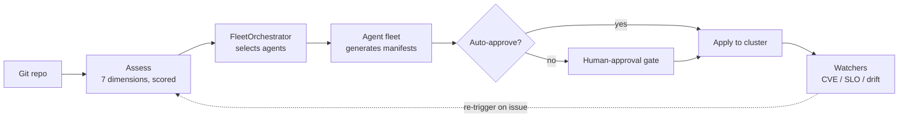

<p align="center">
  
</p>

<p align="center">
  
  
  
  
</p>

<p align="center"><b>An agent fleet that assesses, hardens, and continuously operates applications on Red Hat OpenShift — turning an MVP repo into an enterprise-ready, GitOps-managed, self-healing workload.</b></p>

---

Point AgentIT at a Git repository and it will:

1. **Assess** the repo across 7 enterprise-readiness dimensions and produce a scored report.
2. **Generate** the Kubernetes/Helm/Tekton/Argo manifests needed to close the gaps, via a fleet of specialized agents.
3. **Onboard** the app onto the cluster through a human-gated or (optionally) fully autonomous apply pipeline.
4. **Operate** it going forward — watching for CVEs, SLO breaches, and GitOps drift, and closing the loop by re-assessing, re-generating, and re-applying fixes.

📐 **For the full system diagrams, event-driven pipeline, agent fleet reference, and deployment topology, see [`docs/architecture.md`](docs/architecture.md).**

## Table of Contents

- [Why AgentIT](#why-agentit)
- [Architecture, at a glance](#architecture-at-a-glance)
- [The agent fleet, briefly](#the-agent-fleet-briefly)
- [Web portal](#web-portal)
- [Getting started](#getting-started)
  - [CLI](#cli)
  - [Portal (local)](#portal-local)
- [Configuration](#configuration)
- [Deploying to OpenShift](#deploying-to-openshift)
- [Testing](#testing)
- [Security notes](#security-notes)
- [Repository layout](#repository-layout)
- [License](#license)

## Why AgentIT

Most "enterprise readiness" work — NetworkPolicies, RBAC, SLOs, GitOps wiring, dependency scanning, chaos testing, cost tagging — is repetitive, well-understood, and rarely the reason a team built their MVP in the first place. AgentIT treats that work as something a fleet of specialized agents can plan and generate, with a human (or an LLM safety gate) approving anything destructive before it touches a live cluster.

It is built to run **on** OpenShift, **for** OpenShift: Argo CD for GitOps, Argo Rollouts for canary delivery, Tekton for CI, Argo Events + Kafka for the event-driven loop, and OLM Subscriptions for any operator dependencies the generated manifests need.

## Architecture, at a glance



That's the loop end-to-end. The real system has more moving parts — an event-driven path via Kafka + Argo Events, an LLM safety gate that fails closed, canary delivery via Argo Rollouts, and a dedicated orchestrator conflict-resolution step. **All of it is diagrammed in detail in [`docs/architecture.md`](docs/architecture.md).**

## The agent fleet, briefly

10 one-shot onboarding agents (security hardening, observability, CI/CD, compliance, release coordination, dependency risk, incident response, cost optimization, chaos testing, retirement/decommission, plus an LLM-driven code-change agent) and 3 long-lived watchers (vuln-watcher, slo-tracker, drift-detector). Every agent shares one contract — `Agent(report, output_dir).run() -> Result` — and a `FleetOrchestrator` decides which ones run per assessment and resolves overlaps.

→ Full agent-by-agent breakdown of what each one generates: [`docs/architecture.md#the-agent-fleet`](docs/architecture.md#the-agent-fleet).

## Web portal

`agentit portal` launches a FastAPI + Jinja2 app (no frontend framework — server-rendered HTML, styling centralized in `base.html`, no inline styles). Key pages: **Fleet** (dashboard), **Assess**, **Assessment detail**, **Onboarding**, **Gates** (human approvals), **Events**, **Agents**, **Schedules** (watcher status), **Health** (Rollout/pod/pipeline status), **SLOs**, **Remediations**, **Settings** (auto-mode toggle).

Webhook endpoints power the event-driven loop: `/api/webhook/assess`, `/api/webhook/github-push`, `/api/webhook/onboard`, `/api/webhook/auto-apply`, `/api/webhook/remediate`.

## Getting started

Requires **Python ≥ 3.12**. Uses [`uv`](https://docs.astral.sh/uv/) for dependency management (a `pyproject.toml` + `uv.lock` are provided; plain `pip install -e ".[dev]"` also works).

```bash
git clone https://github.com/alimobrem/AgentIT.git
cd AgentIT
uv sync --extra dev
```

### CLI

```bash
# Score a repo across all 7 dimensions
uv run agentit assess https://github.com/some-org/some-app --format terminal

# Generate hardening manifests only
uv run agentit harden https://github.com/some-org/some-app --output-dir ./out

# Full pipeline: assess → plan → run every applicable agent → validate → summarize
uv run agentit orchestrate https://github.com/some-org/some-app --output-dir ./out

# assess + orchestrate + write assessment.json, in one command
uv run agentit onboard https://github.com/some-org/some-app --output-dir ./out

# Continuously re-assess on an interval, optionally POST results to a webhook
uv run agentit watch https://github.com/some-org/some-app --interval 3600

# Dogfood: assess AgentIT's own repo
uv run agentit self-assess
```

Add `--llm` to enable Claude-backed secret classification and architecture summaries (auto-detected if `ANTHROPIC_API_KEY` or `ANTHROPIC_VERTEX_PROJECT_ID` is set).

### Portal (local)

```bash
uv run agentit portal --port 8080
# open http://localhost:8080
```

The portal uses a local SQLite file (`agentit.db` by default) — no external database required for local use.

## Configuration

All configuration is via environment variables (no config file). Nothing here belongs in `values.yaml` or any committed file — see [Security notes](#security-notes).

<details>
<summary><b>Environment variables</b> (click to expand)</summary>

| Variable | Used by | Purpose |
|---|---|---|
| `ANTHROPIC_API_KEY` | `llm.py` | Direct Anthropic API auth (alternative to Vertex) |
| `ANTHROPIC_VERTEX_PROJECT_ID` + `CLOUD_ML_REGION` | `llm.py` | Use Claude via Vertex AI instead of the direct API |
| `GITHUB_TOKEN` | `portal/github_pr.py` | Required for PR creation, infra-repo management, webhook registration |
| `AGENTIT_DB_PATH` | `portal/store.py` | SQLite file path (default `agentit.db`) |
| `AGENTIT_KAFKA_BOOTSTRAP` | `events.py`, `consumer.py` | Kafka bootstrap servers; publisher/consumer no-op gracefully if unset |
| `AGENTIT_AUTO_MODE` | `automode.py` | `1`/`true`/`on` to enable autonomous apply (also togglable at runtime via `/settings`) |
| `AGENTIT_PORTAL_URL` | `remediation_loop.py` | Base URL the remediation loop calls back into (default `http://localhost:8080`) |
| `GOOGLE_APPLICATION_CREDENTIALS` | Vertex SDK | Path to mounted GCP credentials JSON (set automatically by the chart when `gcp.credentialsSecret` is configured) |

</details>

## Deploying to OpenShift

AgentIT deploys itself the same way it onboards other apps — via the Helm chart in `chart/` and the Argo CD `Application` in `argocd/application.yaml`. **Argo CD is the sole deployer**; see [`docs/deployment.md`](docs/deployment.md) for the full operational runbook (how to change config, rotate secrets, and troubleshoot Rollouts/Argo CD conflicts). In short:

- Change behavior → edit `argocd/application.yaml` Helm parameters → commit → push → Argo CD auto-syncs.
- Change a secret → `oc create secret` on-cluster, then reference it via a Helm parameter. Never in Git.
- Never `helm upgrade` manually or `oc edit` the `Rollout` — both conflict with Argo CD / Rollouts controller ownership.

Key `chart/values.yaml` feature flags: `rollout.enabled` (canary via Argo Rollouts), `kafka.enabled` / `argoEvents.enabled` (event-driven loop), `tektonCI.enabled` (build pipeline), `cronJobs.cveScan.enabled`, and `agents.{vulnWatcher,sloTracker,driftDetector}.enabled`.

→ See the full deployment topology diagram: [`docs/architecture.md#deployment-topology-openshift`](docs/architecture.md#deployment-topology-openshift).

## Testing

```bash
uv run pytest -q
```

502 tests, covering analyzers, agents, the orchestrator's conflict/gate logic, the portal routes, the SQLite store, cluster-apply pre-flight logic, and Helm template rendering. A small set of `real_repo`-marked tests that clone live GitHub repos are skipped by default (enable with `--run-real-repos`).

## Security notes

- **No authentication is currently implemented in the portal.** Every route — including ones that apply manifests to a live cluster or delete records — is unauthenticated. Run this behind a trusted network boundary (e.g., an OpenShift `Route` restricted to your cluster's ingress rules or an authenticating proxy) until portal auth is added.
- **GitHub webhooks are not signature-verified.** `/api/webhook/github-push` does not check `X-Hub-Signature-256`; treat the webhook endpoint as trusted-network-only, or add HMAC verification before exposing it publicly.
- **Secrets never belong in Git.** This repo is public — see [Configuration](#configuration) and `docs/deployment.md`. `scripts/pre-commit-secrets-check.sh` provides an optional local pre-commit hook that blocks common secret patterns (AWS keys, private keys, GitHub/GitLab tokens, `sk-` API keys) from being committed.
- **Destructive actions are LLM-gated and fail closed.** `automode.py` will only auto-apply when the orchestrator approves *and* an LLM classifies the change as non-destructive with ≥ 0.8 confidence; if the LLM is unavailable, unconfident, or flags a risk, the change is gated for human review instead.
- **Manifests are validated before being trusted.** `agents/base.py::validate_manifest()` checks every generated YAML file has the required Kubernetes fields, and `cluster_apply.py` runs a `--dry-run=client` pass before any real apply, skips cluster-scoped kinds (needs `cluster-admin`), and skips CRDs that aren't installed on the target cluster (surfacing the missing operator instead of failing silently).

## Repository layout

<details>
<summary><b>Full source tree</b> (click to expand)</summary>

```
AgentIT/
├── src/agentit/
│   ├── cli.py                 # click CLI: assess, harden, onboard, orchestrate,
│   │                          #   watch, portal, vuln-watch, slo-track, drift-detect, self-assess
│   ├── runner.py               # run_assessment(): stack detection + analyzers → AssessmentReport
│   ├── cloner.py                # shallow git clone helper
│   ├── reporter.py              # JSON / terminal report rendering
│   ├── models.py                # Pydantic models: Finding, DimensionScore, AssessmentReport, ...
│   ├── llm.py                    # Claude client (Anthropic direct or Vertex AI), fail-open design
│   ├── automode.py               # LLM-gated auto-apply decision engine (fail-closed)
│   ├── remediation_loop.py       # detect → assess → onboard → apply → verify pipeline
│   ├── events.py / consumer.py   # Kafka publisher / consumer (no-op if Kafka unavailable)
│   ├── image_builder.py          # Tekton-driven image build (auto-generates Dockerfile if missing)
│   ├── analyzers/                # 7 read-only analyzers + stack_detector + shared base utilities
│   ├── agents/                   # 10 manifest/code-generating agents + orchestrator + shared base
│   └── portal/
│       ├── app.py                # FastAPI routes (dashboard, onboarding, gates, health, settings, webhooks)
│       ├── store.py               # SQLite persistence (assessments, events, gates, SLOs, remediations)
│       ├── cluster_apply.py       # oc/kubectl apply with pre-flight CRD/namespace checks, operator install
│       ├── github_pr.py            # GitHub REST API: PR creation, infra-repo management, webhooks
│       └── templates/              # Jinja2 templates for every portal page
├── chart/                       # Helm chart (Deployment/Rollout, Services, Route, RBAC, PVC,
│                                #   Tekton pipeline/trigger, Kafka + Argo Events, watcher agents)
├── argocd/application.yaml       # Argo CD Application definition for self-deployment
├── docs/
│   ├── architecture.md            # System diagrams, pipeline, event loop, agent fleet reference
│   └── deployment.md               # GitOps operational rules (Argo CD is the sole deployer)
├── scripts/pre-commit-secrets-check.sh  # optional local pre-commit hook against committed secrets
├── Containerfile                  # UBI9 Python 3.12 image, installs oc/kubectl, runs the portal
└── tests/                          # pytest suite (502 tests)
```

</details>

## License

[MIT](LICENSE)
