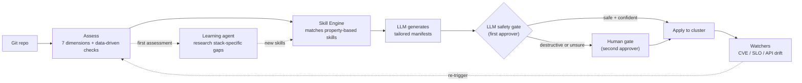

<p align="center">
  
</p>

<p align="center">
  
  
  
  
</p>

<p align="center"><b>An agent-powered platform that assesses, hardens, and continuously operates applications on Red Hat OpenShift — turning an MVP repo into an enterprise-ready, self-healing workload.</b></p>

---

Point AgentIT at a Git repository and it will:

1. **Assess** the repo across 7 enterprise-readiness dimensions and produce a scored report.
2. **Generate** Kubernetes/Helm/Tekton/Argo manifests to close the gaps — via property-based skills (LLM-tailored) backed by a fleet of specialized agents.
3. **Onboard** the app onto the cluster through a human-gated or (optionally) fully autonomous apply pipeline, with an LLM safety gate that fails closed.
4. **Operate** it going forward — watching for CVEs, SLO breaches, API drift, and GitOps drift, then closing the loop by re-assessing, re-generating, and re-applying fixes.
5. **Learn** from outcomes — the learning agent researches CVEs and best practices, generates new skills, and deprecates ineffective ones.

## Table of Contents

- [Why AgentIT](#why-agentit)
- [Architecture, at a glance](#architecture-at-a-glance)
- [Skills & check engine](#skills--check-engine)
- [The agent fleet](#the-agent-fleet)
- [Self-improvement loop](#self-improvement-loop)
- [Web portal](#web-portal)
- [Getting started](#getting-started)
  - [CLI](#cli)
  - [Portal (local)](#portal-local)
- [Configuration](#configuration)
- [Deploying to OpenShift](#deploying-to-openshift)
- [Testing](#testing)
- [Security notes](#security-notes)
- [Repository layout](#repository-layout)
- [License](#license)

## Why AgentIT

AI makes building software trivial — a team can go from idea to working MVP in days. But that MVP is a liability: no security posture, no observability, no compliance evidence, no CI/CD. The gap between "it works" and "it's enterprise-ready" takes 10x longer than building the app itself and requires specialized expertise most organizations can't scale.

AgentIT treats that work as something a fleet of specialized agents and property-based skills can plan and generate, with a human (or an LLM safety gate) approving anything destructive before it touches a live cluster.

It is built to run **on** OpenShift, **for** OpenShift: Argo CD for GitOps, Argo Rollouts for canary delivery, Tekton for CI, Argo Events + Kafka for the event-driven loop, and OLM Subscriptions for any operator dependencies the generated manifests need.

## Architecture, at a glance



The real system has more moving parts — an event-driven path via Kafka + Argo Events, platform context discovery, canary delivery via Argo Rollouts, and conflict resolution. **See [`docs/architecture.md`](docs/architecture.md) for full diagrams.**

## Skills & check engine

AgentIT uses two complementary systems for assessment and remediation:

### Property-based skills (40 skills across 11 domains)

Skills are Markdown files with YAML frontmatter that define **what must be true** (properties), not how to generate manifests. The skill engine matches skills to assessment findings; the LLM generates tailored fixes using the skill's constraints and the app's platform context. `FleetOrchestrator` builds and passes an LLM client into the skill engine on every run (CLI, portal, and webhook onboarding alike) whenever `ANTHROPIC_API_KEY`/`ANTHROPIC_VERTEX_PROJECT_ID` is configured, so LLM-only skills (no template block — e.g. `network-policy`, `containerfile`, `tekton-pipeline`) actually produce tailored output in production, not just template substitution.

```
skills/
├── security/       # network-policy, rbac, containerfile, security-context, resource-limits, image-scan-task
├── observability/   # service-monitor, grafana-dashboard, alerting-rules, otel-collector
├── cicd/            # tekton-pipeline, argocd-application, argo-rollout
├── compliance/      # kyverno-policies, audit-policy, sbom-task, compliance-evidence, image-registry-policy, compliance-cronjob
├── infrastructure/  # hpa, pdb, resourcequota, limitrange, namespace
├── cost/            # vpa, cost-labels, cost-cronjob
├── dependency/      # renovate-config, dependabot-config, dependency-cronjob
├── incident/        # runbook, pagerduty-config, alertmanager-config
├── release/         # analysis-template, rollout-patch, rollback-policy, release-runbook
├── retirement/      # decommission-plan, cleanup-task, data-archive-job
└── custom/          # learning-agent-generated skills
```

Skills have lifecycle management: `draft` → `active` → `deprecated` → `retired`. The API drift detector auto-deprecates skills when their target APIs are removed from the cluster. Low-effectiveness skills (< 30% human approval rate) are flagged for review.

### Data-driven checks (20 checks across 7 dimensions)

YAML check files in `checks/` define declarative rules that supplement the Python analyzers. Check types: `file_exists`, `file_contains`, `file_missing`, `yaml_kind_exists`, `yaml_kind_missing`. The learning agent can create new checks without touching Python code.

```
checks/
├── security/         # containerfile, network-policy, secrets-scanning
├── observability/    # health-check, metrics-endpoint, structured-logging
├── cicd/             # ci-pipeline, dockerfile, gitops
├── compliance/       # admission-policies, license, sbom
├── infrastructure/   # helm-chart, k8s-manifests, resource-quota
├── ha_dr/            # hpa, pdb, replicas
└── data_governance/  # backup-config, retention-policy
```

### Catalog change tracking

Additions and removals to the `skills/`/`checks/` catalog are no longer only visible via `git log` — `skill_inventory.py` snapshots the catalog (by `(domain, name)` / `(dimension, name)` identity, so status-only transitions like `active → deprecated` aren't double-counted alongside the existing `skill-activated` event) and diffs it against the last saved snapshot once an hour from the portal's background maintenance loop. Every skill/check added or removed is logged as a `skill-added` / `skill-removed` / `check-added` / `check-removed` event, which shows up automatically on the **Events** feed (`/events`) and in a "Recent Catalog Changes" section on the **Capabilities** page.

## The agent fleet

12 one-shot onboarding agents and 3 long-lived watchers. Skills run **first** as the primary generation path; Python agents supplement for findings that no skill covers.

Conflict detection only flags *real* collisions between agent outputs — a known-conflicting resource-kind pair actually being generated for the same workload (e.g. an actively-resizing VPA alongside an HPA), or two agents writing a file at the same output path — not merely "both agents succeeded". `plan.auto_approve` (computed from score/criticality at plan time) is downgraded to `False` if a real conflict is found during the actual run, so it can be trusted end-to-end.

| Agent | Category | Always runs? | Generates |
|---|---|---|---|
| **HardeningAgent** | `security` | Yes | NetworkPolicy, Containerfile, RBAC, SecurityContext |
| **ObservabilityAgent** | `observability` | Yes | ServiceMonitor, Grafana dashboard, alerting rules, OTel config |
| **CICDAgent** | `cicd` | Yes | Tekton Pipeline, Argo CD Application, Argo Rollout |
| **ComplianceAgent** | `compliance` | Yes | Namespaced Kyverno Policy, SBOM task, compliance evidence |
| **InfrastructureAgent** | `infrastructure` | Yes | HPA, PDB, ResourceQuota, LimitRange, Namespace |
| **ReleaseCoordinatorAgent** | `release` | Yes | AnalysisTemplate, rollout patch, rollback policy |
| **DependencyAgent** | `dependency` | high/critical | Dependency report, Renovate config, CVE-scan CronWorkflow |
| **IncidentAgent** | `incident` | high/critical | Incident runbook, PagerDuty config, Alertmanager routing |
| **CostOptimizationAgent** | `cost` | high/critical | Cost report, right-sizing, cost labels |
| **ChaosAgent** | `chaos` | not critical | LitmusChaos experiments |
| **RetirementAgent** | `retirement` | score < 30 | Decommission plan, cleanup, data archive |

Long-lived watchers (deployed as separate pods):

| Watcher | Loop | Role |
|---|---|---|
| **vuln-watcher** | 6h | Fleet CVE monitoring, triggers remediation |
| **slo-tracker** | 5m | Collects fresh `availability`/`error_rate` metrics from the cluster (via `slo_collector`; `latency_p99_ms` has no collector yet and is skipped/logged, not silently ignored) for every tracked SLO, checks breaches with the correct per-metric direction (`availability` = higher is better; `error_rate`/`latency_p99_ms` = lower is better), publishes breach alerts, and opens rollback gates |
| **drift-detector** | 10m | Argo CD sync monitoring, API drift detection, auto-deprecation of affected skills, reports still-in-use deprecated APIs (`PlatformContext.deprecated_apis`) |
| **skill-learner** | 24h | Researches CVEs via LLM, drafts new skills for human review — opt-in via `agents.skillLearner.enabled` (chart default: disabled; enabled on the live deployment via `argocd/application.yaml`), requires an LLM connection |

## Self-improvement loop

AgentIT improves itself through three tiers of learning:

1. **Feedback loop** — tracks human decisions (approve/reject/modify) on generated fixes. Skills with < 30% approval rate are flagged for review on the Insights page, though a human still decides whether to act on that flag. Agents query the feedback store before generating to avoid repeating rejected patterns.

2. **Learning agent** — researches CVEs and best practices via LLM and generates draft skills that go through human review before activation. Runs automatically every 24h via the `skill-learner` watcher (chart default: disabled — enable with `agents.skillLearner.enabled=true`; currently enabled on the live deployment via `argocd/application.yaml`), and can also be triggered on demand from the Capabilities page ("Research CVEs & Generate Skills") or via `agentit learn` / `agentit learn-for` on the CLI. Draft skills get an "Activate" button right next to them on the Capabilities page — the full research → draft → human-review → active loop runs end-to-end in the portal, no CLI required.

3. **Platform awareness** — `PlatformContext` discovers the cluster's K8s version, available APIs, CRDs, and operators. Every skill generation includes this context. The API drift detector auto-deprecates a skill specifically when the API kind it generates has been removed from the cluster (a narrower guarantee than the effectiveness-based flagging in tier 1).

## Web portal

`agentit portal` launches a FastAPI + Jinja2 app (htmx + Alpine.js for interactivity, no frontend framework). 56+ routes.

Key pages:

| Page | Purpose |
|---|---|
| **Fleet** | Dashboard of all managed apps with scores and lifecycle stage |
| **Assessment Detail** | 7-dimension scores, lifecycle stepper, score trend, timeline, remediation items |
| **Gates** | Human approval queue with LLM reasoning, confirm/reject with reason |
| **Insights** | Fleet stats, agent performance, low-effectiveness skills, learning feedback |
| **Capabilities** | Skills/checks catalog, onboarding agents, watchers, and the "Research CVEs & Generate Skills" trigger. Tabbed with **Agents** (live registry of who's actually run, and their success rate) |
| **Events** | Activity feed with DLQ for failed events |
| **Health** | Rollout/pod/pipeline status |
| **SLOs** | SLO definitions and error budgets |
| **Settings** | Auto-mode toggle, decision matrix, configuration. Tabbed with **Schedules** (watcher status, cron jobs) |

Webhook endpoints power the event-driven loop: `/api/webhook/assess`, `/api/webhook/github-push`, `/api/webhook/onboard`, `/api/webhook/auto-apply`, `/api/webhook/remediate`.

## Getting started

Requires **Python >= 3.12**. Uses [`uv`](https://docs.astral.sh/uv/) for dependency management (a `pyproject.toml` + `uv.lock` are provided; plain `pip install -e ".[dev]"` also works).

```bash
git clone https://github.com/alimobrem/AgentIT.git
cd AgentIT
uv sync --extra dev
```

### CLI

```bash
# Score a repo across all 7 dimensions
uv run agentit assess https://github.com/some-org/some-app --format terminal

# Generate hardening manifests
uv run agentit harden https://github.com/some-org/some-app --output-dir ./out

# Full pipeline: assess + plan + run agents + skills + validate + summarize
uv run agentit orchestrate https://github.com/some-org/some-app --output-dir ./out

# assess + orchestrate + write assessment.json
uv run agentit onboard https://github.com/some-org/some-app --output-dir ./out

# Continuously re-assess on an interval
uv run agentit watch https://github.com/some-org/some-app --interval 3600

# Re-assess every currently-tracked fleet app once and exit (for CronJobs --
# the CronJob's own schedule controls periodicity, not an internal loop).
# Works on both `watch` and `assess`; `--dimension` optionally scopes the
# per-app finding count reported (e.g. only compliance findings).
uv run agentit watch --rescan
uv run agentit assess --rescan --dimension compliance

# Dogfood: assess AgentIT's own repo
uv run agentit self-assess

# Self-fix loop: assess → skill engine generates → LLM reviews → verify → PR
uv run agentit self-fix . --create-pr

# Learn new skills from CVE/best-practice research
uv run agentit learn --source cves --limit 5

# Targeted learning from an app's specific stack
uv run agentit learn-for https://github.com/some-org/some-app

# Test a skill loads, matches, and generates valid output
uv run agentit test-skill skills/security/network-policy.md

# Promote a draft skill to active
uv run agentit activate-skill skills/custom/new-skill.md
```

Add `--llm` to enable Claude-backed reasoning, or `--no-llm` to force it off (otherwise auto-detected from `ANTHROPIC_API_KEY` / `ANTHROPIC_VERTEX_PROJECT_ID`).

Agent containerization: agents can run as K8s Jobs with `--profile lightweight|standard|full` and `--agents` filter. Set `AGENT_MODE=kubernetes` to dispatch agents as Jobs instead of local threads.

### Portal (local)

```bash
uv run agentit portal --port 8080
# open http://localhost:8080
```

The portal uses a local SQLite file (`agentit.db` by default) — no external database required for local use.

## Configuration

All configuration is via environment variables (no config file). Nothing here belongs in `values.yaml` or any committed file — see [Security notes](#security-notes).

<details>
<summary><b>Environment variables</b> (click to expand)</summary>

| Variable | Used by | Purpose |
|---|---|---|
| `ANTHROPIC_API_KEY` | `llm.py` | Direct Anthropic API auth (alternative to Vertex) |
| `ANTHROPIC_VERTEX_PROJECT_ID` + `CLOUD_ML_REGION` | `llm.py` | Use Claude via Vertex AI instead of the direct API |
| `AGENTIT_LLM_MODEL` | `llm.py` | Override LLM model (default from env) |
| `GITHUB_TOKEN` | `portal/github_pr.py` | Required for PR creation, infra-repo management, webhook registration |
| `AGENTIT_DB_PATH` | `portal/store.py` | SQLite file path (default `agentit.db`) |
| `AGENTIT_KAFKA_BOOTSTRAP` | `events.py`, `consumer.py` | Kafka bootstrap servers; publisher/consumer no-op gracefully if unset |
| `AGENTIT_AUTO_MODE` | `automode.py` | `1`/`true`/`on` to enable autonomous apply (also togglable at runtime via `/settings`) |
| `AGENTIT_PORTAL_URL` | `remediation_loop.py` | Base URL the remediation loop calls back into (default `http://localhost:8080`) |
| `AGENT_MODE` | `orchestrator.py` | `local` (default) or `kubernetes` — run agents as K8s Jobs |
| `GOOGLE_APPLICATION_CREDENTIALS` | Vertex SDK | Path to mounted GCP credentials JSON |

</details>

## Deploying to OpenShift

AgentIT deploys itself the same way it onboards other apps — via the Helm chart in `chart/` and the Argo CD `Application` in `argocd/application.yaml`. **Argo CD is the sole deployer**; see [`docs/deployment.md`](docs/deployment.md) for the full operational runbook.

- Change behavior: edit `argocd/application.yaml` Helm parameters, commit, push. The CI pipeline's `notify-argocd` task re-applies this file to the live `Application` object on every run (before re-pinning `image.tag`), so the parameter list stays in sync automatically — no manual `oc apply` needed. See [`docs/deployment.md`](docs/deployment.md) for the details and why this exists.
- Change a secret: `oc create secret` on-cluster, then reference it via a Helm parameter. Never in Git.
- Never `helm upgrade` manually or `oc edit` the `Rollout`.

Key `chart/values.yaml` feature flags: `rollout.enabled` (canary via Argo Rollouts), `kafka.enabled` / `argoEvents.enabled` (event-driven loop), `tektonCI.enabled` (build pipeline), `cronJobs.cveScan.enabled`, and `agents.{vulnWatcher,sloTracker,driftDetector}.enabled`.

The chart includes: NetworkPolicy, ResourceQuota, LimitRange, PodDisruptionBudget, anti-affinity, backup CronJob, dedicated ServiceAccount (not `default`), and a self-assess step in the CI pipeline.

The `Route` sets `haproxy.router.openshift.io/timeout: 200s` because `/capabilities/learn` runs synchronous CVE research that can take up to 180s server-side — the router's 30s default would otherwise kill the connection with a 504 before the backend responds.

See the full deployment topology diagram: [`docs/architecture.md#deployment-topology-openshift`](docs/architecture.md#deployment-topology-openshift).

## Testing

```bash
uv run pytest -q
```

787 tests across 65 test files:

| Suite | Tests | What it covers |
|---|---|---|
| Unit tests | ~600 | Analyzers, agents, orchestrator conflict/gate logic, portal routes, SQLite store, Helm templates |
| LLM evals | 17 | Safety classification, fix review quality, generation correctness, learning agent, architecture summary |
| Browser tests | 49 | Playwright end-to-end tests for all portal pages |
| Performance tests | 22 | Response time assertions on portal endpoints |
| API contract tests | 14 | JSON response shape validation |
| Template rendering | 16 | HTML rendering correctness |
| Webhook security | 9 | Auth, SSRF, replay protection |
| Fleet tests | 5 | Multi-app fleet operations |
| Containerization | 22 | K8s Job agent dispatch |
| Futureproof | 16 | Platform context, skill lifecycle, API drift |
| Durability | 12 | Circuit breaker, TTL cache, error recovery |
| Check engine | ~15 | Data-driven check loading, each check type, integration |
| Skill validation | ~15 | All 40 skills load, valid frontmatter, generate valid YAML |

Additional test markers: `--run-real-repos` (clone live GitHub repos), `--live-cluster` (e2e against OpenShift), `--browser-tests` (Playwright), `--run-llm-evals` (requires API key).

## Security notes

- **No authentication is currently implemented in the portal.** Every route is unauthenticated. Run behind a trusted network boundary until portal auth is added (Keycloak integration planned).
- **GitHub webhooks are not signature-verified.** Treat the webhook endpoint as trusted-network-only, or add HMAC verification before exposing publicly.
- **Secrets never belong in Git.** See [Configuration](#configuration) and `docs/deployment.md`.
- **Destructive actions are LLM-gated and fail closed.** `automode.py` only auto-applies when the orchestrator approves *and* the LLM classifies the change as non-destructive with >= 0.8 confidence; if the LLM is unavailable, unconfident, or flags a risk, the change is gated for human review.
- **Manifests are validated before being trusted.** `agents/base.py::validate_manifest()` checks every generated YAML, and `cluster_apply.py` runs a `--dry-run=client` pass before any real apply.
- **SSRF prevention.** `cloner.py` rejects private IPs, localhost, and internal DNS suffixes. `portal/helpers.py::safe_url()` rejects protocol-relative URLs.
- **Circuit breakers.** LLM and Kubernetes API clients use circuit breakers (`CircuitBreaker` in `portal/helpers.py`) to prevent cascading failures.

## Repository layout

<details>
<summary><b>Full source tree</b> (click to expand)</summary>

```
AgentIT/
├── src/agentit/                    # ~21K lines across 71 Python files
│   ├── cli.py                      # click CLI: 15+ commands (assess, harden, onboard, orchestrate,
│   │                               #   watch, portal, self-assess, self-fix, learn, learn-for,
│   │                               #   test-skill, activate-skill, run-agent, vuln-watch, slo-track,
│   │                               #   drift-detect, consume)
│   ├── runner.py                   # run_assessment(): stack detection + analyzers + check engine
│   ├── skill_engine.py             # Property-based skill matching, lifecycle, LLM generation
│   ├── check_engine.py             # Data-driven YAML check loader and runner
│   ├── skill_inventory.py          # Snapshot/diff skills+checks catalog, log added/removed events
│   ├── learning_agent.py           # CVE/best-practice research, skill generation
│   ├── platform_context.py         # Cluster API discovery (K8s version, CRDs, operators)
│   ├── api_drift_detector.py       # Snapshot-based API surface comparison
│   ├── assessment_diff.py          # Compare two reports, find new/resolved findings
│   ├── property_verifier.py        # Verify skill properties hold after generation
│   ├── dependency_manager.py       # Dependency lifecycle management
│   ├── resource_tuner.py           # Resource right-sizing recommendations
│   ├── llm.py                      # Claude client (Anthropic/Vertex), safety gate, fail-open
│   ├── automode.py                 # LLM-gated auto-apply (fail-closed)
│   ├── remediation_loop.py         # detect → assess → onboard → apply → verify pipeline
│   ├── cloner.py                   # Shallow git clone with SSRF prevention
│   ├── models.py                   # Pydantic models
│   ├── events.py / consumer.py     # Kafka publisher/consumer (no-op if unavailable)
│   ├── image_builder.py            # Tekton-driven image build
│   ├── kube.py                     # K8s client with TTL cache, Job dispatch — the single,
│   │                               #   mockable interface for cluster ops (core/apps/batch/custom
│   │                               #   objects); `apply_yaml` is the one remaining `oc` subprocess
│   ├── analyzers/                  # 7 read-only analyzers + stack detector + shared base
│   ├── agents/                     # 11 agents + orchestrator + capabilities registry
│   │   ├── orchestrator.py         # FleetOrchestrator: skills-first, agents supplement
│   │   ├── capabilities.py         # Agent registry with resource tiers
│   │   └── base.py                 # Shared contract: Agent(report, output_dir).run()
│   ├── watchers/                   # Long-lived watcher agents
│   └── portal/
│       ├── app.py                  # FastAPI routes (56+), async assessment, lifecycle stages
│       ├── store.py                # SQLite persistence (12+ tables: assessments, events, gates,
│       │                           #   SLOs, remediations, skill_effectiveness, agent_feedback,
│       │                           #   processed_webhooks)
│       ├── helpers.py              # CircuitBreaker, clone_assess_cleanup, safe_url
│       ├── cluster_apply.py        # oc/kubectl apply with pre-flight checks
│       ├── github_pr.py            # GitHub REST API integration
│       └── templates/              # 25 Jinja2 templates (htmx + Alpine.js)
├── skills/                         # 40 property-based skill definitions (11 domains)
├── checks/                         # 20 data-driven YAML check files (7 dimensions)
├── chart/                          # Helm chart (30+ templates: Rollout, Services, Route, RBAC,
│                                   #   NetworkPolicy, ResourceQuota, LimitRange, PDB, Tekton,
│                                   #   Kafka, Argo Events, watcher agents, backup CronJob)
├── argocd/application.yaml         # Argo CD Application for self-deployment
├── docs/
│   ├── architecture.md             # System diagrams, pipeline, event loop, agent fleet
│   └── deployment.md               # GitOps operational rules
├── Containerfile                   # UBI9 Python 3.12, HEALTHCHECK, non-root
└── tests/                          # 787 tests across 65 files
```

</details>

## License

[MIT](LICENSE)
