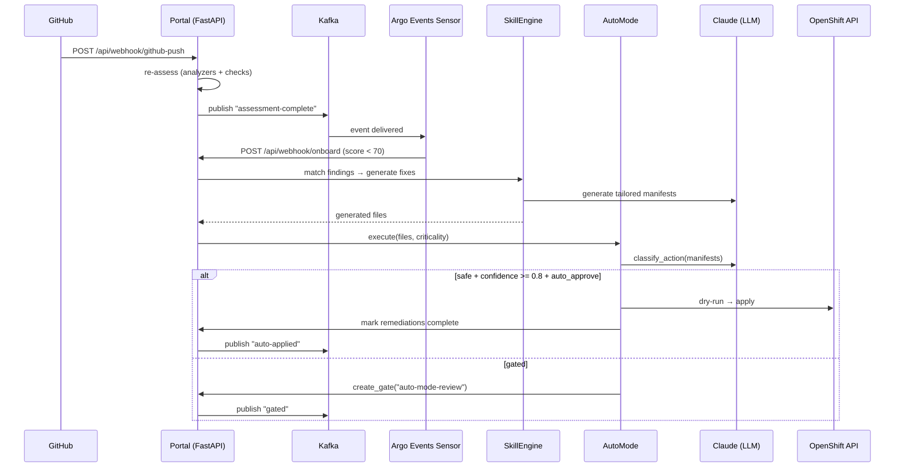
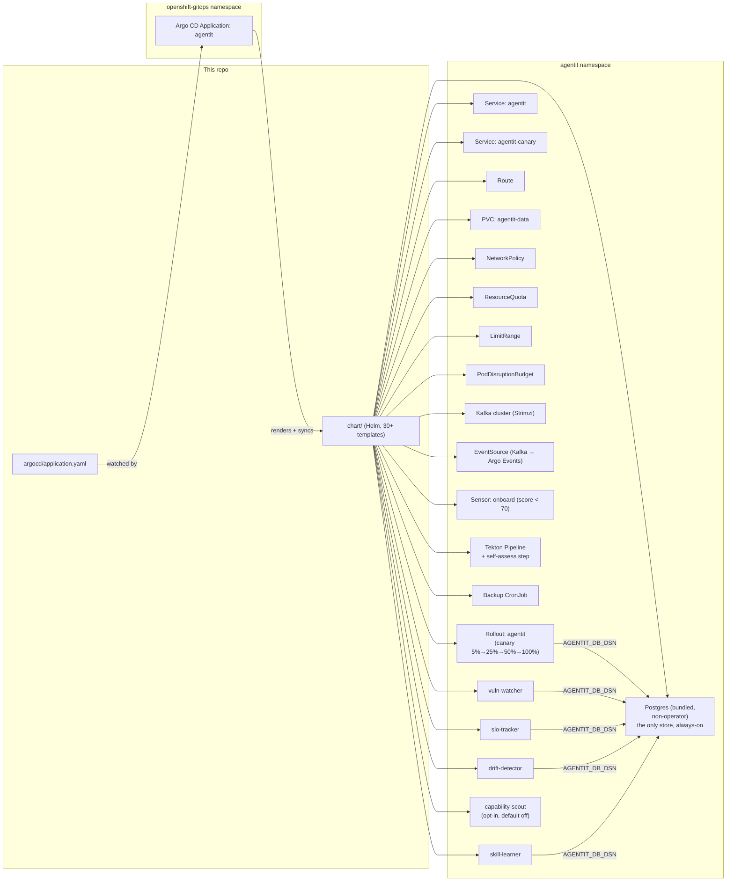

# Architecture

This doc covers how AgentIT is put together: the system components, the assessment/onboarding pipeline, the skill engine, the self-improvement loop, and how it deploys itself on OpenShift. For setup and usage, see the [README](../README.md).

## Table of Contents

- [System overview](#system-overview)
- [Cluster access (`kube.py`)](#cluster-access-kubepy)
- [Assessment pipeline](#assessment-pipeline)
- [Data model: assessments vs. apps](#data-model-assessments-vs-apps)
- [Skill engine & check engine](#skill-engine--check-engine)
- [Self-improvement loop](#self-improvement-loop)
- [Autonomous remediation loop](#autonomous-remediation-loop)
- [Platform awareness & API drift](#platform-awareness--api-drift)
- [Deployment topology (OpenShift)](#deployment-topology-openshift)
- [The agent fleet](#the-agent-fleet)
- [Assessment dimensions](#assessment-dimensions)

## System overview

```mermaid
graph TB
    subgraph Sources["Sources"]
        Repo["Target Git repo"]
        GH["GitHub API\n(PRs, webhooks)"]
    end

    subgraph Core["AgentIT Core (src/agentit)"]
        CLI["CLI\n(click, 15+ commands)"]
        Portal["Portal\nFastAPI + Jinja2\n98 routes"]
        Cloner["cloner.py\nshallow clone + SSRF prevention"]
        Runner["runner.py\nrun_assessment()"]
        Analyzers["7 Analyzers\n(security, observability, cicd,\ninfra, compliance, data-gov, ha/dr)"]
        CheckEngine["CheckEngine\n20 YAML checks"]
        SkillEngine["SkillEngine\n45 property-based skills"]
        Orchestrator["FleetOrchestrator\nskills-first, agents supplement"]
        Agents["Optional codechange\n(source patches) + skills"]
        AutoMode["AutoMode\nLLM safety gate (fail-closed)"]
        RemLoop["remediation_loop.py\ndetect→fix→apply→verify"]
        LLM["LLM client\nClaude (Anthropic / Vertex)\ncircuit breaker"]
        Learning["Learning Agent\nCVE research, skill generation"]
        Platform["PlatformContext\nK8s version, APIs, CRDs, operators"]
        DriftDetector["API Drift Detector\nsnapshot comparison"]
        Delivery["delivery.py\nroute_and_deliver() -- one router for\nevery apply/PR/gate path"]
        CapScout["capability_scout.py\nself-improvement of AgentIT's OWN\ncode -- separate from the skills loop"]
        Store[("AssessmentStore\n19 tables\nPostgres/asyncpg (the only\nsupported store)")]
    end

    subgraph Cluster["OpenShift Cluster"]
        ArgoCD["Argo CD\n(GitOps sync)"]
        Rollout["Argo Rollouts\n(canary)"]
        Kafka["Kafka (Strimzi)\nagentit-events / alerts"]
        ArgoEvents["Argo Events\nEventSource + Sensors"]
        Tekton["Tekton\n(build/push pipeline)"]
        Watchers["5 watchers\nvuln / slo / drift /\nskill-learner / capability-scout"]
        Target["Onboarded app"]
    end

    Repo -->|"clone"| Cloner --> Runner
    Runner --> Analyzers & CheckEngine
    Analyzers & CheckEngine --> Runner
    CLI & Portal --> Runner
    Runner -->|"AssessmentReport"| Orchestrator
    Orchestrator --> SkillEngine -->|"LLM-tailored"| LLM
    Orchestrator --> Agents
    SkillEngine -->|"platform context"| Platform
    SkillEngine & Agents -->|"generated files"| Store
    AutoMode -->|"classify action"| LLM
    AutoMode -->|"apply/PR decision"| Delivery
    Portal --> Store
    Portal -->|"apply/PR decision"| Delivery
    Delivery -->|"direct apply"| Cluster
    Delivery -->|"commit + PR\n(GitOps-registered apps)"| GH
    RemLoop -->|"calls portal webhooks"| Portal
    Learning -->|"research"| LLM
    Learning -->|"new skills/checks"| SkillEngine & CheckEngine
    CapScout -->|"reads own fleet telemetry\n+ docs/*.md gaps"| Store
    CapScout -->|"propose ONE change"| LLM
    CapScout -->|"draft PR against\nAgentIT's own repo"| GH
    DriftDetector -->|"auto-deprecate"| SkillEngine
    DriftDetector -->|"snapshot"| Platform

    ArgoCD -->|"renders chart/"| Target
    ArgoCD --> Rollout
    Tekton -->|"build & push"| Target
    Kafka <--> ArgoEvents
    ArgoEvents -->|"score < 70 → onboard"| Portal
    Portal -->|"events"| Kafka
    Watchers <--> Kafka
```



`AutoMode`/`Portal` used to call `cluster_apply.py`/`github_pr.py` directly
and independently for every delivery decision; both now funnel through
`delivery.py::route_and_deliver()` (the "Unified apply flow" — see the
README section of the same name, and `docs/unified-apply-flow.md`, now
marked implemented). `capability_scout.py` is a distinct, opt-in loop from
`Learning`/`skill-learner` above — it improves AgentIT's *own* codebase
(portal routes, watchers, CLI), not the skills catalog AgentIT generates
for onboarded apps; see `docs/self-improvement-for-agentit.md`.

## Cluster access (`kube.py`)

Every read or write against the cluster goes through `agentit/kube.py`, a thin
wrapper around the official `kubernetes` Python client (`core_v1()`, `apps_v1()`,
`batch_v1()`, `custom_objects()`, plus higher-level helpers like
`list_custom_resources`/`get_custom_resource`/`create_custom_resource`/
`patch_custom_resource` for CRDs such as Argo CD Applications/ApplicationSets,
Argo Rollouts, Tekton PipelineRuns, and OLM CSVs/Subscriptions). This is a
deliberate architectural rule, not just a convenience: `kube.py` is the one
place that needs a Kubernetes client mocked in tests, so unit tests never
depend on `oc`/`kubectl` being installed or a cluster being reachable — and
never risk mutating a real cluster when a test author forgets to mock
something (this happened once: an unmocked `subprocess` `oc apply` call
polluted a live cluster with ~180 fake Tekton PipelineRuns).

`kube.apply_yaml()` no longer shells out to `oc` at all — it resolves each
document in an arbitrary, multi-document manifest (spanning both core kinds
and CRDs) to its REST resource via the Kubernetes Python client's dynamic-
client discovery, then applies it with `content_type="application/apply-patch+yaml"`
and an explicit `field_manager`, matching `oc apply --server-side`'s wire
format through the real client instead of a subprocess. A genuine
field-manager conflict (HTTP 409) returns a structured, distinguishable
result (`conflict: True`, `conflict_details: [...]`) rather than silently
retrying with `force` — every apply path (`AutoMode`, `route_and_deliver()`,
gate resolution) routes a real conflict to a dedicated `cluster-conflict-review`
gate instead. This was the one remaining `oc`-subprocess exception noted in
an earlier version of this doc; it was closed as part of the "Unified apply
flow" work (`docs/unified-apply-flow.md`, now implemented) — see that doc's
"Real per-field-manager server-side-apply" section for the full rationale.

## Assessment pipeline

This is what happens for a single `assess` / `onboard` run (CLI, portal, or webhook — same code path).

```mermaid
flowchart TD
    A["Repo URL"] --> B["cloner.py: shallow clone\n(SSRF prevention)"]
    B --> C["StackDetector\nlanguages, frameworks, DBs, runtimes"]
    B --> D["7 Python Analyzers\n(read-only)"]
    B --> E["CheckEngine\n20 YAML checks"]
    C & D & E --> F["AssessmentReport\noverall_score, criticality,\nremediation_plan"]
    F -->|"optional"| G["LLM: summarize_architecture()"]
    G --> F

    F --> H["FleetOrchestrator.plan()"]
    H --> I{"Select agents by\ncriticality + score"}
    I --> J["Skills run FIRST\n(property-based, LLM-tailored\nwhen ANTHROPIC_API_KEY/\nANTHROPIC_VERTEX_PROJECT_ID configured)"]
    J --> K["Python agents supplement\n(uncovered findings only)"]
    J & K --> L["validate_manifest()\non every output"]
    L --> M["_detect_conflicts()\nreal collisions only:\nknown kind conflicts (VPA vs HPA)\nor output-path collisions"]
    M --> N{"plan.auto_approve?\nnot high/critical + no critical findings\n+ score >= 70 + no real conflicts this run"}
    N -->|"yes"| O["AUTO-APPROVED"]
    N -->|"no"| P["Gates created:\nsecurity-review\ndeploy-approval\nfinal-approval"]
    O & P --> Q["orchestration-summary.md"]

    Q --> R["delivery.py::route_and_deliver()\none router for every entry point:\nmanual Deliver, gate-approve, AutoMode, DriftDetector"]
    R -->|"known infra repo (mandatory)"| S["commit to infra repo + PR\n(github_pr.py, never auto-merged) --\nsame for CI/CD → shared operator namespace,\nvia its own distinct branch/path/gate"]
    R -->|"no infra repo known\n(legacy pre-mandatory-GitOps only)"| T["refuse -- no direct-apply fallback\n(register for GitOps first)"]
    ```

Every path that used to independently decide "apply now" (manual apply,
gate-approve, `AutoMode`, `DriftDetector`) now funnels through this one
router — see "Unified apply flow" in the README and
`docs/unified-apply-flow.md` (marked implemented) for the full taxonomy of
what gets routed where and why.

## Data model: assessments vs. apps

`store.py` persists two conceptually different kinds of data, and keeping them straight matters:

- **Assessment-scoped**: genuinely tied to one specific run -- `overall_score`, `report_json` (scores/findings), `onboarding_results`, `apply_results`, `remediations`, `deliveries`, `agent_runs`, `check_results`. A fresh `save()` correctly creates a brand-new row for each of these; there's no "carry forward" bug possible because there's nothing to carry -- each run's own data is what should be shown for that run.
- **App-scoped**: a fact about the APP that outlives any single assessment -- `infra_repo_url` (is this app GitOps-registered, and where), pending gates (a still-open approval doesn't stop being open just because the app was re-assessed), SLO definitions (a threshold set once at onboarding, meant to persist across every future re-assessment).

Two real bugs this session had the exact same root shape: `infra_repo_url` and pending-gate visibility were both stored/queried as if scoped to a single `assessment_id`, when they're actually app-level facts, keyed by `repo_url`, that persist across many assessments over time. A third (SLO definitions going invisible on the SLOs page/`fleet_slos()`/the post-delivery SLO-watch tail the moment an app is re-assessed) was found and fixed the same session, once the pattern was recognized.

**The decision made here: introduce a real `apps` table for genuinely scalar app-level facts, and a documented, reusable `repo_url`-join convention for app-level *collections*.**

- **`apps`** (keyed by `repo_url`) is the single, always-current source for facts that are exactly one value per app -- today just `infra_repo_url`. `save()` and `set_infra_repo_url()` both upsert into it (`_upsert_app()`); `_last_known_infra_repo_url()` and `get_fleet_data()` both read from it directly, an O(1) lookup instead of the original fix's O(history) `report_json` scan across every past assessment (which also needed backend-specific JSON syntax -- `json_extract` vs `->>` -- to keep in parity, exactly the kind of thing that's already drifted once this session for `get_agent_stats()`/`export_all()`). A one-time backfill (`INSERT OR IGNORE ... SELECT ... FROM assessments GROUP BY repo_url`, same "most recent non-null value wins" logic the original fix used) populates `apps` from any pre-existing `assessments` history on first startup with this code; it's a no-op on every subsequent startup once every app has a row.
- **Gates and SLOs stay in their own tables** (`gates`, `slos`), each still keyed by `assessment_id` (so a specific gate/SLO can still be traced back to when/why it was created) -- but `list_gates_for_assessment()`/`list_slos()`/`delete_slo()` all resolve the *app* a query is really about via a `repo_url` subquery/join back through `assessments`, not an exact `assessment_id` match. This is the reusable convention: any per-app collection that's created under one assessment but must stay visible/actionable across every later re-assessment of that same app uses this join shape.

**Why not put gates/SLOs in (or under) `apps` too?** They're genuine *collections* (many gates, many SLOs, per app) with their own lifecycle (created, resolved/expired, deleted) -- moving them under `apps` wouldn't remove the need for a join, it would just move the join target from `assessments` to `apps`, no simpler. The `repo_url`-join is already the right shape for "this collection item belongs to app X regardless of which assessment created it"; `apps` is the right shape for "this app has exactly one current value of fact Y". Using each for what it's actually good at, rather than forcing everything into one new table, is the more honest data model.

**Known, deliberately-not-fixed gap: `criticality`.** It has the same app-vs-assessment shape (a business-criticality tag that should persist across re-assessments) but a fix analogous to `infra_repo_url`'s isn't safe to make the same way: `infra_repo_url` had a `None` sentinel throughout its whole call chain (`AssessmentReport.infra_repo_url: str | None`) that cleanly distinguished "not supplied, carry forward" from "explicitly supplied, don't." `criticality: str` has no such sentinel -- every caller (the assess form, every webhook handler, `runner.run_assessment`) already defaults a missing value to `"medium"` before it ever reaches `store.save()`, so `store.py` alone can't tell "the human explicitly chose medium" apart from "nothing was known, so it defaulted to medium." Fixing this properly would mean making `criticality` optional end-to-end through `models.py`, `runner.py`, every webhook handler, and every template that reads `report.criticality` directly -- a much larger, separate change, not something to smuggle into a store-layer schema migration. Flagged here so the next person who touches criticality doesn't have to rediscover this.

## Skill engine & check engine

### Skill engine (`skill_engine.py`)

Skills are Markdown files with YAML frontmatter. They define properties (what must be true), not templates (how to generate). `FleetOrchestrator.run()` builds an `LLMClient` (same pattern as `cli.py`'s `_resolve_and_assess`, gracefully falling back to `None` if credentials aren't configured or init fails) and passes it into `SkillEngine.run_all()` for every onboarding run — CLI, portal, and webhook paths all get LLM-tailored generation, not just template substitution, whenever `ANTHROPIC_API_KEY`/`ANTHROPIC_VERTEX_PROJECT_ID` is configured. The LLM generates tailored manifests using:

- The skill's property, constraints, and key decisions
- The assessment report (stack, findings, criticality)
- Platform context (K8s version, available APIs, CRDs, operators)
- Feedback history (what was approved/rejected before)

Skill lifecycle: `draft` → `active` → `deprecated` → `retired`

- `draft`: created by learning agent, not matched until promoted
- `active`: matched and used for generation
- `deprecated`: matched with warning, superseded_by field points to replacement
- `retired`: never matched, kept for history

Skills have: `conflicts_with` (priority resolution), `requires_crd` (skip if CRD not on cluster), `source` (manual/learning-agent), `effectiveness` tracking.

### Check engine (`check_engine.py`)

YAML check files define declarative rules:

| Check type | What it checks |
|---|---|
| `file_exists` | A file matching a glob pattern exists in the repo |
| `file_contains` | A file's content matches a regex |
| `file_missing` | No file matches a glob (triggers finding) |
| `yaml_kind_exists` | A YAML file with a specific `kind` exists |
| `yaml_kind_missing` | No YAML file with a specific `kind` exists |

Checks produce `Finding` objects that feed into the same scoring and remediation pipeline as analyzer findings. The learning agent can create new check files without modifying Python code.

### How they work together

```
Assessment:  Analyzers + CheckEngine → Findings → Score
Remediation: SkillEngine.match(findings) → LLM generates → validate → gate
Fallback:    Python agents cover anything skills don't match
```

## Self-improvement loop

AgentIT improves through three tiers, closed end-to-end — `record_skill_outcome()` fires from every real production apply/gate/PR path, not just the CLI `self-fix` command. See the README's "Self-improvement loop" section for the full current wiring (which routes call it, the recency-weighted effectiveness calculation, and the edit-before-apply flow that lets a human correct generated content before it's delivered — the diff between generated and applied content is now a real, captured fact, not a documented gap).

### Tier 1: Feedback store

The `agent_feedback` table records every human decision on generated fixes:

- **approve**: fix was applied as-is
- **modify**: fix was applied with changes (the modified version is stored)
- **reject**: fix was rejected (reason stored)

Skills query this before generating. The `skill_effectiveness` table tracks a **recency-weighted** approval rate per skill (half-life ~90 days, `AssessmentStore.get_skill_effectiveness()`), so a skill that was bad months ago and has since improved can recover off the "Skills Needing Review" list rather than staying flagged forever. Skills below 30% are surfaced on the Insights page for review.

### Tier 2: Learning agent (`learning_agent.py`)

Three ways to trigger it: automatically every 24h via the `skill-learner` watcher (`watchers/skill_learner.py`, disabled by default), on demand from the Capabilities page's "Research CVEs & Generate Skills" button, or manually via `agentit learn` / `agentit learn-for`. All three call the same functions below:

1. `research_for_app()` — targeted research based on the app's detected stack
2. `research_cves()` — generic CVE research for K8s/container workloads
3. `research_best_practices()` — best practices for a specific topic
4. `generate_skill_from_research()` — LLM generates a complete skill MD file
5. `check_skill_exists()` — dedup with fuzzy name matching
6. `save_skill()` — writes to `skills/custom/` as `draft` status

Draft skills require `agentit activate-skill` (human gate) before they're used.

### Tier 3: Platform-aware deprecation

The drift detector (`watchers/drift_detector.py`) and API drift detector (`api_drift_detector.py`) work together:

1. `PlatformContext.discover_platform()` snapshots the cluster's API surface
2. `detect_drift()` compares against previous snapshot
3. If APIs are removed from the cluster, skills that generate those API kinds are auto-deprecated
4. If APIs are deprecated, warnings are published to the event stream
5. If new APIs appear, they're logged for potential skill creation

### A fourth, separate loop: capability-scout (self-improvement of AgentIT itself)

The three tiers above improve what AgentIT *generates for other apps* — the
skills catalog. `capability_scout.py` is a distinct, opt-in (default off)
24h watcher that improves AgentIT's *own* codebase instead — its portal
routes, watchers, and CLI. It mirrors `skill-learner`'s
research → propose → verify → human-review → merge shape, but reads
AgentIT's own fleet-wide telemetry (rejection rates, agent/check health,
skill effectiveness) plus a static grep of this repo's own `docs/*.md` for
admitted gaps ("Known gap" / "Deliberately deferred" / "not built"), asks
the LLM for **at most one** small, evidence-cited change, runs it through
fail-closed safety gates (diff-size cap, scope allowlist, secret-pattern
scan, `py_compile`, the exact `pytest` invocation CI uses, a one-open-PR
throttle), and — if every gate passes — commits a reviewable
`docs/proposals/<slug>.md` write-up as a draft PR against AgentIT's own
repo. It never mechanically applies a source diff in its current form, and
it never auto-merges. See `docs/self-improvement-for-agentit.md` (now
marked implemented) for the full design and exactly how the shipped
version differs from the original proposal.

## Autonomous remediation loop

When Kafka + Argo Events + auto-mode are all enabled, AgentIT closes the loop autonomously. Every apply still goes through an LLM safety gate that **fails closed**.



### Self-fix command

`agentit self-fix` runs the full loop on a single repo:

1. Assess the repo (analyzers + checks)
2. Skill engine matches findings → LLM generates tailored fixes
3. LLM reviews each fix (first approver): approved/rejected with confidence + reason
4. Verify: re-assess to confirm score improved
5. Create PR with approved fixes (human is second approver)

## Platform awareness & API drift

### PlatformContext (`platform_context.py`)

Discovers the cluster environment and passes it to every skill generation:

- Kubernetes version
- Available API groups and resource kinds
- Installed CRDs
- Running operators (via OLM Subscriptions)
- Known API deprecations (built-in table)

Provides `offline_context()` for testing without a live cluster.

### API drift detector (`api_drift_detector.py`)

Snapshot-based comparison of the cluster API surface:

- `save_snapshot()` — records current API groups, kinds, operators
- `detect_drift()` — compares current vs. previous snapshot
- Returns: `removed_apis`, `deprecated_apis`, `new_apis`, `has_breaking_changes`

The drift detector watcher (`watchers/drift_detector.py`) runs this on every tick and:
- Auto-deprecates skills that generate removed API kinds
- Publishes critical events for removed APIs
- Publishes warnings for deprecated APIs
- Logs new APIs for potential skill creation

### Assessment diff (`assessment_diff.py`)

Compares two assessment reports to find:
- New findings (regression)
- Resolved findings (improvement)
- Auto-fixable gaps (findings that match skills)

## Deployment topology (OpenShift)

AgentIT deploys **itself** the same way it onboards other apps: Argo CD is the sole deployer.



### Authentication (`auth.enabled`)

Optional `oauth-proxy` sidecar in the `agentit` Deployment/Rollout pod, fronting the portal's real port for browser traffic via the Route. Disabled by default. See [docs/deployment.md#authentication](deployment.md#authentication) for the full picture, including CSRF protection on browser form POSTs and the separate shared-secret token that authenticates the Argo Events Sensors calling `/api/webhook/*` (which bypass both the Route and the proxy, going straight to the in-cluster Service).

## The agent fleet

Every agent shares the same contract (`agents/base.py`): `Agent(report, output_dir).run() -> Result` where `Result.files` is a `list[GeneratedFile]`. The `FleetOrchestrator` runs **skills first, unconditionally**, as the primary generation path for every domain (including cost/dependency). Cost/dependency Python agents and Per-Agent PRs were removed 2026-07-21 — skills own those remediations; Scan/`auto_delivery` is the sole GitOps PR creator. The only remaining one-shot Python onboarding agent is optional **CodeChangeAgent** (source patches — not a domain peer to skills). See [`docs/agent-removal-readiness.md`](agent-removal-readiness.md).

| Agent | Category | Tier | When | Generates | Role |
|---|---|---|---|---|---|
| **CodeChangeAgent** | `codechange` | large | high/critical or score < 50 | Source-level patches to the app's own repo (`.gitignore`, health endpoints, OTel/logging / Dockerfile) | Optional **source-patch** path; skills don't model app source trees. |

`FleetOrchestrator._select_agents()` only plans `codechange` when criticality/score warrants it; skill-covered domains skip any matching Python agent (none remain for cost/dependency).

Resource tiers control K8s Job resource requests/limits when agents run in containerized mode (`AGENTIT_AGENT_MODE=kubernetes` — falls back to the undocumented `AGENT_MODE` if unset, for backward-compat):

| Tier | CPU request/limit | Memory request/limit |
|---|---|---|
| small | 50m / 250m | 128Mi / 256Mi |
| standard | 100m / 500m | 256Mi / 512Mi |
| large | 250m / 1000m | 512Mi / 1Gi |

Five long-lived watcher agents run as separate Deployments (three of the
five are always-on by default; `skill-learner` and `capability-scout` are
both opt-in via a chart flag, though `skill-learner` is enabled on the live
deployment via `argocd/application.yaml`):

| Watcher | Default interval | Role |
|---|---|---|
| **vuln-watcher** | 6h | Fleet CVE monitoring -- surfaces critical/high findings as alerts; fixing them requires a human to Assess/Onboard/Deliver (no autonomous fix pipeline) |
| **slo-tracker** | 5m | SLO polling (real Prometheus `latency_p99_ms` + pod-status `availability`/`error_rate`), breach alerts, rollback gates |
| **drift-detector** | 10m | Argo CD sync + API drift detection, auto-deprecation |
| **skill-learner** | 24h | Researches CVEs via LLM, drafts new skills for human review (chart default: disabled; needs an LLM connection) |
| **capability-scout** | 24h | Proposes small, evidence-grounded changes to AgentIT's *own* codebase as a draft PR (chart default: disabled) — see "A fourth, separate loop" above |

Every watcher records real tick telemetry (`tick-complete`/`tick-failed` events plus an `agent_heartbeat()` call) after each loop iteration, backing a per-watcher `AgentITWatcherStale` Prometheus alert — see the README's "The agent fleet" section for the exact mechanism.

## Assessment dimensions

`runner.py` runs the `StackDetector` plus 7 Python analyzers plus the `CheckEngine` (20 YAML checks) over the cloned repo. Each produces a `DimensionScore` (0-100) with `Finding`s at `critical`/`high`/`medium`/`low`/`info` severity.

| Dimension | Analyzer | Check files | Example checks |
|---|---|---|---|
| `security` | `SecurityAnalyzer` | 3 | Hardcoded secrets, root containers, missing HEALTHCHECK, :latest tags, missing NetworkPolicy, non-UBI base |
| `observability` | `ObservabilityAnalyzer` | 3 | Health probes, metrics endpoint, structured logging |
| `cicd` | `CICDAnalyzer` | 3 | CI pipeline, Dockerfile/Containerfile, GitOps wiring |
| `infrastructure` | `InfrastructureAnalyzer` | 3 | Helm chart, K8s manifests, ResourceQuota, **base-image/runtime EOL detection** (`analyzers/eol.py` — a deterministic baseline of cited support-lifecycle dates for Python/Node.js/Ubuntu/Debian/CentOS/Alpine, plus an optional LLM-additive pass, `LLMClient.detect_eol_risks()`, that degrades to nothing rather than fabricating a date) |
| `compliance` | `ComplianceAnalyzer` | 3 | Admission policies, license, SBOM |
| `data_governance` | `DataGovernanceAnalyzer` | 2 | Backup config, retention policy |
| `ha_dr` | `HADRAnalyzer` | 3 | HPA, PDB, replica count |

Findings are sorted by severity into a prioritized `remediation_plan`, each with an estimated effort and the skill or agent responsible for fixing it.
