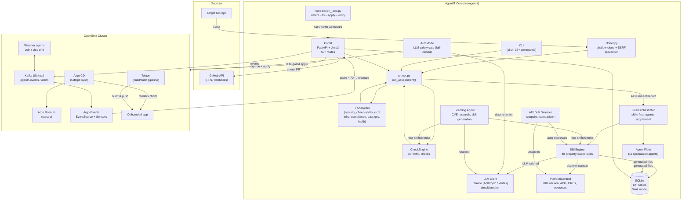
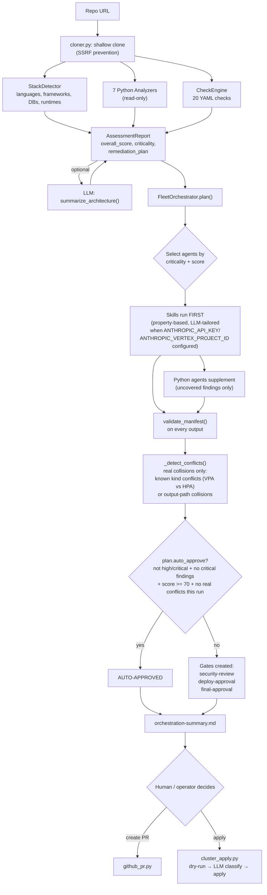
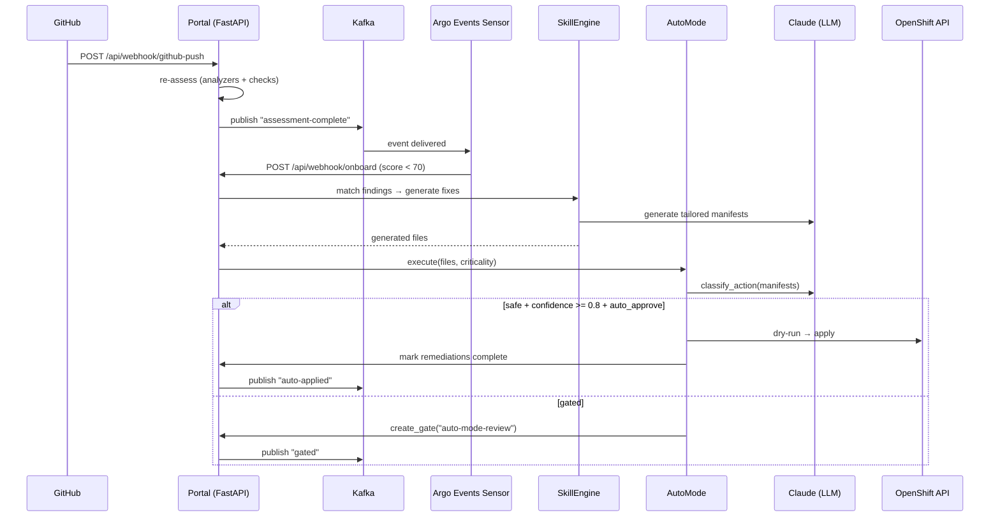
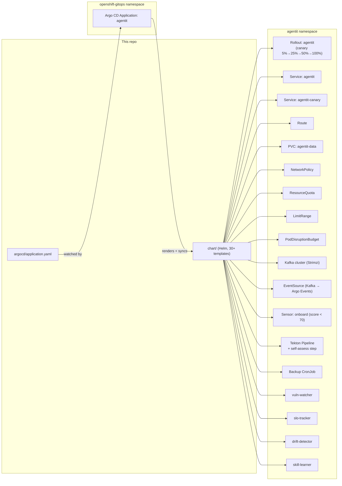

# Architecture

This doc covers how AgentIT is put together: the system components, the assessment/onboarding pipeline, the skill engine, the self-improvement loop, and how it deploys itself on OpenShift. For setup and usage, see the [README](../README.md).

## Table of Contents

- [System overview](#system-overview)
- [Assessment pipeline](#assessment-pipeline)
- [Skill engine & check engine](#skill-engine--check-engine)
- [Self-improvement loop](#self-improvement-loop)
- [Autonomous remediation loop](#autonomous-remediation-loop)
- [Platform awareness & API drift](#platform-awareness--api-drift)
- [Deployment topology (OpenShift)](#deployment-topology-openshift)
- [The agent fleet](#the-agent-fleet)
- [Assessment dimensions](#assessment-dimensions)

## System overview



## Assessment pipeline

This is what happens for a single `assess` / `onboard` run (CLI, portal, or webhook — same code path).



## Skill engine & check engine

### Skill engine (`skill_engine.py`)

Skills are Markdown files with YAML frontmatter. They define properties (what must be true), not templates (how to generate). `FleetOrchestrator.run()` builds an `LLMClient` (same pattern as `cli.py`'s `_resolve_and_assess`, gracefully falling back to `None` if credentials aren't configured or init fails) and passes it into `SkillEngine.run_all()` for every onboarding run — CLI, portal, and webhook paths all get LLM-tailored generation, not just template substitution, whenever `ANTHROPIC_API_KEY`/`ANTHROPIC_VERTEX_PROJECT_ID` is configured. The LLM generates tailored manifests using:

- The skill's property, constraints, and key decisions
- The assessment report (stack, findings, criticality)
- Platform context (K8s version, available APIs, CRDs, operators)
- Feedback history (what was approved/rejected before)

Skill lifecycle: `draft` → `active` → `deprecated` → `retired`

- `draft`: created by learning agent, not matched until promoted
- `active`: matched and used for generation
- `deprecated`: matched with warning, superseded_by field points to replacement
- `retired`: never matched, kept for history

Skills have: `conflicts_with` (priority resolution), `requires_crd` (skip if CRD not on cluster), `source` (manual/learning-agent), `effectiveness` tracking.

### Check engine (`check_engine.py`)

YAML check files define declarative rules:

| Check type | What it checks |
|---|---|
| `file_exists` | A file matching a glob pattern exists in the repo |
| `file_contains` | A file's content matches a regex |
| `file_missing` | No file matches a glob (triggers finding) |
| `yaml_kind_exists` | A YAML file with a specific `kind` exists |
| `yaml_kind_missing` | No YAML file with a specific `kind` exists |

Checks produce `Finding` objects that feed into the same scoring and remediation pipeline as analyzer findings. The learning agent can create new check files without modifying Python code.

### How they work together

```
Assessment:  Analyzers + CheckEngine → Findings → Score
Remediation: SkillEngine.match(findings) → LLM generates → validate → gate
Fallback:    Python agents cover anything skills don't match
```

## Self-improvement loop

AgentIT improves through three tiers:

### Tier 1: Feedback store

The `agent_feedback` table in SQLite records every human decision on generated fixes:

- **approve**: fix was applied as-is
- **modify**: fix was applied with changes (the modified version is stored)
- **reject**: fix was rejected (reason stored)

Skills query this before generating. The `skill_effectiveness` table tracks approval rates per skill. Skills below 30% are surfaced on the Insights page for review.

### Tier 2: Learning agent (`learning_agent.py`)

Three ways to trigger it: automatically every 24h via the `skill-learner` watcher (`watchers/skill_learner.py`, disabled by default), on demand from the Capabilities page's "Research CVEs & Generate Skills" button, or manually via `agentit learn` / `agentit learn-for`. All three call the same functions below:

1. `research_for_app()` — targeted research based on the app's detected stack
2. `research_cves()` — generic CVE research for K8s/container workloads
3. `research_best_practices()` — best practices for a specific topic
4. `generate_skill_from_research()` — LLM generates a complete skill MD file
5. `check_skill_exists()` — dedup with fuzzy name matching
6. `save_skill()` — writes to `skills/custom/` as `draft` status

Draft skills require `agentit activate-skill` (human gate) before they're used.

### Tier 3: Platform-aware deprecation

The drift detector (`watchers/drift_detector.py`) and API drift detector (`api_drift_detector.py`) work together:

1. `PlatformContext.discover_platform()` snapshots the cluster's API surface
2. `detect_drift()` compares against previous snapshot
3. If APIs are removed from the cluster, skills that generate those API kinds are auto-deprecated
4. If APIs are deprecated, warnings are published to the event stream
5. If new APIs appear, they're logged for potential skill creation

## Autonomous remediation loop

When Kafka + Argo Events + auto-mode are all enabled, AgentIT closes the loop autonomously. Every apply still goes through an LLM safety gate that **fails closed**.



### Self-fix command

`agentit self-fix` runs the full loop on a single repo:

1. Assess the repo (analyzers + checks)
2. Skill engine matches findings → LLM generates tailored fixes
3. LLM reviews each fix (first approver): approved/rejected with confidence + reason
4. Verify: re-assess to confirm score improved
5. Create PR with approved fixes (human is second approver)

## Platform awareness & API drift

### PlatformContext (`platform_context.py`)

Discovers the cluster environment and passes it to every skill generation:

- Kubernetes version
- Available API groups and resource kinds
- Installed CRDs
- Running operators (via OLM Subscriptions)
- Known API deprecations (built-in table)

Provides `offline_context()` for testing without a live cluster.

### API drift detector (`api_drift_detector.py`)

Snapshot-based comparison of the cluster API surface:

- `save_snapshot()` — records current API groups, kinds, operators
- `detect_drift()` — compares current vs. previous snapshot
- Returns: `removed_apis`, `deprecated_apis`, `new_apis`, `has_breaking_changes`

The drift detector watcher (`watchers/drift_detector.py`) runs this on every tick and:
- Auto-deprecates skills that generate removed API kinds
- Publishes critical events for removed APIs
- Publishes warnings for deprecated APIs
- Logs new APIs for potential skill creation

### Assessment diff (`assessment_diff.py`)

Compares two assessment reports to find:
- New findings (regression)
- Resolved findings (improvement)
- Auto-fixable gaps (findings that match skills)

## Deployment topology (OpenShift)

AgentIT deploys **itself** the same way it onboards other apps: Argo CD is the sole deployer.



## The agent fleet

Every agent shares the same contract (`agents/base.py`): `Agent(report, output_dir).run() -> Result` where `Result.files` is a `list[GeneratedFile]`. The `FleetOrchestrator` runs **skills first** as the primary generation path, then Python agents supplement for findings that no skill covers.

| Agent | Category | Tier | Always runs? | Generates |
|---|---|---|---|---|
| **HardeningAgent** | `security` | standard | Yes | NetworkPolicy, Containerfile, RBAC, SecurityContext |
| **ObservabilityAgent** | `observability` | small | Yes | ServiceMonitor, Grafana dashboard, alerting rules, OTel config |
| **CICDAgent** | `cicd` | standard | Yes | Tekton Pipeline, Argo CD Application, Argo Rollout |
| **ComplianceAgent** | `compliance` | small | Yes | Kyverno policies, SBOM task, audit policy, compliance evidence |
| **InfrastructureAgent** | `infrastructure` | small | Yes | HPA, PDB, ResourceQuota, LimitRange, Namespace |
| **ReleaseCoordinatorAgent** | `release` | small | Yes | AnalysisTemplate, rollout patch, rollback policy, release runbook |
| **DependencyAgent** | `dependency` | small | high/critical | Dependency report, Renovate config, CVE-scan CronWorkflow |
| **IncidentAgent** | `incident` | small | high/critical | Incident runbook, PagerDuty config, Alertmanager routing |
| **CostOptimizationAgent** | `cost` | small | high/critical | Cost report, right-sizing, cost labels, cost CronWorkflow |
| **ChaosAgent** | `chaos` | — | not critical | LitmusChaos experiments |
| **RetirementAgent** | `retirement` | small | score < 30 | Decommission plan, cleanup, data archive Job |

Resource tiers control K8s Job resource requests/limits when agents run in containerized mode (`AGENT_MODE=kubernetes`):

| Tier | CPU request/limit | Memory request/limit |
|---|---|---|
| small | 50m / 250m | 128Mi / 256Mi |
| standard | 100m / 500m | 256Mi / 512Mi |
| large | 250m / 1000m | 512Mi / 1Gi |

Three long-lived watcher agents run as separate Deployments:

| Watcher | Default interval | Role |
|---|---|---|
| **vuln-watcher** | 6h | Fleet CVE monitoring, triggers RemediationLoop |
| **slo-tracker** | 5m | SLO polling, breach alerts, rollback gates |
| **drift-detector** | 10m | Argo CD sync + API drift detection, auto-deprecation |
| **skill-learner** | 24h | Researches CVEs via LLM, drafts new skills for human review (disabled by default, needs an LLM connection) |

## Assessment dimensions

`runner.py` runs the `StackDetector` plus 7 Python analyzers plus the `CheckEngine` (20 YAML checks) over the cloned repo. Each produces a `DimensionScore` (0-100) with `Finding`s at `critical`/`high`/`medium`/`low`/`info` severity.

| Dimension | Analyzer | Check files | Example checks |
|---|---|---|---|
| `security` | `SecurityAnalyzer` | 3 | Hardcoded secrets, root containers, missing HEALTHCHECK, :latest tags, missing NetworkPolicy, non-UBI base |
| `observability` | `ObservabilityAnalyzer` | 3 | Health probes, metrics endpoint, structured logging |
| `cicd` | `CICDAnalyzer` | 3 | CI pipeline, Dockerfile/Containerfile, GitOps wiring |
| `infrastructure` | `InfrastructureAnalyzer` | 3 | Helm chart, K8s manifests, ResourceQuota |
| `compliance` | `ComplianceAnalyzer` | 3 | Admission policies, license, SBOM |
| `data_governance` | `DataGovernanceAnalyzer` | 2 | Backup config, retention policy |
| `ha_dr` | `HADRAnalyzer` | 3 | HPA, PDB, replica count |

Findings are sorted by severity into a prioritized `remediation_plan`, each with an estimated effort and the skill or agent responsible for fixing it.
