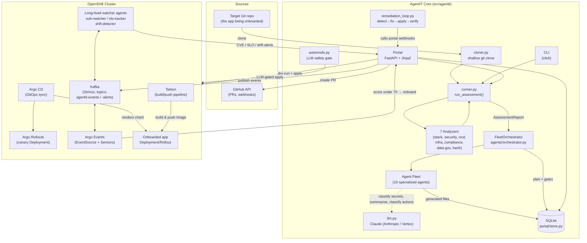
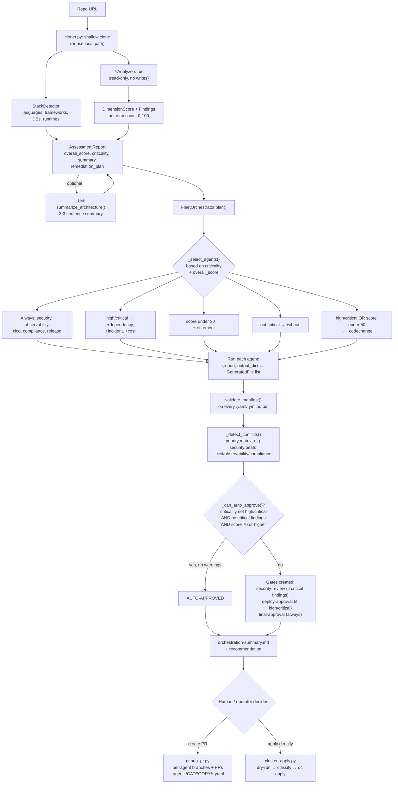
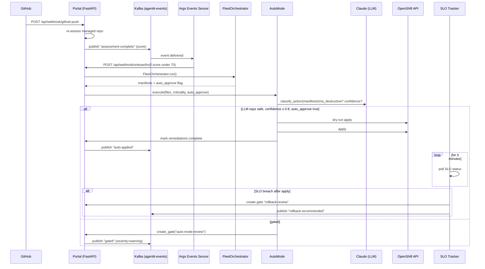
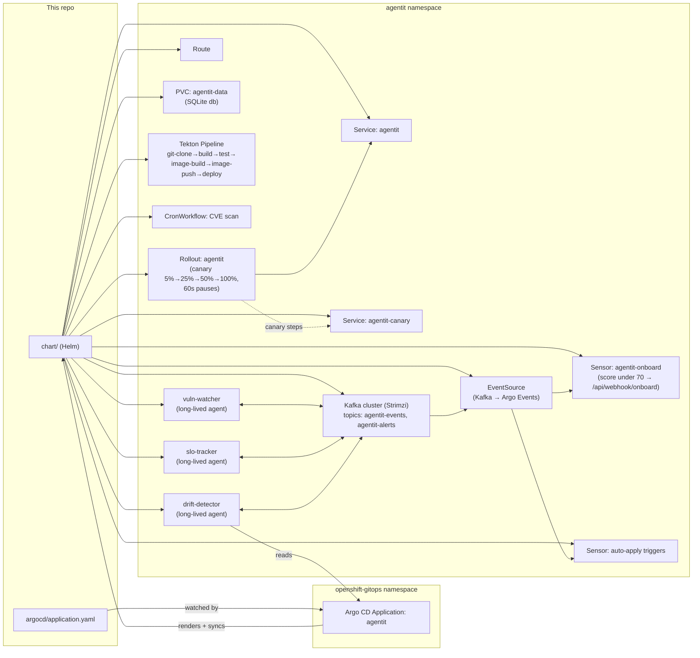

# Architecture

This doc covers how AgentIT is put together: the system components, the assessment/onboarding pipeline, the event-driven autonomous loop, and how it deploys itself on OpenShift. For setup and usage, see the [README](../README.md).

## Table of Contents

- [System overview](#system-overview)
- [Assessment → onboarding pipeline](#assessment--onboarding-pipeline)
- [Autonomous remediation loop](#autonomous-remediation-loop)
- [Deployment topology (OpenShift)](#deployment-topology-openshift)
- [The agent fleet](#the-agent-fleet)
- [Assessment dimensions](#assessment-dimensions)

## System overview

## Assessment → onboarding pipeline

This is what happens for a single `assess` / `onboard` run (CLI, portal form, or webhook — same code path).

## Autonomous remediation loop

When Kafka + Argo Events + auto-mode are all enabled, AgentIT can close the loop without a human in it — but every apply still goes through an LLM safety gate that **fails closed** (gates for human review) if the LLM is unavailable, unconfident, or flags the change as destructive.

## Deployment topology (OpenShift)

AgentIT deploys **itself** the same way it onboards other apps: Argo CD is the sole deployer (see [`deployment.md`](deployment.md) — never `helm upgrade` manually against a running install).

## The agent fleet

Every agent shares the same contract (`agents/base.py`): `Agent(report: AssessmentReport, output_dir: Path).run() -> Result` where `Result.files` is a `list[GeneratedFile]`. The `FleetOrchestrator` decides which agents run for a given assessment (see the pipeline diagram above) and resolves overlaps via a priority matrix.

| Agent | Category | Always runs? | Generates |
|---|---|---|---|
| **HardeningAgent** | `security` | Yes | Deny-all `NetworkPolicy`, hardened `Containerfile`, minimal RBAC (`ServiceAccount`/`Role`/`RoleBinding`), `SecurityContext` patches |
| **ObservabilityAgent** | `observability` | Yes | `ServiceMonitor`, Grafana dashboard JSON, Prometheus alerting rules, OpenTelemetry Collector config |
| **CICDAgent** | `cicd` | Yes | Tekton `Pipeline`, Argo CD `Application`/`ApplicationSet`, Argo `Rollout` canary manifest |
| **ComplianceAgent** | `compliance` | Yes | Kyverno `ClusterPolicy` set (require-labels, require-limits, restrict-registries, disallow-`:latest`), SBOM generation script, compliance evidence doc |
| **ReleaseCoordinatorAgent** | `release` | Yes | Argo Rollouts `AnalysisTemplate`, rollout patch, rollback policy, release runbook; also seeds default SLOs by criticality |
| **DependencyAgent** | `dependency` | high/critical | Dependency risk report, Renovate config, weekly CVE-scan `CronWorkflow` |
| **IncidentAgent** | `incident` | high/critical | Incident runbook, PagerDuty service config, Alertmanager routing |
| **CostOptimizationAgent** | `cost` | high/critical | Cost report, right-sizing recommendations, cost-attribution labels, weekly cost `CronWorkflow` |
| **ChaosAgent** | `chaos` | not critical | LitmusChaos experiments: pod-kill recovery, network-latency injection, CPU-stress vs. HPA |
| **RetirementAgent** | `retirement` | score under 30 | Decommission plan, cleanup script, pre-deletion data-archive `Job` |
| **CodeChangeAgent** | `codechange` | high/critical or score under 50 | LLM-generated **source-level** patches (e.g., health-check endpoints, `.gitignore`, OTel instrumentation) — the only agent that touches app code rather than infra |
| **FleetOrchestrator** | — | meta-agent | Selects agents, resolves conflicts, decides auto-approve, writes `orchestration-summary.md` |

Three additional agents run as **long-lived processes** (via `agentit vuln-watch` / `slo-track` / `drift-detect`, deployed as their own Deployments in the chart) rather than one-shot onboarding agents:

| Long-lived agent | Loop | Role |
|---|---|---|
| **vuln-watcher** | every 6h (default) | Consumes Kafka events, checks fleet for critical findings, triggers `RemediationLoop` when auto-mode is on |
| **slo-tracker** | every 5m (default) | Polls SLO status per assessment, publishes breach alerts, opens a `rollback-review` gate if a breach follows a recent apply |
| **drift-detector** | every 10m (default) | Polls Argo CD `Applications` for `OutOfSync`, publishes drift alerts, auto-syncs if auto-mode is on |

## Assessment dimensions

`runner.py` runs the `StackDetector` plus 7 analyzers over the cloned repo (read-only — analyzers never write to the repo). Each produces a `DimensionScore` (0–100) with `Finding`s at `critical`/`high`/`medium`/`low`/`info` severity, which feed both the overall score and the `RemediationItem` plan.

| Dimension | Analyzer | Checks (examples) |
|---|---|---|
| `security` | `SecurityAnalyzer` | Hardcoded secrets (regex + LLM false-positive filtering), root containers, missing `HEALTHCHECK`, `:latest` tags, missing `NetworkPolicy`, missing vuln scanning in CI, non-UBI base images |
| `observability` | `ObservabilityAnalyzer` | Metrics/tracing/logging instrumentation, health probes |
| `cicd` | `CICDAnalyzer` | CI pipeline presence, GitOps wiring, deployment automation |
| `infrastructure` | `InfrastructureAnalyzer` | IaC presence, manifest completeness |
| `compliance` | `ComplianceAnalyzer` | Policy-as-code, labeling, SBOM/provenance |
| `data_governance` | `DataGovernanceAnalyzer` | Data handling, retention, PII exposure signals |
| `ha_dr` | `HADRAnalyzer` | Replica counts, backup/restore, multi-AZ signals |

Findings are sorted by severity into a prioritized `remediation_plan`, each with an estimated effort (`critical` → 2 agent-hours … `info` → 5 agent-minutes) and the agent responsible for fixing it.
