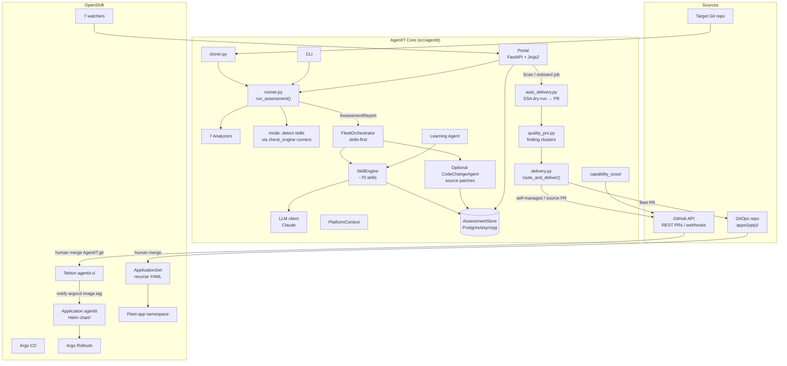
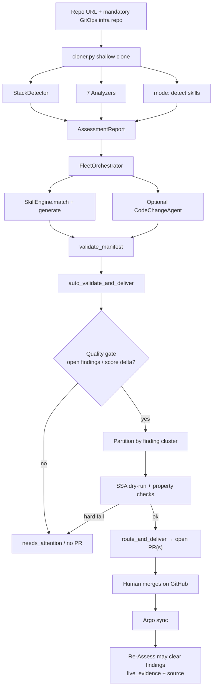
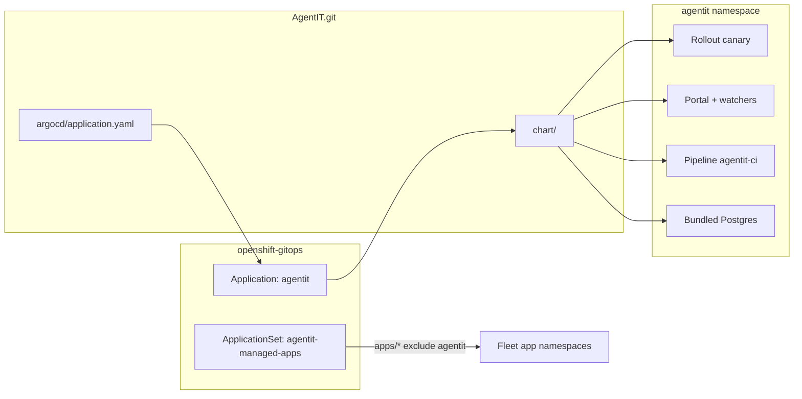

# Architecture

How AgentIT is put together: skills-primary Scan HITL, GitOps-only deploy, self-managed vs fleet delivery. Setup/usage: [README](../README.md). Score math: [score-methodology.md](./score-methodology.md). Docs index: [README.md](./README.md).

## Table of Contents

- [System overview](#system-overview)
- [Cluster access (`kube.py`)](#cluster-access-kubepy)
- [Assessment & Scan pipeline](#assessment--scan-pipeline)
- [Self-managed vs fleet](#self-managed-vs-fleet)
- [Data model: assessments vs. apps](#data-model-assessments-vs-apps)
- [Skill engine & detections](#skill-engine--detections)
- [Self-improvement loops](#self-improvement-loops)
- [Platform awareness & API drift](#platform-awareness--api-drift)
- [Deployment topology (OpenShift)](#deployment-topology-openshift)
- [Agents & watchers](#agents--watchers)
- [Assessment dimensions](#assessment-dimensions)
- [Out of scope](#out-of-scope)

## System overview

**Deploy path is always:** PR opened by Scan → human merges on GitHub → Argo syncs ([ADR 0001](./adr/0001-gitops-scan-hitl.md)).

## Cluster access (`kube.py`)

All cluster I/O goes through `agentit/kube.py` (official Python client). Unit tests mock this module — never shell out to `oc`/`kubectl` for product paths.

`kube.apply_yaml(..., dry_run=True)` is **SSA dry-run** (`dryRun=All`). Portal/`auto_delivery` use it as preflight. Hard vs soft error classification: see README. Real mutations for apps go through GitOps after merge; Tekton `notify-argocd` may patch Application `image.tag` as part of AgentIT’s own CI promote path.

## Assessment & Scan pipeline

Scan is the **sole product PR creator**. Onboard Results is Scan-results-only (Retry Scan delivery only on `needs_attention` with no open PR).

## Self-managed vs fleet

Normative detail: [architecture-agentit-vs-fleet-gitops.md](./architecture-agentit-vs-fleet-gitops.md).

| | Fleet app | AgentIT itself |
| --- | --- | --- |
| PR target | gitops `apps/{app}/…` | AgentIT.git `chart/` · `skills/` · `src/` |
| Argo | ApplicationSet `agentit-managed-apps`, `directory.recurse=true`, `include: '{*.yaml,*.yml}'` | Application `agentit` → Helm `chart/` |
| HPA | `fleet_hpa.py` live Deployment/Rollout discovery; fail-closed if no target | `self_managed_hpa.py` Rollout name + RWO caps; Helm-shaped only |
| Forbidden | — | Do **not** use `apps/agentit/` in gitops |

## Data model: assessments vs. apps

- **Assessment-scoped:** scores, findings, onboarding_results, apply_results, deliveries, agent_runs, check_results — one row set per run.
- **App-scoped:** `apps` table (`repo_url` → `infra_repo_url`, cadence, …). Collections that outlive a run (e.g. SLOs) join via `repo_url`.

In-app **gates table is gone**; human approval is Ledger + GitHub PR merge.

## Skill engine & detections

Skills are Markdown + YAML frontmatter under `skills/` (`mode: template` | `llm` | `detect`). `FleetOrchestrator` passes an LLM client when configured so LLM-only skills generate in production.

- **Remediation:** `SkillEngine.match(findings)` → generate → validate → quality filter → PR.
- **Detection:** `mode: detect` skills use the same rule runners as the legacy `checks/` YAML engine; `checks/` is empty on disk (loader kept temporarily).
- **Registry / contracts:** `remediation/registry.py` `SOLUTION_CONTRACTS` maps each analyzer category → skill + `delivery` + `evidence_kind` + `auto_pr`. `FIX_REGISTRY` is derived from remediable (`auto_pr=True`) rows only. Pre-open simulation: `remediation/clear_evidence.py` (wired in `auto_delivery`). Fleet cluster delivery → `apps/{app}/`; self-managed → `chart/`; source → app repo.
- **Portal catalog:** `portal/check_catalog.py` merges analyzer categories + detect skills + contracts into the Capabilities **Checks & resolutions** matrix (`/capabilities#checks-resolutions`, `GET /api/check-catalog`). Assessment Detail badges findings remediable / detect-only / uncontracted; Fix CTA only when `allows_auto_pr`. Insights annotates check compliance with the same badges. Health and Decisions stay orthogonal (platform self-health and LLM decision audit).

Lifecycle: `draft` → `active` → `deprecated` → `retired`. Activate opens a durability PR so image rebuilds keep `status: active`.

## Self-improvement loops

1. **Skills catalog** — outcomes from merge/finding-clear; learning agent drafts; HITL Activate; drift auto-deprecates.
2. **AgentIT itself** — `capability-scout` proposes one evidence-cited change as a draft PR against this repo (never auto-merge). Historical design notes: [history/self-improvement-for-agentit.md](./history/self-improvement-for-agentit.md).

Watchers alert; humans Assess/Scan. Deploy is always PR → merge → Argo.

## Platform awareness & API drift

`PlatformContext` snapshots version/APIs/CRDs/operators for generation. `api_drift_detector` + `drift-detector` watcher auto-deprecate skills for removed APIs and can re-sync already-merged Argo Applications when OutOfSync (GitOps-aware sync of approved state — not a substitute for opening PRs).

## Deployment topology (OpenShift)

AgentIT deploys **itself** via Argo CD Application `agentit` → `chart/`. See [deployment.md](./deployment.md).

Image promote: push `main` → Tekton `run-tests` → `build-image` → `smoke-test-image` → `notify-argocd` pins `image.tag`.

## Agents & watchers

| Component | Role |
| --- | --- |
| **Skills** | Primary remediation for all domains (incl. cost/dependency) |
| **CodeChangeAgent** | Optional source patches when criticality/score warrants |
| **vuln-watcher** | CVE alerts (no auto-fix pipeline) |
| **slo-tracker** | SLO breach alerts / rollback recommendations |
| **drift-detector** | Argo + API drift |
| **skill-learner** | Draft skills (HITL Activate) |
| **capability-scout** | Draft PRs to AgentIT.git |
| **reassess-scheduler** | Cadence re-Assess |
| **self-health-check** | AgentIT infra health panel |

Cost/dependency **Python agents** and **Per-Agent PRs** are removed.

## Assessment dimensions

Full scoring math (penalties, overall average, PR impact): [score-methodology.md](./score-methodology.md).

| Dimension | Analyzer | Detections (skills) | Examples |
| --- | --- | --- | --- |
| `security` | SecurityAnalyzer | containerfile-exists, network-policy-exists, secrets-scanning-in-ci | `:latest`, missing NetPol, secrets in CI |
| `observability` | ObservabilityAnalyzer | health-probes-check, prometheus-metrics-exists, structured-logging-detected | probes, metrics, logging |
| `cicd` | CICDAnalyzer | ci-pipeline-exists, dockerfile-exists, argocd-application-exists | pipeline, Dockerfile, GitOps |
| `infrastructure` | InfrastructureAnalyzer | helm-chart-exists, k8s-deployment-exists, resource-quota-exists | Helm/IaC, quota, EOL |
| `compliance` | ComplianceAnalyzer | admission-policies-exist, license-file-exists, sbom-exists | Kyverno, LICENSE, SBOM |
| `data_governance` | DataGovernanceAnalyzer | backup-config-exists, retention-policy-exists | backup, retention |
| `ha_dr` | HADRAnalyzer | hpa-exists, pdb-exists, multi-replica-deployment | HPA, PDB, replicas |

Remediation skills (e.g. `infrastructure/hpa`, `helm-chart`, `health-probes-policy`) are separate from `mode: detect` skills. Some categories remain detect-only (e.g. `secrets`, `license`, `backup`) — Scan does not open PRs for those.

## Out of scope

Supported operate path is Scan → PR → human merge → Argo only. AgentIT does not: live-mutate the cluster from portal Deliver, auto-merge its own PRs, open per-agent PR factories, or deploy self-managed AgentIT into `apps/agentit/` in gitops.

Historical design / session writeups: [history/](./history/).
