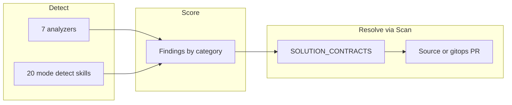

# Release notes

Canonical product pitch and quick start live in [`../README.md`](../README.md). This file holds the denser product-contract and release detail that used to bloat the README. Dated dogfood/session writeups: [`changelog-dogfood-notes.md`](./changelog-dogfood-notes.md).

---

## 2026-07-22 — Post-dogfood Scan HITL + crisp portal

### Product contract

| Do | Do not |
| -- | ------ |
| Skills-primary generation; Scan/`auto_delivery` opens PRs | Per-Agent PRs / `create-agent-prs` (removed) |
| GitOps PR → human merge → Argo | Direct Apply / live cluster mutate from portal Deliver |
| SSA dry-run preflight (`kube.apply_yaml(..., dry_run=True)`) | Treat dry-run as `kubectl`/`oc` CLI |
| Self-managed AgentIT → PRs on **AgentIT.git** (`chart/`, `skills/`, `src/`) | Deliver AgentIT into `apps/agentit/` in gitops |
| Fleet apps → PRs under `apps/{app}/` with AppSet `directory.recurse=true` | Assume top-level-only Directory sync |
| Quality filter: finding-tied, one PR per cluster, approve on merge+clear | Catalog dumps; approve-on-PR-open |
| HITL Ledger / GitHub merge | AutoMode auto-merge (removed) |

### Dry-run & delivery

**Dry Run** = apiserver server-side-apply `dryRun=All` via `kube.apply_yaml(..., dry_run=True)`.

- **Hard** errors (schema/admission/unreachable) block the PR.
- **Soft** errors (Forbidden for AgentIT SA, missing optional CRD, field-manager conflict) warn only.
- Nothing is left applied. Real apply = merge + Argo.
- GitHub PR APIs use REST (`portal/github_pr.py`). Quality module: `portal/quality_prs.py` ([plan](./plan-quality-helpful-prs.md)).

### Self-managed vs fleet

| | Fleet (e.g. pinky) | AgentIT itself |
| --- | --- | --- |
| Desired state | `agentit-gitops` `apps/{app}/` | This repo: `chart/`, `skills/`, `src/` |
| Argo | ApplicationSet `agentit-managed-apps` (`recurse` + `*.yaml`/`*.yml`) | Application `agentit` (Helm) |
| Image | App’s own CI | Tekton `notify-argocd` pins `image.tag` |
| HPA gates | Live workload discovery (`fleet_hpa.py`) | Rollout/RWO correctness (`self_managed_hpa.py`) |

Normative detail: [`architecture-agentit-vs-fleet-gitops.md`](./architecture-agentit-vs-fleet-gitops.md).

### Solution contracts

[#154](https://github.com/alimobrem/AgentIT/pull/154) landed `SOLUTION_CONTRACTS`; follow-up hardening made every analyzer category contracted:

| Layer | What it does |
| --- | --- |
| `SOLUTION_CONTRACTS` | Every analyzer category contracted; `auto_pr=False` for detect-only (`license`, `secrets`, …) |
| `evidence_kind` | Machine check before open (`dockerfile_pin`, `audit_wired`, `hpa_target`, …) |
| Pre-open simulation | `remediation/clear_evidence.py` + `auto_delivery` refuse if MERGE would not clear |
| Skill ↔ contract CI | `tests/test_skill_registry_agreement.py` fails on FIX_REGISTRY / skill / delivery drift |
| Fleet vs self-managed | Cluster → gitops `apps/{app}/`; self-managed → app `chart/`; source → app repo |
| PR / portal honesty | Body: `Clears X by Y (evidence: …)`; Assessment Detail PR cards show contract lines |

[#155](https://github.com/alimobrem/AgentIT/pull/155) (detect_only coverage) is **superseded** (closed; do not revive substring `contract_for`). Session notes: [`changelog-dogfood-notes.md`](./changelog-dogfood-notes.md).

### Checks vs resolutions

| Layer | What | Opens a Scan PR? |
| ----- | ---- | ---------------- |
| Analyzers (7 dims → ~27 categories) | Pattern / source / cluster posture | Only if contracted + `auto_pr` |
| `mode: detect` skills (~20) | File/YAML rule checks | Never by themselves — emit findings only |
| Remediable contracts | Skill + `delivery: source\|cluster` + evidence | **Yes** (quality-gated) |
| Detect-only contracts | e.g. `license`, `backup`, `secrets` | **No** — human-only |

**Live catalog:** Capabilities → **Checks & resolutions** (`/capabilities#checks-resolutions`) and `GET /api/check-catalog` (`portal/check_catalog.py`).

### Portal IA (crisp chrome)

[#160](https://github.com/alimobrem/AgentIT/pull/160) — fixed masthead + footer; denser P0/P1 pages:

- **Capabilities** — Checks / Skills / Activity; check catalog SoT; collapse-all Checks matrix
- **Assessment Detail** — above-fold identity + next action + Scan; cadence under Overview; Findings owns remediations; full PR history on Ledger tab
- **Onboard Results** — PR-first + single Diagnostics accordion (Apply Report hidden on PR-only success)
- **Insights** — fleet rollup + deep links (not duplicate tables)
- **Health** — Overview / Workloads / Messaging / Access tabs
- **Fleet / Schedules / Decisions** — density cuts (no Namespace/Trend; CronWorkflows only; Decision Log first)

EDL: [`portal-experience-design-language.md`](./portal-experience-design-language.md).

### Image promotion

Merge to `main` alone does not move the portal. Tekton `agentit-ci`: `run-tests` → `build-image` → `smoke-test-image` → `notify-argocd` (pins Application `agentit` `image.tag`). GitHub context `agentit-ci/tekton` must succeed. Details: [`deployment.md`](./deployment.md).

---

## Earlier history

For skills-primary simplification, quality PR Phases A–F, HPA gates, AppSet recurse, clearable findings, audit wiring, and other dated writeups, see [`changelog-dogfood-notes.md`](./changelog-dogfood-notes.md).
