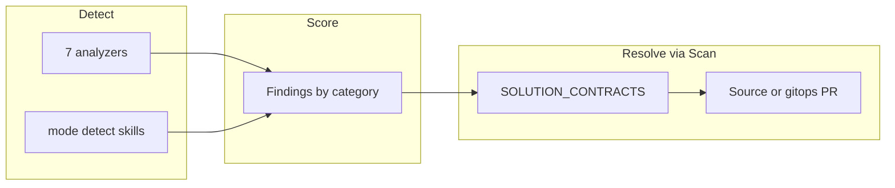

# Release notes

Canonical pitch and quick start: [`../README.md`](../README.md). Score math: [`score-methodology.md`](./score-methodology.md). Version history: [`../CHANGELOG.md`](../CHANGELOG.md). Dated dogfood/session writeups: [`history/`](./history/).

---

## Product contract (current)

| Do | Do not |
| -- | ------ |
| Skills-primary generation; Scan/`auto_delivery` opens PRs | Per-agent PR factories or parallel create-PR product paths |
| GitOps PR → human merge → Argo | Live cluster mutate from portal Deliver |
| SSA dry-run preflight (`kube.apply_yaml(..., dry_run=True)`) | Treat dry-run as `kubectl`/`oc` CLI |
| Self-managed AgentIT → PRs on **AgentIT.git** (`chart/`, `skills/`, `src/`) | Deliver AgentIT into `apps/agentit/` in gitops |
| Fleet apps → PRs under `apps/{app}/` with AppSet `directory.recurse=true` | Assume top-level-only Directory sync |
| Quality filter: finding-tied, one PR per cluster, approve on merge+clear | Catalog dumps; approve-on-PR-open |
| HITL Ledger / GitHub merge | Auto-merge of AgentIT-opened PRs |

Decisions: [ADR 0001 — GitOps Scan HITL](./adr/0001-gitops-scan-hitl.md), [ADR 0002 — Postgres store](./adr/0002-postgres-store.md).

### Dry-run & delivery

**Dry Run** = apiserver server-side-apply `dryRun=All` via `kube.apply_yaml(..., dry_run=True)`.

- **Hard** errors (schema/admission/unreachable) block the PR.
- **Soft** errors (Forbidden for AgentIT SA, missing optional CRD, field-manager conflict) warn only.
- Nothing is left applied. Real apply = merge + Argo.
- GitHub PR APIs use REST (`portal/github_pr.py`). Quality module: `portal/quality_prs.py` ([plan](./plan-quality-helpful-prs.md)).

### Self-managed vs fleet

| | Fleet | AgentIT itself |
| --- | --- | --- |
| Desired state | `agentit-gitops` `apps/{app}/` | This repo: `chart/`, `skills/`, `src/` |
| Argo | ApplicationSet `agentit-managed-apps` (`recurse` + `*.yaml`/`*.yml`) | Application `agentit` (Helm) |
| Image | App’s own CI | Tekton `notify-argocd` pins `image.tag` |
| HPA gates | Live workload discovery (`fleet_hpa.py`) | Rollout/RWO correctness (`self_managed_hpa.py`) |

Normative detail: [`architecture-agentit-vs-fleet-gitops.md`](./architecture-agentit-vs-fleet-gitops.md).

### Solution contracts

`SOLUTION_CONTRACTS` lands every analyzer category as remediable or detect-only:

| Layer | What it does |
| --- | --- |
| `SOLUTION_CONTRACTS` | Every analyzer category contracted; `auto_pr=False` for detect-only (`license`, `secrets`, …) |
| `evidence_kind` | Machine check before open (`dockerfile_pin`, `audit_wired`, `hpa_target`, …) |
| Pre-open simulation | `remediation/clear_evidence.py` + `auto_delivery` refuse if MERGE would not clear |
| Resource collisions | `quality_prs.find_resource_collisions()` refuses a batch that would create two resources with the same (apiVersion, kind, namespace, name) — the Argo-sync-blocking class of bug SSA dry-run validates each file independently and never caught |
| Skill ↔ contract CI | `tests/test_skill_registry_agreement.py` fails on FIX_REGISTRY / skill / delivery drift |
| Fleet vs self-managed | Cluster → gitops `apps/{app}/`; self-managed → app `chart/`; source → app repo |
| Chart-aware source patches | `workload-replicas`/`workload-health-probes` (like HPA before them) find the real Deployment/Rollout via GitHub-REST `read_file`/`tree_paths` and patch a Helm chart's `values.yaml` when `replicas:` is templated — never a fabricated, disconnected stand-in |
| Manual Deliver = auto pipeline | `POST /assessments/{id}/deliver`'s real (non-dry-run) path calls `auto_validate_and_deliver()` directly — one quality bar every delivery entry point shares, not a hand-maintained subset that can drift |
| PR / portal honesty | Body: `Clears X by Y (evidence: …)`; Assessment Detail PR cards show contract lines |

### Checks vs resolutions

| Layer | What | Opens a Scan PR? |
| ----- | ---- | ---------------- |
| Analyzers (7 dims → categories) | Pattern / source / cluster posture | Only if contracted + `auto_pr` |
| `mode: detect` skills | File/YAML rule checks | Never by themselves — emit findings only |
| Remediable contracts | Skill + `delivery: source\|cluster` + evidence | **Yes** (quality-gated) |
| Detect-only contracts | e.g. `license`, `backup`, `secrets` | **No** — human-only |

**Live catalog:** Capabilities → **Checks & resolutions** (`/capabilities#checks-resolutions`) and `GET /api/check-catalog` (`portal/check_catalog.py`).

### Portal IA (crisp chrome)

Fixed masthead + footer; denser P0/P1 pages (PR [#160](https://github.com/alimobrem/AgentIT/pull/160)):

- **Primary journey:** Assess → Findings → Scan → merge PR → operate (Fleet/Ledger)
- **Capabilities** — Checks / Skills / Activity; check catalog SoT
- **Assessment Detail** — identity + next action + Scan; Findings own remediations; PR history on Ledger tab
- **Operator / advanced:** Events, Decisions, DLQ, Agents — not the first-run path

EDL: [`portal-experience-design-language.md`](./portal-experience-design-language.md).

### Image promotion

Merge to `main` alone does not move the portal. Tekton `agentit-ci`: `run-tests` → `build-image` → `smoke-test-image` → `notify-argocd` (pins Application `agentit` `image.tag`). Details: [`deployment.md`](./deployment.md).

---

## Earlier history

Skills-primary simplification, quality PR Phases A–F, HPA gates, AppSet recurse, clearable findings, audit wiring, and dated writeups: [`history/`](./history/) (especially [`history/changelog-dogfood-notes.md`](./history/changelog-dogfood-notes.md)).
