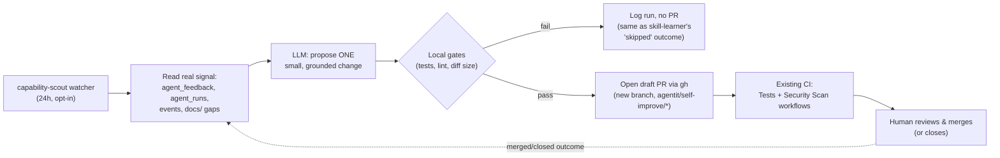

# Self-Improvement for AgentIT Itself

**Status: design only, not yet built.** This is a proposal doc for the repo owner to review and approve before any of it lands as code — following this project's own human-in-the-loop philosophy (LLM proposes, something with real teeth verifies, a human approves). Nothing in this doc has been implemented except where explicitly marked "PoC" below.

## The gap this closes

AgentIT already has a real, running self-improvement loop — see README's "Self-improvement loop" section. It is scoped entirely to the **skills catalog** AgentIT generates for the apps it onboards: `skill-learner` (the 24h watcher) and `learning_agent.py` research CVEs and underperforming skills, draft replacement/new skill Markdown files, and a human activates them via the Capabilities page's `Activate` button (`routes/capabilities.py::activate_skill_route`). `record_skill_outcome()` feeds real approval/rejection data back into `get_low_effectiveness_skills()`, which the learning agent reads before deciding what to research next (`skill_learner.py::research_once()`).

That loop improves what AgentIT generates for *other* apps. It has no counterpart that improves AgentIT's *own* codebase — its portal routes, its watchers, its CLI, its own features. Two commands that sound like they might be this (`self-assess`, `self-fix`) are **not** it: they run AgentIT's existing hardening pipeline *against* AgentIT's own repo (treating AgentIT as an onboarded app and generating/applying K8s manifests — NetworkPolicies, HPAs, etc. — for it), not proposing new Python features for AgentIT's product surface. Naming for the new capability below is deliberately kept distinct from `self-assess`/`self-fix` for exactly this reason — see "Naming" in the Deferred section.

The goal here: a daily loop that looks at AgentIT's own code, its own usage/effectiveness data, and its own documented gaps, and proposes small, evidence-grounded feature/functionality changes to AgentIT itself — landing as a real, reviewable PR, never a direct commit to `main`.

## The loop shape

Mirrors the skill-learner shape exactly: **research → draft → verify → human review → merge**, aimed at AgentIT's own repo instead of the skills catalog.



### What triggers it

A new long-lived watcher, **`capability-scout`** (name discussion below), following the exact pattern of the other 4 watchers in `src/agentit/watchers/`:

- New CLI command `propose-watch` (mirrors `learn-watch`), added to `cli.py` next to the other watcher commands, constructed the same way (`store = await create_store()`, `await scout.run()`).
- New chart file `chart/templates/agents/capability-scout.yaml`, copy-pasted from `chart/templates/agents/skill-learner.yaml`'s shape (same `securityContext`, same env-var wiring for `AGENTIT_DB_BACKEND`/`ANTHROPIC_VERTEX_PROJECT_ID`/etc., same liveness-probe-via-heartbeat-file convention) — new `chart/values.yaml` key `agents.capabilityScout.enabled` (default `false`, exactly like `skillLearner`).
- Default interval: 24h (`agents.capabilityScout.interval`, default `86400`), same cadence as `skill-learner`. **Not** hooked onto `skill-learner`'s own tick — a separate watcher, separate pod, separate opt-in flag. Reasons: (1) `skill-learner`'s job is the skills catalog and already has its own prioritization logic (flagged-skill-improvement vs. CVE-sweep); bolting an unrelated "propose a code change to AgentIT itself" branch onto that same tick would make one watcher's failure mode (e.g. LLM outage) block two unrelated capabilities, and (2) this is materially higher-risk (writes to AgentIT's own source tree and opens PRs against AgentIT's own repo, not the skills catalog) and deserves its own on/off switch, its own PVC-free stateless design, and its own audit trail (`agent_name = "capability-scout"` in `agent_runs`, not overloading `skill-learner`'s existing rows).
- A Tekton `CronWorkflow`/`CronJob` alternative was considered and rejected for the *first* iteration: the long-lived-watcher pattern already has working heartbeat/staleness alerting (`AgentITWatcherStale` Prometheus rule, `record_tick()`), whereas wiring a *new* alerting path for a Tekton cron job would be new engineering this doc's "genuinely new" accounting (below) should charge to this feature, not get for free. Revisit as a CronWorkflow only if a long-lived pod turns out to be the wrong resource shape in practice (it isn't for the other 4 watchers).

### What data it reads (the "grounded in real signal" requirement)

This is the part that has no existing analog in `skill_learner.py` and is the actual new engineering (see "Cheap reuse vs. real new work" below). Candidate signal sources, all real and already in `store.py` today — nothing here requires a new table for the *read* side:

| Signal | Store method (exists today) | What it tells the LLM |
|---|---|---|
| Rejected/modified findings by category, fleet-wide | `get_all_feedback()` / `get_rejection_count(app_name, category)` — **today only queryable per-app**; needs a new fleet-wide aggregate (see below) | Which finding categories humans distrust most — a strong signal for "the skill/check for X needs work" or "there's a missing capability around X" |
| Agent run failures/durations | `get_agent_stats()`, `list_agent_runs()` (backed by `agent_runs`) | Recurring error patterns per agent — e.g. an agent that fails a specific way repeatedly is a concrete "AgentIT itself has a bug/gap here" signal |
| Check pass rates fleet-wide | `get_check_compliance()` (backed by `check_results`) | Checks that almost never pass across the whole fleet may indicate the check itself is miscalibrated, not that every onboarded app is broken |
| Skill effectiveness / flagged skills | `get_skill_effectiveness()`, `get_low_effectiveness_skills()`, `get_loop_health()` | Already read by `skill_learner.py` for skill improvement — re-read here for a different question: "is the skill-authoring *tooling itself* (not one skill) systematically producing low-quality output?" |
| Watcher tick health | `agent_heartbeat`/`tick-complete`/`tick-failed` events | A watcher that fails a specific way repeatedly is itself a capability gap (e.g. "the drift-detector needs a retry backoff") |
| `docs/*.md` "Known gap" / "Deliberately deferred" / "Documented future idea" sections | New: a small static scan, not a store query | Explicit, human-written admissions of missing functionality — see the worked example below; this is the single highest-precision signal available and should be weighted first |

**New store method needed** (small, additive, no schema change): `get_fleet_wide_rejection_stats(limit: int = 10) -> list[dict]`, a `GROUP BY finding_category` aggregate over `agent_feedback` (today's `get_rejection_count` is scoped to one `app_name` + one `category` at a time — there's no existing "top rejected categories across the whole fleet" query). This is genuinely small: `agent_feedback` already has every column needed (`finding_category`, `action`); it's the same shape as `get_check_compliance()`'s existing `GROUP BY`, just against a different table.

**No mock data, ever** — the LLM prompt is built exclusively from what these queries return plus grep-able doc text; if a fleet has too little data (e.g. a fresh dev cluster with `< 5` recorded outcomes anywhere), the run should log a `warning`-severity `learning-run`-style event and produce no proposal that cycle, exactly like `skill_learner.py::research_once()` already does when the LLM is unavailable — a no-op is an honest outcome, a proposal invented from nothing is not.

### What the LLM is asked to propose

One structured item per cycle (capped — see "Safety gates" below), shaped like `research_skill_improvement()`'s existing dict convention but for a code change instead of a skill:

```json
{
  "title": "short name for the change",
  "gap_description": "what's missing/broken and why (must cite the specific signal: doc quote, stat, or event pattern)",
  "evidence": "the exact grep hit / query result / doc line that grounded this",
  "target_files": ["list of files the change would touch"],
  "change_summary": "what the code change does, in 2-4 sentences",
  "risk": "low | medium | high",
  "test_plan": "what test(s) the PR should add or what existing test(s) prove it works"
}
```

The system prompt must explicitly instruct the LLM to:
1. Prefer a documented gap (`docs/*.md` "Known gap"/"Deliberately deferred"/"Documented future idea" text) over inventing one from general knowledge — this is the anti-hand-wave constraint the user asked for.
2. Only propose changes that are "small, focused, and reviewable" (this repo's own `.cursor/rules` convention, quoted directly into the prompt) — e.g. **not** "rewrite the store layer," but "add a new-stack-signature counter + a threshold check that triggers `learn-for` automatically."
3. Never propose a change to `argocd/application.yaml`, `chart/templates/`, CI workflows, or anything touching secrets/RBAC/deployment topology — those are exactly the changes this project's own conventions say need the most human judgment, and are the least "small, focused" in practice. Scope the LLM to application code (`src/agentit/**/*.py`, `skills/`, `checks/`, tests) only, at least for v1.

### What the OUTPUT actually is

**A real, draft-state GitHub PR on a new branch — never a direct commit to `main`, never auto-merge.** Concretely:

1. Generate the code change (LLM writes a unified diff or full file replacement for a small number of files — capped, see below).
2. Apply it locally to a fresh branch (`git checkout -b agentit/self-improve/<slug>-<date>`).
3. Run the safety gates (next section). If any gate fails, discard the branch and log a `capability-run` event (same action name as every other outcome — see step 6 below) with `severity="warning"` and the failure reason in `gate_results` — no PR opens. This mirrors `research_once()`'s `skipped` list exactly: a cycle that finds nothing safe to ship is a normal, expected, non-error outcome.
4. If gates pass, push the branch and open the PR via `gh pr create --draft` (draft, not ready-for-review — an extra, cheap "this is a robot, look twice" signal on top of the description). Use `gh` directly rather than `github_pr.py`'s raw-REST tree/commit/ref dance: `gh` is already authenticated in this environment (confirmed: `gh auth status` shows a logged-in `repo`-scoped token), handles the create-branch-and-push mechanics in one call, and — critically — `github_pr.py`'s existing functions (`create_onboarding_pr`, `create_agent_prs`, `commit_to_infra_repo`) are all shaped around writing generated *manifests* via the GitHub Contents/Git-Data API into a target app's repo; none of them clone/branch/push AgentIT's *own* checked-out working tree, which is what a real source-code change needs. `self-fix --create-pr` (`cli.py`) already does exactly this shape (`git checkout -b` → `git add` → `git commit` → `git push -u origin`) via raw `subprocess` calls — reuse and lightly extend that pattern (swap the final "print the compare URL" step for an actual `gh pr create --draft --title ... --body ...` call) rather than inventing a third code path.
5. PR body must include: the `evidence` field verbatim (so a human reviewer can verify the grounding without re-deriving it), the `risk` field, a link to the exact `agent_runs`/`get_fleet_wide_rejection_stats`/doc line that triggered it, and a standard footer (`> Proposed by AgentIT's capability-scout — see docs/self-improvement-for-agentit.md`), matching `github_pr.py`'s existing "Generated by AgentIT" footer convention.
6. Log **one** `capability-run` event (new action name, logged via `log_event()` exactly like every other watcher already does) for the cycle — whether it produced a PR, was gate-blocked, or found nothing to propose. `details_json` carries `{trigger, evidence, doc_anchor, gate_results, pr_url}` (`pr_url` is `null` when nothing shipped this cycle). Deliberately **one action for every outcome**, not a separate `capability-proposed`-only event — this is the exact shape `learning-run` already uses (see `describe_learning_run()`) specifically so every cycle is queryable, not just the ones that shipped something. See "Portal transparency" below for how this single event stream powers three different pages without a second data model.

### Safety/verification gates (before a human ever sees it as a candidate)

In order, fail-closed at every step (no PR opens if any gate fails):

1. **Diff-size cap.** Reject if the proposed diff touches more than N files (suggest N=3) or more than ~150 changed lines total. This is a direct, mechanical enforcement of the "keep changes minimal" rule already in this repo's own `.cursor/rules` — not a new philosophy, just making an existing rule machine-checked for once.
2. **Scope allowlist.** Reject if any touched path falls outside `src/agentit/`, `skills/`, `checks/`, `tests/`, or `docs/` (the last one to also allow "clean up docs/session-status" or update a specific gap's doc text as an artifact of fixing it). Anything touching `chart/`, `argocd/`, `.github/workflows/`, `Dockerfile`, or files with `secret`/`rbac` in the path is an automatic reject — no exceptions, no LLM override.
3. **Local test suite must pass.** Apply the diff on the throwaway branch, run `pytest tests/ -q --ignore=tests/test_real_repos.py --ignore=tests/test_browser.py --ignore=tests/test_live_cluster_e2e.py` (the exact same invocation `.github/workflows/tests.yml` uses, same `KUBECONFIG=/tmp/nonexistent-path` env var per `CLAUDE.md`'s Testing section) locally before ever pushing. A red suite is an automatic discard, not a PR with a note saying "tests are failing" — this repo's CI already gates merges on green tests; this loop should never even ask a human to look at something that's already known-red.
4. **New test required for non-trivial changes.** If `test_plan` from the LLM's proposal is empty or the diff doesn't touch anything under `tests/`, reject — a code change with zero test coverage added or exercised is exactly the kind of thing this repo's human reviewers already push back on, so don't waste their time with it.
5. **Existing CI still runs after the PR opens** — `tests.yml` and `security.yml` (`.github/workflows/`) trigger on `pull_request` automatically, no new workflow needed. This is genuinely free — the gate is already wired at the repo level for every PR regardless of who opens it.
6. **Weekly cap, not daily-spam.** Even though the watcher ticks every 24h, only open a new PR if there are 0 open, unmerged `agentit/self-improve/*` PRs already outstanding (one `gh pr list --head agentit/self-improve --state open` check before generating anything) — this directly answers the "cap on proposals to avoid PR spam" question the user asked about. If a proposal PR is sitting open awaiting review, the loop should research and log its findings (visible on `/events`) but hold off opening a second one until the first is resolved (merged or closed). This is a deliberately conservative default; the repo owner may prefer a numeric cap (e.g. 3/week) instead — call this out explicitly as a config knob (`agents.capabilityScout.maxOpenPRs`, default `1`) rather than hardcoding one philosophy.
7. **No secrets, ever, in the diff or PR body.** Same rule this repo already enforces everywhere else (`CLAUDE.md`: "Never put secrets in values.yaml or any committed file") — a cheap regex pre-flight (`AKIA`, `-----BEGIN`, `sk-ant-`, etc.) over the generated diff before it's ever written to disk or pushed, reusing whatever pattern list `security.yml`'s Trivy scan or any existing secret-scan tooling in this repo already uses (if none exists today, a short hardcoded list is an acceptable v1 — flag as a possible follow-up to unify with Trivy's own detectors rather than maintaining two secret-pattern lists).

## Portal transparency — first-class, not deferred

**This overrides the original draft of this doc, which deferred a dedicated UI to a "cheap follow-up" and pointed at GitHub's own PR UI as the review surface.** Per explicit direction: GitHub's PR UI stays the actual *code-diff review* surface (that part was right — nobody wants a diff viewer rebuilt inside the portal) — but a human should be able to answer "what has AgentIT proposed for itself, why, and what happened to each proposal" entirely from inside the AgentIT portal, without needing to already know a PR exists or go hunting on GitHub for it. That means transparency into the *loop itself* — every cycle, every piece of evidence, every gate result, every proposal's live status — is in scope for the first version of this feature, not a follow-up.

The good news: this costs very little new engineering, because it's the same trick this repo already leans on three times over — **one durable event stream, read by several thin views.** No new UI-only data model is needed; every piece below is either an existing store table/query, the single `capability-run` event from step 6 above, or `github_pr.py::get_pr_status()` (already used by `assessments.py::onboarding_history` to poll a PR's live merge state — see below).

### Where this shows up, and why each location was chosen

**1. A new "Self-Improvement" tab on the Capabilities page — not a new top-level nav page.** Concretely: `@router.get("/capabilities/self-improvement")` in `routes/capabilities.py`, added as a third entry to the `tab_nav()` call at the top of `capabilities.html` (`{"href": "/capabilities/self-improvement", "label": "Self-Improvement", "prefix": "/capabilities/self-improvement"}`, alongside the existing `Catalog`/`Registry` tabs) — the exact same macro, same pattern, already rendering two tabs today. Justification for a tab over a new top-level page: this loop is a direct sibling of the skill-learner loop that already lives on this page (same "AgentIT improving something about itself" concept, same research → draft → human-review shape), and the Capabilities page's own framing — "Skills, checks, agents, and automation — everything AgentIT can do" — already fits "AgentIT proposing new things it can do" without a stretch. A new top-level nav item was considered and rejected: `base.html`'s nav is already at 7 items post-cleanup (per `docs/session-status-2026-07-13.md`'s IA-cleanup commit `c274055`, which deliberately paired related concepts as tabs specifically to avoid nav bloat) — adding an 8th top-level item for a feature that's conceptually a sibling of something already on Capabilities would undo that cleanup for no real navigational benefit.

**2. "Self-Improvement Runs" table on that tab — mirrors "Learning Agent Runs" exactly.** Same columns (Timestamp / Trigger / Considered / Outcome / Details), same data shape: a new `_get_capability_run_history(s, limit=15)` helper in `capabilities.py`, structurally identical to the existing `_get_learning_run_history()` — both are just `await s.list_events_by_action(<action>, limit=limit)` plus a `json.loads(details_json)` unpack. "Considered" shows the `evidence`/`doc_anchor` field (truncated) so a human sees *what grounded the LLM's decision* directly in the row, not just the outcome — this is the concrete answer to "what did it consider" without opening anything. "Outcome" reuses the same three-way badge convention (`success`/`warning`/`danger` badges keyed off `severity`, exactly like the existing table) plus a **PR status badge** when a PR exists — see point 4. Every cycle appears here, including cycles that proposed nothing or got gate-blocked, exactly like `learning-run` rows today — this is the literal answer to the requirement that every cycle is "a durable, queryable event/row even when it produces nothing."

**3. A new entry in the Decisions page (`/decisions`), not a separate audit view.** `llm_decisions.py` gets a third source function, `_capability_proposal_decisions(store, limit, loop)`, sibling to the existing `_fix_review_decisions()`/`_auto_mode_decisions()`, reading the same `capability-run` events and mapping each cycle to a decision dict: `decision_type="capability-proposal"` (new `DECISION_TYPE_CAPABILITY_PROPOSAL` constant), `attribution="capability-scout"`, `attribution_kind="component"` (it's a watcher, not a per-app agent or a named skill — same bucket `auto-mode`'s generic decisions already fall into), `target_app="agentit"` (the target of every proposal is AgentIT's own repo, so this is a constant, not derived per-row), `outcome` is one of `proposed` / `gate-blocked` / `no-signal` (mapped from the event's `severity`+`pr_url` presence, same translation `_parse_auto_mode_summary()` already does for its own event shape), `reason` is the `gap_description`. One line added to `list_llm_decisions()`'s existing merge (`_fix_review_decisions(...) + _auto_mode_decisions(...) + _capability_proposal_decisions(...)`) — the page, its filters, and its "by attribution" summary table all keep working unmodified, because they're already written generically over whatever `decision_type`/`attribution` values show up. This directly answers "what has AgentIT's LLM decided and why" for this loop without a second decisions concept — a human filtering `/decisions?attribution=capability-scout` sees this loop's reasoning trail sitting right alongside fix-review and auto-mode decisions.

**4. The Schedules page's watcher table — via one array entry, zero new route/template code.** `agents/capabilities.py`'s `WATCHER_AGENTS` list gets one new dict: `{"name": "capability-scout", "mode": "LLM polling", "interval": "24 hours", "description": "Reads fleet usage/effectiveness data and doc-gap signals, proposes one small code change to AgentIT itself as a draft PR for human review — requires an LLM connection and GITHUB_TOKEN"}`. `routes/schedules.py::schedules_page()` already iterates `_WATCHER_AGENTS`, joins against `agent_registry` for real heartbeat-derived status (`active`/`not deployed`), and the template already renders it — because `record_tick("capability-scout", ...)` writes to the exact same `agent_heartbeat`/events mechanism every other watcher uses, this "just works" the moment the watcher exists, with **zero new code in `schedules.py` or `schedules.html`**. This is the concrete answer to "should it need a bespoke status widget" — no, the existing generic watcher-status mechanism already covers it, which is precisely why `record_tick()` was written as a shared helper in the first place.

**5. A drill-through detail page per run — mirrors `/capabilities/skills/{name}/history`'s shape.** New route `/capabilities/self-improvement/runs/{event_id}` (a tiny new store method, `get_event(event_id) -> dict | None`, a single `SELECT * FROM events WHERE id = ?` — the same shape as `get_setting()`, `events.id` is already a real primary key today, just never queried singly before). Template mirrors `skill_detail.html`'s stat-grid + table layout:
   - **Stat grid:** Outcome (proposed / gate-blocked / no-signal), Risk (from the proposal dict), PR status (see point 6).
   - **Evidence section:** the `evidence` and `doc_anchor` fields verbatim, plus a direct link to the doc file/line when `doc_anchor` points at one of this repo's own `docs/*.md` files (using `open_resource`-style linking isn't available from a server-rendered Jinja page, so this renders as inline `<code>` text with the file path — a human can open it themselves, same as any other file path already shown elsewhere in this portal, e.g. skill paths on Capabilities).
   - **Gate results table:** one row per gate from step-by-step "Safety/verification gates" above (diff-size cap, scope allowlist, tests, test-coverage-required, secrets-scan, open-PR throttle) with pass/fail and the specific number/reason (e.g. "3 files, 42 lines — under the 150-line/3-file cap" or "BLOCKED: touches chart/templates/foo.yaml, outside scope allowlist") — this is the part with no existing template to copy verbatim (skill activation's `verify_skill()` only returns a flat issues list, not a named per-gate breakdown), so this table's exact shape is new, but intentionally modeled on `skill_detail.html`'s existing "Activation / Deprecation History" table (same columns: Gate / Result / Detail).
   - **Resulting PR:** link + live status badge, same as point 6.
   - Back-link to `/capabilities/self-improvement`, exactly like `skill_detail.html`'s `&larr; All Capabilities` link.

**6. Live PR status, polled inline — reusing `get_pr_status()`, not `gh`.** Both the Self-Improvement Runs table (point 2) and its drill-through detail page (point 5) show each proposal's real-time GitHub state (`open` / `merged` / `closed`) without a human leaving the portal. This is a **direct copy of an already-proven pattern**, not new design: `routes/assessments.py::onboarding_history()` already does exactly this today — `asyncio.gather(*(asyncio.to_thread(get_pr_status, url) for url in pr_urls))`, then merges the result into each row as `pr_status`. `get_pr_status()` (`github_pr.py`) hits the GitHub REST API directly with the existing `GITHUB_TOKEN` env var (already required for the PR-creation step itself, so no new credential), which is the right choice over shelling out to `gh` from the portal process specifically because the portal doesn't need (and shouldn't need) `gh` installed/authenticated in its own container image just to read status — the watcher pod needs `gh` (or the raw API) to *create* the PR; the portal only needs to *read* it, and `get_pr_status()` already does exactly that read, today, for a different feature. Rendered as a badge: green "merged", blue "open", grey "closed (not merged)" — same badge-color convention already used everywhere else in this UI (`badge-success`/`badge-info`/`badge-muted`).

### What this costs, concretely

All of the above reads from tables/queries already named in this doc — `events` (one new action string, `capability-run`, no schema change), `agent_registry`/heartbeats (already generic), and one brand-new *tiny* method (`get_event(id)`, a single-row lookup by primary key). The genuinely new pieces are: the `capability-run` details-JSON shape itself (a one-time schema decision, not a schema *migration*), the per-gate results table's markup (no exact precedent, but a trivial mirror of an existing table's columns), and one new `WATCHER_AGENTS` array entry. Nothing here requires a background poller, a websocket, or any new persistence beyond what step 6 of "What the OUTPUT actually is" already logs — this is UI work over data the loop was already going to produce.

## Cheap reuse vs. real new work — an honest accounting

Matching this repo's own candor in `docs/agent-removal-readiness.md` and `docs/postgres-migration-plan.md` about what's cheap vs. what's real engineering:

**Cheap, near-total reuse of existing conventions:**
- The watcher lifecycle shape (`run()` loop, `record_tick()`, heartbeat file, chart Deployment template, `agents.<name>.enabled` values.yaml gating) — copy `skill_learner.py`'s structure almost verbatim.
- The "research → draft → log a `learning-run`-shaped event → human-reviewable artifact" flow — same shape as `describe_learning_run()`, just a new sibling function (e.g. `describe_capability_run()`) rather than a new pattern.
- Reading `agent_feedback`/`agent_runs`/`check_results`/`skill_effectiveness` — all the *read* queries already exist except one small new aggregate (`get_fleet_wide_rejection_stats`).
- The `git checkout -b` / `git commit` / `git push` mechanics — already written once, in `self_fix`'s `--create-pr` branch; this is a copy-and-extend, not new code.
- CI verification of the resulting PR — `tests.yml`/`security.yml` already trigger on every PR unconditionally; zero new CI work required.
- **All of "Portal transparency" above, except one table's markup.** The Self-Improvement Runs table is `_get_learning_run_history()` copy-pasted against a different action string. The Decisions-page entry is one new sibling function in `llm_decisions.py`, following `_auto_mode_decisions()`'s exact shape. The Schedules-page row is one array literal added to `WATCHER_AGENTS` — literally zero new route or template code. Live PR-status polling is `onboarding_history()`'s existing `get_pr_status()` call, copy-pasted against a different URL source. This is the strongest evidence that the transparency requirement, while explicitly called out as first-class in this revision, isn't actually expensive — it was cheap specifically *because* the loop was already designed (in the original draft) to log one durable event per cycle; the UI is just several thin views over that one stream, following patterns this codebase already leans on three separate times (`capabilities.html`, `decisions.html`, `schedules.html`).

**Genuinely new engineering, not a small extension of something that exists:**
- The doc-gap scanner (grepping `docs/*.md` for "Known gap"/"Deliberately deferred"/"Documented future idea" sections and turning them into structured candidate items) — nothing today parses this repo's own docs as a data source; `skill_learner.py` only ever reads structured store data, never prose.
- The diff-size/scope-allowlist/secret-regex safety gates — `self_fix` has no equivalent gate today; its own `--create-pr` path only checks "did the score improve," which is a fundamentally different (and much easier) safety property than "is this a small, in-scope, test-covered, secret-free source diff."
- Actually generating a *source code diff* (not a Markdown skill file, not a K8s manifest) via LLM and applying it mechanically. `generate_skill_from_research()` generates a self-contained Markdown file with a known schema (frontmatter + fixed sections) that's trivial to validate structurally (`load_skill()`/`verify_skill()` already exist). A source diff has no equivalent structural validator today — "does this Python code even parse/import cleanly" is a new, non-trivial check this loop needs before it's safe to hand to a human at all (a bare minimum: `python -m py_compile` on every touched `.py` file, in addition to running the full test suite).
- The `gh pr create --draft` integration itself — `github_pr.py` has robust GitHub API helpers, but none of them clone-and-push AgentIT's own working tree; that's the `self_fix` `subprocess` path, which itself has never actually been exercised with `--create-pr` in production as far as `docs/session-status-2026-07-13.md`'s shipped-commits list shows (worth confirming with the repo owner before relying on it being battle-tested).
- The "only one open self-improve PR at a time" throttle — no existing watcher has a concept of "check GitHub's own PR state before acting"; `skill-learner` has no external-system-state check at all today (it only ever checks its own DB).
- The per-gate results table on the drill-through detail page (point 5 of "Portal transparency" above) — the *concept* of showing a per-check pass/fail breakdown exists (`verify_skill()`'s issues list), but nothing today renders a named, itemized gate-by-gate table; this is genuinely new markup, even though it's modeled closely on an existing table's columns.

## Worked example: day one

Using one of the two real, already-documented gaps the user asked for as proof this isn't hand-wavy — **README's own "Documented future idea (not built)"** (`README.md`'s Self-improvement loop section, tier 2 bullet): *"auto-triggering `agentit learn-for` when a new/uncommon stack pattern is detected 3+ times across onboardings would need new cross-onboarding stack-signature detection logic — flagged here as a real idea, deliberately not built."*

Walking the loop end to end against this:

1. **Signal.** The doc-gap scanner finds this exact sentence in `README.md` under a `## Self-improvement loop` heading, tagged "Documented future idea (not built)." Cross-checked against real data: a query over `assessments` (via a small new read, or reusing `get_score_history`-style grouping) for `stack` field values shows, say, 4 onboarded apps in the last 30 days all detected `Go` + `PostgreSQL` + no matching existing skill triggered a `learn-for` call for that combination — corroborating the README's claim with an actual repeated pattern, not just trusting the doc text blindly.
2. **Proposal.** The LLM is given both the doc quote and the real stack-repeat count, and asked to propose *the smallest possible* first step — not the full "new cross-onboarding stack-signature detection logic" (that's explicitly flagged as bigger scope than one PR should attempt). A realistic, right-sized proposal:
   - **Title:** "Track stack signatures per assessment and log a `repeated-stack-pattern` event at 3+ occurrences"
   - **Target files:** `src/agentit/portal/store.py` (one new method, `get_stack_signature_counts()`, a `GROUP BY` over `assessments`' existing stack-derived fields — no new table, no schema migration), `src/agentit/agents/orchestrator.py` or wherever `FleetOrchestrator` finishes an assessment (one new call to log the event when the threshold is crossed), one new test in `tests/test_store.py` or `tests/test_orchestrator.py` asserting the threshold logic.
   - **What it deliberately does NOT do:** it does not auto-call `agentit learn-for` — that's the "auto-trigger" half of the original idea, and auto-invoking an LLM-costing, skill-writing command with no human in the loop is exactly the kind of thing this whole design doc argues against doing autonomously. The PR's own description says so explicitly, and proposes the auto-trigger as a **separate, future, human-approved** follow-up once the *detection* half has been observed working for a few cycles.
3. **Gates.** 2 files + 1 test, ~40 lines — well under the diff-size cap. Both files are inside the scope allowlist. `pytest` run locally on the branch passes (it's additive — a new method and a new log call, nothing existing changes behavior). No secrets. No open `agentit/self-improve/*` PR already exists.
4. **PR.** `gh pr create --draft --title "[AgentIT] Detect repeated stack patterns (step 1 of README's documented auto-learn idea)" --body "..."` — body cites the README line verbatim, cites the 4-apps-in-30-days figure from the real query, and states the risk as "low — purely additive, no auto-trigger wired yet, one new test." A single `capability-run` event is logged with this PR's URL in `details_json`.
5. **Portal, before the human even opens GitHub.** The new Self-Improvement tab on Capabilities shows a row: timestamp, "Automatic (24h watcher)," `Considered: README.md Self-improvement loop — "auto-trigger learn-for..." (4 apps/30d)`, outcome badge "proposed," and a live PR-status badge reading "open." Clicking through to the run's detail page shows the full `evidence`/`doc_anchor` text, a 7-row gate table (all passed), and the same PR link/status. The Decisions page also shows one new `capability-proposal` row, attributed to `capability-scout`, reason = the gap description — filterable alongside every other real LLM decision this system logs.
6. **Human.** Reviews (in the portal first, then clicks through to the actual PR on GitHub to read the diff), sees it's a faithful, narrowly-scoped first step toward an idea they already wrote down themselves, and merges (or requests the threshold be configurable, or closes it if priorities have shifted) — exactly the same review posture as approving a drafted skill on the Capabilities page today. The next time they load the Self-Improvement tab, that row's PR-status badge now reads "merged," with no further action needed to notice that.

This is deliberately the *easy* case (the gap and its evidence already exist in prose someone wrote by hand) — which is the point: day one's job is proving the loop can find and safely ship what's already been identified, before trusting it to identify genuinely novel gaps from store data alone.

## Deliberately deferred — not built in this design, and why

Matching `docs/session-status-2026-07-13.md`'s own "Deliberately deferred" convention:

1. **Auto-detecting novel gaps purely from store telemetry, with no human-written doc text to anchor to.** The doc-gap scanner (grepping `docs/*.md`'s own admissions) is high-precision and ships first. Teaching the LLM to *infer* a gap purely from `agent_runs`/`agent_feedback` statistics with no corroborating prose (e.g. "the `compliance` category gets rejected 60% of the time, therefore propose X") is a much easier way to hallucinate a plausible-sounding but wrong root cause, and this repo's "no mock data / no fabricated values" rule extends naturally to "no fabricated root-cause narratives." Ship the doc-anchored version first, observe a few real cycles, and only then consider whether pure-telemetry inference earns enough trust to add.
2. **Multi-file, cross-module refactors or anything touching `orchestrator.py`/`skill_engine.py`/`store.py`'s core contracts.** The diff-size cap and scope allowlist above structurally prevent this loop from ever proposing something that large — not because it's technically impossible to prompt for, but because a "small, focused, reviewable" change is the entire safety property this design leans on. If AgentIT genuinely needs a big structural change, that should stay a human-initiated, human-planned effort (exactly how the Postgres migration and the agent-removal work in this repo were actually done — both via a written plan doc reviewed by a human first, never proposed autonomously).
3. **Auto-merge, auto-rebase, or any "if CI is green, merge it" automation.** Every apply path in this codebase already fails closed to a human gate when anything is destructive or uncertain (`gates.py`, `AutoMode`'s dry-run-first requirement) — a PR that changes AgentIT's *own* running code is categorically at least as sensitive as an onboarding apply to someone else's cluster, so it gets no less scrutiny, not more automation. This is non-negotiable per the user's own framing of the task, not just this doc's preference.
4. **Naming.** This doc uses `capability-scout` as a working name to avoid colliding with `self-assess`/`self-fix` (which already mean something different and narrower — see "The gap this closes" above) and to avoid overloading `skill-learner` (which is specifically the skills-catalog loop). The repo owner may prefer different naming (`feature-scout`, `roadmap-watcher`, `dogfood-agent`, etc.) — this is a naming decision for approval, not a technical one, and is called out explicitly so it isn't accidentally locked in by whoever implements this first.
5. **Applying this to the two other in-flight workstreams' territory** (observability/chart hardening, EOL-software auditing) even as *examples* of what this loop might one day propose. Both are currently being built by concurrent sessions in this exact repo as of this doc's writing — deliberately not referenced as day-one candidate proposals to avoid this design doc creating confusing cross-talk with work that's actively in progress elsewhere in the tree.
6. **A push-based/real-time UI (websocket/SSE PR-status updates, background poller keeping `pr_status` warm in the DB).** The "Portal transparency" section above deliberately keeps PR-status polling synchronous and on-page-load (`get_pr_status()` called when the page renders, exactly like `onboarding_history()` already does), not a background job that periodically re-polls GitHub and caches the result. A background poller would be the natural next step if this page turns out to be checked often enough that GitHub API rate limits become a real concern — not needed for a v1 whose whole premise is "at most ~1 new proposal a day."

**Note on item 4 in the previous revision of this doc:** an earlier draft deferred "a UI surface beyond `/events`," reasoning that GitHub's own PR UI was a sufficient review surface. Per explicit follow-up direction from the repo owner, that decision has been reversed — see "Portal transparency — first-class, not deferred" above, which is now a required part of this design, not a future nice-to-have. GitHub's PR UI remains the review surface for the actual *code diff*; the portal is now where a human sees the loop's own activity, evidence, and gate results without needing to already know a PR exists.

## Summary for the repo owner

- **New watcher** (`capability-scout`, name TBD), same shape as `skill-learner`, opt-in via `chart/values.yaml`, 24h default cadence.
- **Reads** real fleet signal (`agent_feedback`, `agent_runs`, `check_results`, skill effectiveness — one small new aggregate query needed) **and** this repo's own docs for already-admitted gaps.
- **Proposes** one small, evidence-cited code change per cycle, capped in size and scope (app code + tests only — never chart/CI/secrets).
- **Verifies** locally (compiles, tests pass, no secrets, in-scope files only, has test coverage) before a human ever sees it.
- **Outputs** a real draft PR via `gh pr create`, on its own branch, going through the existing `tests.yml`/`security.yml` CI unmodified — never a direct commit, never auto-merge.
- **Throttled** to one open proposal PR at a time by default (configurable).
- **Fully transparent from inside the portal** — a new Self-Improvement tab on Capabilities (run history + per-run drill-through with evidence/gates/live PR status), a new entry on the Decisions page (attributed reasoning, filterable alongside every other LLM decision), and a one-line addition to the Schedules page's existing watcher table (no bespoke widget). GitHub's PR UI stays the surface for reviewing the actual code diff; the portal is where a human sees what the loop is doing and why, without needing to already know a PR exists.
- Roughly half the plumbing (watcher lifecycle, event logging, git-branch-and-push mechanics, and — per this revision — nearly all of the UI transparency work) is near-total reuse of `skill_learner.py`/`self_fix`/`decisions.html`/`schedules.html`'s existing patterns; the doc-gap scanner, the source-diff safety gates, the PR-state-aware throttle, and the one new per-gate results table are genuinely new engineering.
