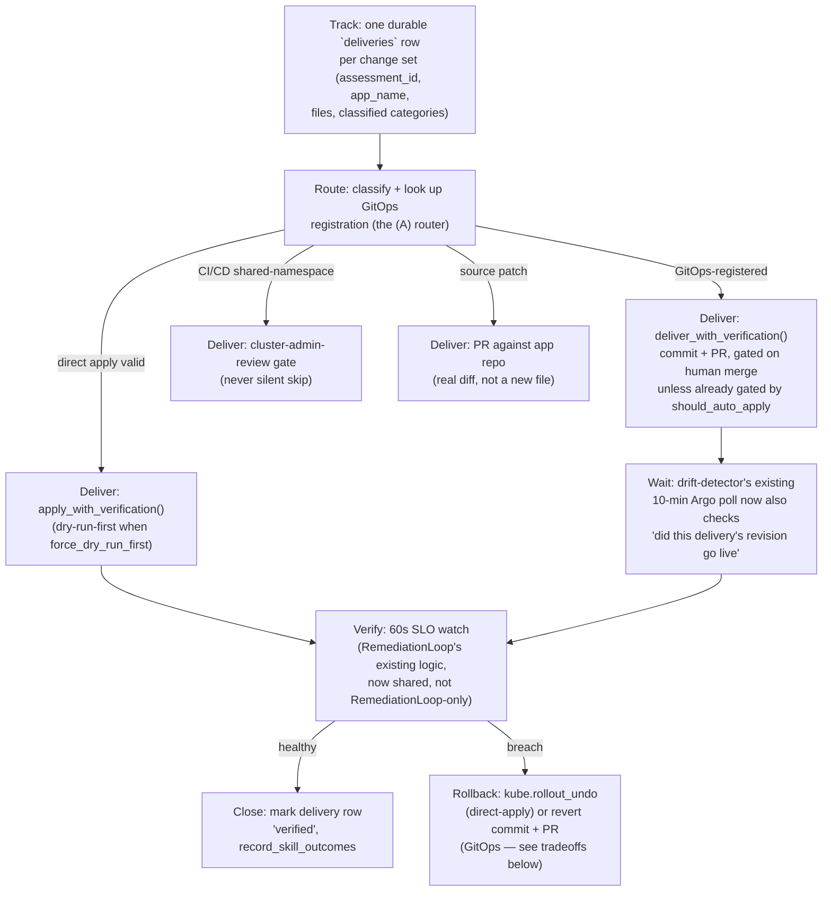

# Unified Apply Flow

**Status: design only, not yet built.** This is a proposal doc for the repo
owner to review and approve before any of it lands as code — same posture as
`docs/self-improvement-for-agentit.md` and `docs/agent-removal-readiness.md`.
Nothing in this doc has been implemented.

## The gap this closes, and why it's urgent rather than just untidy

Two things AgentIT already does to get a change into a cluster are fully
disconnected today:

1. **Gate-approve** (`routes/gates.py::resolve_gate`, lines 75–102) always
   calls `apply_manifests_to_cluster()` directly
   (`portal/cluster_apply.py:256`) — never `apply_with_verification()`, the
   audit-trail-and-skill-outcome wrapper both the manual "Apply to Cluster"
   route (`assessments.py:601`) and `AutoMode.execute()`
   (`automode.py:151`) already use. A gate approval has **zero audit log
   entry for the apply itself** (only the generic `gate-{status}` audit line
   at `gates.py:57`) and never runs a dry-run first.
2. **Create PR** (`routes/assessments.py::create_pr`, lines 707–747) either
   opens an informational PR against the target app's *own* repo
   (`create_onboarding_pr`, `github_pr.py:91`) — nothing in the cluster
   watches it — or, when `report.infra_repo_url` is set, commits to a
   separate GitOps repo *and* synchronously calls `ensure_applicationset()`
   (`github_pr.py:473`), which creates or patches a live Argo CD
   `ApplicationSet` with `syncPolicy.automated.selfHeal: true` **and
   `prune: true`** (`github_pr.py:522–524`) watching `apps/*` in that repo.

These two are not just disconnected — once an app has gone through path 2,
path 1 becomes actively dangerous for that same app. `ensure_applicationset`
targets `namespace: "{{path.basename}}"` (`github_pr.py:519`), i.e. the same
namespace the "Apply to Cluster" button and gate-approve write to
(`assessments.py:105`, `_ensure_namespace` in `cluster_apply.py:202`). With
`prune: true`, Argo CD will delete, on its next reconcile, anything in that
namespace it doesn't recognize from the infra repo — including anything a
direct apply or gate-approve just put there but never committed to the infra
repo. `CLAUDE.md`'s own "Never run `helm upgrade` manually — Argo CD is the
sole deployer... causing ownership fights" rule is AgentIT admitting this
exact failure mode already bit its own deployment. Nothing today stops
AgentIT from inflicting the identical failure mode on every app it onboards
via infra-repo GitOps registration, because `apply_manifests_to_cluster()`,
`apply_with_verification()`, and `resolve_gate()` have no idea that
registration exists — see "The concrete plumbing gap" below.

There is also a **third, already-built, GitOps-aware apply path** nobody
asked about but that materially changes the design: `DriftDetector`
(`watchers/drift_detector.py`). When auto-mode is on and it finds an Argo CD
`Application` `OutOfSync`, `_maybe_auto_sync()` (lines 126–156) patches that
`Application` with `{"operation": {"sync": {"revision": "HEAD"}}}` —
triggering Argo to pull whatever is currently committed. This is the *only*
mechanism in the whole codebase that is actually GitOps-aware, and it is
completely uninvolved in the AutoMode/gate/PR machinery above — it only
reacts to drift Argo itself already detected, never decides "commit vs.
direct-apply" for a newly generated fix.

### The concrete plumbing gap

The data needed to make the right routing decision already exists — it's
just never read by the code that needs it:

- `AssessmentReport.infra_repo_url` (`models.py:98`) is set once per
  assessment (`assessments.py:88-90`, auto-created via
  `_auto_create_infra_repo` if the human didn't supply one) and **does**
  survive into storage, because `store.py::save()` persists the entire
  `report.model_dump_json()` (`store.py:404`) and `get(assessment_id)`
  reconstructs the full model (`store.py:425`) — so `report.infra_repo_url`
  is available in `gates.py::resolve_gate` (it already calls `s.get(...)` at
  line 76) and in `assessments.py::create_pr` (line 719). It is simply never
  *read* by `resolve_gate`, by `AutoMode.execute()` (whose signature has no
  such parameter at all, `automode.py:95-104`), or by
  `apply_with_verification()` (`cluster_apply.py:333-345`).
- `store.py::get_fleet_data()` (lines 750-786) reconstructs the full report
  internally (`report = AssessmentReport.model_validate_json(...)`, line
  768) but the dict it returns (lines 774-785) **omits** `infra_repo_url` —
  so every fleet-wide caller that only has an `app` dict, not a full report
  (`vuln_watcher.py::check_fleet`, `webhooks.py::webhook_finding`), has no
  way to see it even if it wanted to.

Fixing this plumbing gap — surfacing `infra_repo_url` (and, better, "does a
live Application/ApplicationSet actually exist for this app," which is a
stronger and more current signal than "was an infra repo URL set at some
point") everywhere a delivery decision is made — is the single most
load-bearing change this design depends on. Everything else below is
built on having that fact available at decision time.

## Full inventory of paths that currently "deliver" something

| # | Entry point | Mechanism | Verified/audited? | GitOps-aware? |
|---|---|---|---|---|
| 1 | Manual "Apply to Cluster" (`assessments.py:585-628`) | `apply_with_verification(force_dry_run_first=False)` → `kube.apply_yaml` | Yes (`audit_log`, skill outcomes) | No |
| 2 | Gate-approve (`gates.py:60-102`) | Raw `apply_manifests_to_cluster()` | No (no `apply_with_verification`, no dry-run) | No |
| 3 | `AutoMode.execute()` (`automode.py:95-197`), invoked from `webhook_auto_apply` (`webhooks.py:299-332`), `webhook_finding`'s dispatcher branch (`webhooks.py:376-396`), and `RemediationLoop._auto_apply` (`remediation_loop.py:240-250`, HTTP call to the same webhook) | `apply_with_verification(force_dry_run_first=True)` | Yes | No |
| 4 | `DriftDetector._maybe_auto_sync` (`drift_detector.py:126-156`) | Patches Argo CD `Application` to sync `HEAD` | Only via the generic tick event log | Yes — but reactive-only, never chooses a delivery mechanism for a *new* fix |
| 5 | "Create PR" (`assessments.py:707-747`) | `create_onboarding_pr` (app repo, informational) **or** `commit_to_infra_repo` + `ensure_applicationset` (infra repo, live GitOps) | No LLM/human gate at all — unconditionally available the instant onboarding finishes | Only branch 2 is; and it self-selects based on `infra_repo_url`, not based on artifact type |
| 6 | "Per-Agent PRs" (`assessments.py:750-772`, `create_agent_prs`, `github_pr.py:209-339`) | Same as 5's app-repo branch, one PR per agent | No | No |
| 7 | `capability-scout` (`capability_scout.py`, `watchers/capability_scout.py`, `git_pr.py`) | `git checkout -b` + `git commit` + `gh pr create --draft` against **AgentIT's own repo** | Yes — diff-size/scope/test/secret gates before a PR ever opens (`docs/self-improvement-for-agentit.md`) | N/A (not a target-app delivery at all — see taxonomy) |

Six different pieces of code (1, 2, 3's three callers, 4, 5's two branches)
can each independently decide "this change reaches a cluster now," for the
same app, with no shared decision, no shared verification tail, and — for 1
vs. 2 vs. 3 vs. 5's infra-repo branch — no awareness of which of the other
five just ran or is about to run.

## (D) Taxonomy of change types

This is the load-bearing section: the current design has two disconnected
*paths* in large part because it never named the *artifact types* flowing
through them. "Which button do I click" and "what kind of thing is this"
are different questions, and today's UI conflates them (`onboard_results.html`
puts "Apply to Cluster" and "Create PR" side by side for every artifact type,
regardless of which is structurally valid).

| Category | What produces it | Structurally valid mechanism(s) | Invalid mechanism(s) and why | How the unified flow should route it |
|---|---|---|---|---|
| **Cluster/app config** | Skills (`skills/**/*.md` via `SkillEngine`, one flat `category="skills"` `AgentResult` regardless of domain — `orchestrator.py:306-313`), plus `cost`/`dependency`'s manifest outputs (VPA, cost-labels, Renovate/Dependabot config) | Direct `kubectl apply` to the app's own namespace (today's `cluster_apply.py`), **or** commit to the infra repo for Argo CD to apply — see next row, these are the *same artifact* via two mechanisms | N/A as a category — every mechanism below is valid for *some* instance of this category, that's the point of the next row | If the app has a live GitOps registration → infra-repo commit (Argo applies it). Otherwise → direct apply. Never both for the same app (see the prune/selfHeal risk above). |
| **GitOps/infra-repo delivery** | *Not a distinct artifact type* — it's a **delivery mechanism** for the row above, currently implemented as `commit_to_infra_repo` + `ensure_applicationset` (`github_pr.py:342-543`). Conflating "what kind of thing is this" with "how do I deliver it" is exactly why gate-approve and create-PR are disconnected today — see the gap section. | Commit + PR to the infra repo, `ApplicationSet` already ensures the sync | Direct `kubectl apply` to the same namespace once this registration exists, for the reason above | Retired as a separate row in the human-facing taxonomy; kept internally as `cluster/app config`'s "already-GitOps-registered" branch. |
| **CI/CD pipeline & delivery-plane config** | Skills: `tekton-pipeline.md`, `argocd-application.md`, `argo-rollout.md` (all `category="skills"` per the flattening above — domain distinction is lost by the time files reach `apply_manifests_to_cluster`, it only re-derives risk from each manifest's own `namespace`/`kind`) | Direct apply **only** for `Rollout`/`AnalysisTemplate` objects that land in the *app's own* namespace (Argo Rollouts controller already runs cluster-wide, no special namespace needed). `Pipeline`/`PipelineRun`/`Task` objects that must live in `openshift-pipelines` and `Application`/`AppProject` objects that must live in `openshift-gitops` hit `_OPERATOR_NAMESPACES` (`cluster_apply.py:27-30`) today and are **silently skipped** (`skip_operator_ns`, line 239) with no alternate route offered. | Never a direct apply into a shared operator namespace from a per-app onboarding flow — that needs cluster-admin-adjacent RBAC this service account correctly doesn't have by default (`_RBAC_HELP`, `cluster_apply.py:434-439` already documents the analogous OLM-install case). | Route to a **dedicated cluster-admin-reviewed queue**, distinct from the per-app gate queue — see "CI/CD needs its own lane" below. Never silently drop it; today's `skip_operator_ns` skip reason is shown in a collapsed "Skipped" list on the results page with no operator-install-style remediation UI the way `missing_operators` gets one. |
| **GitHub/source-repo changes — manifests-at-rest** | `create_onboarding_pr`'s `.agentit/{category}/*` tree (`github_pr.py:91-206`) | PR against the app's own repo only. Structurally cannot be `kubectl apply`'d (they're informational copies, not live objects) — `cluster_apply.py`'s own `_NON_MANIFEST_PURPOSE` table already treats `.md`/`.json`/`.toml` this way for non-YAML files, but never extends that judgment to *YAML* files chosen for PR instead of apply. | Direct cluster apply of the *same* YAML content the PR body describes as "reference copy" is redundant, not wrong, but doing both from the same button click with no correlation (today's actual behavior) makes it look like two different changes. | Only produced as a byproduct when there's no GitOps registration to commit real manifests into — see "cluster/app config" row. Not a first-class delivery choice. |
| **GitHub/source-repo changes — real source patches** | `CodeChangeAgent` (`agents/codechange.py`) — Dockerfile, `.gitignore`, health endpoints, OTel/logging snippets. Structurally *cannot* be applied to a cluster at all. | PR against the app's own repo, as an actual patch/diff to the named file — **not** as a loose file dropped under `.agentit/codechange/*`. | Direct cluster apply (nonsensical — there's no K8s object). Infra-repo commit (also nonsensical — the infra repo has no relationship to the app's source tree). | Today, neither branch of `create_pr` does this correctly: `.gitignore`/`healthz.py`/`otel_setup.go` land in `_NON_MANIFEST_PURPOSE`'s generic "Not a Kubernetes manifest" fallback (`cluster_apply.py:276`, no entry for `.py`/`.go`/`.js`/dotfile suffixes) and, if committed at all, land as new standalone files under `.agentit/codechange/` or `apps/{app}/codechange/` — never merged into the actual target file. This is a real, pre-existing correctness gap (also flagged, independently, in `docs/agent-removal-readiness.md`'s "CodeChangeAgent — fundamentally not skill-shaped" section) that the unified flow must fix by giving this category its own PR-construction path (real diff/patch against the named `file_path`, not a same-named file under a new directory). |
| **Narrative documentation (runbooks, decommission plans, compliance evidence)** | Skills: `incident/runbook.md`, `release/release-runbook.md`, `retirement/decommission-plan.md`, `compliance/compliance-evidence.md` — per `docs/agent-removal-readiness.md`, the template fallback wraps prose in a `ConfigMap` because `SkillEngine.generate()` hardcodes one `.yaml` file per skill | Direct cluster apply is **structurally valid** (a `ConfigMap` is a real K8s object) even though it's an imperfect fit — the content isn't config a workload reads, it's documentation a human reads via `oc get configmap -o jsonpath`. | Not invalid, just a debatable choice already made elsewhere and out of this design's scope to relitigate. Infra-repo commit would arguably be the *better* home (versioned prose belongs in git, not a ConfigMap) but that's a `skill_engine.py` change, not an apply-routing change. | Route exactly like any other cluster/app config manifest for now (GitOps-registered → infra commit, else → direct apply) — flagged here as a **named tension**, not silently absorbed into the general case: this doc takes no position on whether `skill_engine.py` should someday emit `.md` instead of a `ConfigMap`-wrapped `.yaml`; that's a generation-side decision, out of scope for an apply-routing design. |
| **Narrative reports (dependency-report, cost-report)** | `DependencyAgent`/`CostOptimizationAgent`'s narrative `.md` output — real computed data (detected ecosystems, cost tier), not a template | Neither cluster apply (they're `.md`, caught by `cluster_apply.py`'s `_SKIP_EXTENSIONS`, always routed to `repo_files`/"Documentation — review in your repo") nor infra-repo commit (nothing in the infra repo's structure expects loose Markdown reports) is really "delivery" — there's no live object and no ongoing sync relationship. | N/A | These are **read-only artifacts, not changes to deliver at all** — they belong on the assessment/report UI (already downloadable via the zip export, `assessments.py:559-582`), not funneled through an apply/PR decision. Excluded from "delivery" entirely; this is the clearest example of a category that doesn't need a mechanism because it was never actually an *apply candidate* in the first place — the current UI's "Download" button already treats it this way; "Create PR" incorrectly treats it as PR-worthy alongside real manifests. |
| **Secrets/credential-adjacent changes** | **Nothing today.** A repo-wide check of every skill under `skills/` confirms zero `kind: Secret` output anywhere in this codebase's skill catalog. | If this were ever produced, the only valid mechanism is **none of the above** — `oc create secret` out-of-band by a human, referenced (never inlined) via a Helm param or manifest field, per `CLAUDE.md`'s existing "Never put secrets in values.yaml or any committed file" rule. Neither direct apply nor any PR/commit path (app repo *or* infra repo, both would commit the value to a readable git history) is ever valid for an actual secret value. | Both direct apply and any commit-based delivery, if the payload were an actual secret value rather than a reference. | Named here so the router has an explicit, permanent deny-rule: **any generated manifest of `kind: Secret` (or any field the generator itself flags as sensitive) must be hard-blocked from every delivery mechanism**, not routed at all, with a loud error — this is a "never build a path for this" case, not a routing gap to fix. |
| **AgentIT's own capability proposals** | `capability-scout` (`capability_scout.py`, `git_pr.py`) — `docs/proposals/<slug>.md` plus, per its own design doc, small source diffs to `src/agentit/**` | `git commit` + `gh pr create --draft` against **AgentIT's own repo** exclusively | Cluster apply (nonsensical — nothing here is a K8s object) and infra-repo/app-repo commit (wrong repo entirely — this targets AgentIT's own codebase, not an onboarded app) | Entirely outside this design's scope — it already has its own repo, its own PR mechanism (`git_pr.py`, explicitly built to avoid duplicating `github_pr.py`'s app-repo-shaped helpers), and its own safety gates. Named here only so it's clear this is a *sixth*, deliberately separate category, not something the unified router should ever touch. |

### Why "CI/CD needs its own lane" isn't hand-waved

`_OPERATOR_NAMESPACES` (`cluster_apply.py:27-30`) already encodes the right
instinct — `openshift-gitops`/`openshift-pipelines`/`openshift-monitoring`/
`openshift-logging`/`openshift-operators` need privilege this service
account shouldn't have by default — but "skip and mention it in a collapsed
list" is not a real outcome for a `Pipeline`/`Task` a human explicitly asked
for by triggering onboarding. The existing `missing_operators` UI
(`onboard_results.html:197-235`) is the right *shape* of fix: a named,
actionable follow-up row instead of a silent skip. The unified router should
treat `skip_operator_ns` the same way `skip_crd_missing` is already
treated — surface it as "needs elevated apply, not silently dropped" — and
create a distinct gate type (`cluster-admin-review`, not `auto-mode-review`
or a per-app `finding-{category}` gate) that's explicitly routed to whoever
holds elevated RBAC, not the app owner who approves everything else. This
doc does not design that RBAC-elevation UI in detail (see "Deliberately not
addressed" below) — it only asserts that "silently skip" must stop being the
terminal state for this category.

## (A) The unified apply flow

**One decision surface, computed once per change set, not re-decided by
whichever button a human happens to click.**

Concretely: replace the independent "Apply to Cluster" / "Create PR" /
"Per-Agent PRs" buttons on `onboard_results.html` (and the equivalent
branchless call sites in `gates.py`/`automode.py`) with a single function —
call it `route_and_deliver()` — that every one of the six entry points in
the inventory table calls, instead of each choosing its own mechanism:

```python
async def route_and_deliver(
    files: list[dict],
    *,
    app_name: str,
    namespace: str,
    report: AssessmentReport,          # for infra_repo_url + repo_url
    store: object,
    actor: str,
    dry_run: bool,
    force_dry_run_first: bool,          # AutoMode's existing safety knob, unchanged
) -> DeliveryResult:
    ...
```

What it does, per file, using the taxonomy above:

1. **Classify** each file the same way `cluster_apply.py::_classify_and_fix`
   already does (extension + `kind`/`apiVersion` + `metadata.namespace`) —
   this logic is *kept*, not replaced; it's the correct mechanical basis for
   distinguishing "cluster/app config" from "not a K8s manifest at all."
   `CodeChangeAgent` output gets a new, explicit tag at generation time
   (`GeneratedFile` already has a `skill_name` field for skill attribution;
   add an analogous `source_patch: bool` or reuse `category == "codechange"`,
   which is already threaded through today) so the router never has to
   guess from file extension alone that a `.gitignore`/`healthz.py` file is
   a source patch, not a stray non-YAML manifest.
2. **Look up GitOps registration** for `app_name` — this is the fix for the
   plumbing gap above: a real query (not just "was `infra_repo_url` set
   once"), ideally "does a live Argo CD `Application` exist targeting this
   namespace" (ask `kube.get_custom_resource("argoproj.io", ..., name=app_name,
   namespace="openshift-gitops")`, the same call `ensure_applicationset`
   itself already makes at `github_pr.py:532`), falling back to
   `report.infra_repo_url is not None` when the cluster call fails or
   AgentIT is running against a mock/offline cluster in tests.
3. **Route each classified group** to exactly one mechanism:
   - Cluster/app config, GitOps-registered → commit to infra repo (reusing
     `commit_to_infra_repo`), open (or reuse) one PR per app, never a direct
     apply to that namespace.
   - Cluster/app config, not registered → direct apply (today's
     `apply_manifests_to_cluster`), unchanged.
   - CI/CD targeting a shared operator namespace → the `cluster-admin-review`
     gate lane described above, never silently skipped.
   - Source patches (`codechange`) → PR against the app's own repo, built as
     a real patch against the named file, not a same-named file under a new
     directory (fixing the correctness bug named in the taxonomy).
   - Narrative reports → excluded entirely; surfaced on the assessment page,
     not the delivery flow.
   - Manifests-at-rest (`.agentit/*` copies) → only generated as a byproduct
     when there's no GitOps registration to commit real manifests into.
4. **Delegate to the existing verification wrapper** for whichever mechanism
   was chosen — `apply_with_verification()` for the direct-apply branch
   (unchanged), and a *new*, structurally parallel `deliver_with_verification()`
   for the commit-and-PR branch that wraps `commit_to_infra_repo()`/
   `create_onboarding_pr()` the same way `apply_with_verification()` wraps
   `apply_manifests_to_cluster()`: one `audit_log()` call covering every exit
   path, `record_skill_outcomes()` after a successful commit (not just after
   a successful apply — a merged PR is exactly as strong a "this fix was
   accepted" signal as an apply, arguably stronger since a human explicitly
   reviewed the diff), and a durable `deliveries` row (see loop shape below)
   instead of (or alongside) `apply_results`.

**What every existing caller becomes**, once `route_and_deliver()` exists:

- `assessments.py::apply_to_cluster` and `create_pr` **collapse into one
  route**, `POST /assessments/{id}/deliver`, with `dry_run` as the only
  form field the human still controls directly — the mechanism (apply vs.
  PR) stops being a human choice for cluster/app config, matching the "one
  decision surface" framing at the top of this section. The button on
  `onboard_results.html` is relabeled dynamically server-side: "Apply to
  Cluster" when not GitOps-registered, "Commit & Open PR" when it is —
  never both shown as independently clickable for the same manifest set.
  "Per-Agent PRs" and a standalone "Propose Source Changes" action survive
  as distinct, clearly-labeled buttons **only** for the categories that are
  structurally PR-only regardless of GitOps registration (source patches,
  manifests-at-rest fallback) — they stop appearing for plain K8s manifests
  that a GitOps-registered app should never receive via a parallel,
  uncorrelated PR.
- `gates.py::resolve_gate`'s approved branch calls `route_and_deliver()`
  instead of the raw `apply_manifests_to_cluster()` call at line 80 — this
  alone closes investigation finding #1 and gives every gate approval the
  same audit trail, dry-run sequencing, and GitOps-awareness as every other
  path.
- `AutoMode.execute()` calls `route_and_deliver()` instead of
  `apply_with_verification()` directly — see (B) below for exactly how its
  own decision (`should_auto_apply`) composes with the router's decision.

## (B) Where AutoMode fits

**Confirmed, explicitly, per the task's own question:** `AutoMode` is a
*third* apply path with the *same* blind spot as gate-approve, not a
GitOps-aware one. `AutoMode.execute()` (`automode.py:95-197`) calls
`apply_with_verification()` (line 151) with no `infra_repo_url`/registration
input anywhere in its call graph, and its constructor
(`automode.py:33-36`) takes only `store`/`publisher`/`llm_client` — there is
no code path by which it could consult GitOps state even if it wanted to.
`should_auto_apply()` (lines 56-93) classifies **safety** (is this
destructive, is the LLM confident, does the orchestrator's own
`auto_approve` flag allow it) — it has never been about **mechanism**, and
that distinction is exactly right and should be preserved, not blurred.

**The answer to "should auto-mode ever push via PR/commit instead of direct
apply": yes, for GitOps-registered apps — but the PR should always require a
human merge, never auto-merge, even when `should_auto_apply()` already said
"safe."** Reasoning:

- AutoMode already trusts its own LLM safety gate enough to skip human
  review entirely for a **direct apply** to a non-GitOps app today — that's
  the existing, already-accepted risk level for "manifest generated by
  AgentIT, classified safe." Merging a change into a **GitOps source of
  truth with `selfHeal: true` and `prune: true`** is not a bigger grant of
  *trust in the manifest*, but it is a bigger grant of *blast radius*: a bad
  direct apply is one bad state, correctable by the next good apply; a bad
  merge into a self-healing, pruning GitOps repo is a standing instruction
  Argo will keep re-enforcing, including actively fighting a human's manual
  correction, until someone reverts the commit. That asymmetry — not
  distrust of the LLM classification — is why the terminal action differs.
- This also matches `CLAUDE.md`'s own already-stated policy for AgentIT's
  own deployment ("Argo CD is the sole deployer... to change config: edit
  `argocd/application.yaml` params, commit, push" — always a human commit,
  never automated) — extending that same posture to apps AgentIT onboards is
  consistency, not a new restriction invented for this doc.
- Concretely: `AutoMode.execute()`'s flow becomes: `should_auto_apply()`
  unchanged → if `can_apply` is `True` and the app is **not**
  GitOps-registered, call `route_and_deliver()`'s direct-apply branch exactly
  as today. If `can_apply` is `True` and the app **is** GitOps-registered,
  call the commit-and-PR branch, but create a gate (reusing the existing
  `create_gate` mechanism, new `gate_type="gitops-pr-pending"`) instead of
  finishing the action — the PR is opened autonomously (this is still "fast,
  autonomous" up to the point that matters — the LLM already did the work
  and validated it via dry-run) but a human's merge, not AgentIT's own
  action, is what actually changes the cluster's future state. Approving
  that gate (via the same `/gates` UI every other gate uses) is then a
  merge, not a re-apply — `resolve_gate`'s handling of this new gate type
  should call `gh pr merge` (or the GitHub API merge endpoint) rather than
  `route_and_deliver()` again, since the manifests were never meant to be
  applied directly for this app at all.
- If `can_apply` is `False` (today's existing gate-for-human-review branch),
  behavior is unchanged regardless of GitOps registration — a
  `auto-mode-review` gate is created either way; the only new fact the
  gate's summary text should surface is *which* mechanism approving it will
  trigger, so a human isn't guessing.

`DriftDetector` is not folded into `AutoMode` — it answers a different
question ("has an already-registered app's live state drifted from what's
committed," independent of any specific new change) and should keep polling
independently. But it becomes the natural place to close the loop for
GitOps deliveries — see (C).

## (C) One loop shape: track → apply via the correct mechanism → verify → record

The codebase already has two real, partial implementations of "apply then
verify":

- `RemediationLoop.trigger()` (`remediation_loop.py:139-214`): assess →
  onboard → auto-apply (via the webhook, i.e. `AutoMode.execute()`) → 60s
  SLO watch (`_verify_slos`, lines 273-305) → rollback-on-breach
  (`_rollback`, lines 252-271, `kube.rollout_undo`).
- `apply_with_verification()` (`cluster_apply.py:333-421`): dry-run-first
  sequencing for auto-mode, consistent `audit_log`/`record_skill_outcomes`
  side effects — but no SLO watch of its own; that only exists one layer up,
  in `RemediationLoop`, and only for the one caller that goes through it.

Neither shape covers the gate-approve path (which does neither dry-run
sequencing nor an SLO watch today) or the create-PR path (which has no
concept of "verify" at all — a merged PR is treated as success with no
check that the app is actually healthy afterward).

**Proposed single loop, applied to every one of the six entry points via
`route_and_deliver()`:**



The key structural change from today: **the SLO-watch-and-rollback tail
(`_verify_slos`/`_rollback`) moves out of `RemediationLoop` and becomes a
shared step any delivery can end in**, not something only the fully
autonomous fleet-watcher-triggered path gets. A human clicking "Apply to
Cluster" today gets no automatic post-apply health check at all — under
this design, every delivery — human-clicked or autonomous, direct-apply or
GitOps — ends in the same verify step, because it's a property of "we just
changed this app's live state," not a property of which button was clicked.

For the GitOps branch specifically, "verify" can't start immediately after
the commit/PR the way it does for a direct apply, because the actual change
to the cluster only happens once a human merges and Argo's own reconcile
loop picks it up — asynchronously, on Argo's schedule, not AgentIT's. This
is where `DriftDetector`'s existing 10-minute Argo poll
(`drift_detector.py:33-113`) becomes genuinely load-bearing rather than a
bystander: extend `detect_once()` to also check, for each `Application` it
already fetches, whether its `status.sync.revision` matches a pending
delivery row's commit SHA, and if so, kick off the same SLO-watch tail at
that point instead of on a fixed timer. This reuses an existing poll loop
instead of adding a new one, and it's the concrete mechanism by which
`DriftDetector` and the unified apply flow become one coherent system
instead of two more disconnected pieces.

## Concrete before/after: the exact flow the user manually walked through

**Before** (reassess → dry-run → create PR → merge → gate-approve), as the
code actually behaves today:

1. **Reassess**: `webhook_github_push` or a manual "Assess" re-runs
   `run_assessment`, saves a new assessment row. No relationship recorded to
   any prior delivery attempt for this app.
2. **Dry-run**: human clicks "Dry Run" on `onboard_results.html` →
   `apply_to_cluster` → `apply_with_verification(dry_run=True,
   force_dry_run_first=False)` → validates against the live cluster, no
   commit anywhere.
3. **Create PR**: human clicks "Create PR" → `create_pr` → since
   `report.infra_repo_url` is set, `commit_to_infra_repo` opens a PR against
   the infra repo, then `ensure_applicationset` unconditionally
   creates/patches the live, `selfHeal`+`prune` `ApplicationSet` — **before
   the PR is even merged**. Nothing gates this call; it runs on every
   "Create PR" click regardless of dry-run outcome, LLM classification, or
   auto-mode setting.
4. **Merge**: human merges the PR on GitHub directly. AgentIT has no
   visibility into this moment at all beyond the next time someone loads
   `onboard_results.html` and `get_pr_status()` happens to poll it
   (`assessments.py:525-530`) — there is no push notification, no webhook on
   the *infra* repo (the only push webhook AgentIT registers is on the
   *app's own* repo, `assessments.py:478-486`, for re-assessment — merging
   into the infra repo triggers nothing in AgentIT at all; Argo CD's own
   independent poll is what actually notices).
5. **Gate-approve**: separately — most plausibly because a `webhook_finding`
   dispatch or an auto-mode gate fired for an unrelated finding on this same
   app — a gate shows up on `/gates`. The human clicks Approve.
   `resolve_gate` calls raw `apply_manifests_to_cluster()` **directly against
   the same namespace the ApplicationSet from step 3 now (or soon will)
   manage with `prune: true`.** If the ApplicationSet's Application has
   already synced by the time this runs, Argo's next reconcile can delete
   exactly what this gate approval just applied, with no error, no alert,
   and no correlation back to either the gate or the PR anywhere in the UI.

**After**, under this design:

1. **Reassess**: unchanged — but the resulting `deliveries` row (once one
   exists for this app from any prior cycle) is visible on the assessment
   page so a human re-assessing sees "this app already has a pending/live
   GitOps delivery" before doing anything else.
2. **Dry-run**: unchanged in spirit, but the preview now explicitly states
   which terminal mechanism a real "Deliver" click will use ("this app is
   GitOps-registered via `<infra repo>` — Deliver will commit and open a PR,
   not apply directly").
3. **Deliver** (replaces the separate "Create PR" button for cluster/app
   config): `route_and_deliver()` commits to the infra repo and opens the
   PR — `ensure_applicationset` is only ever called once per infra repo (it
   already checks `existing is None` before creating, `github_pr.py:535`)
   and is not re-triggered on every click; the PR is tracked in the new
   `deliveries` row, correlated to this assessment.
4. **Merge**: same human action on GitHub, but now `DriftDetector`'s poll
   (extended per (C)) recognizes the merge once Argo syncs it and
   automatically starts the SLO-verify tail — no separate action needed,
   and it's visible on the delivery's detail view without a human needing
   to know to go check.
5. **Gate-approve**: any *other* gate for this same app (e.g. from an
   unrelated finding) is now itself routed through `route_and_deliver()`.
   Because the router already knows this app is GitOps-registered, approving
   that gate produces a *second, correlated* PR against the infra repo (or,
   if one is already open, adds to it) instead of a raw, un-audited direct
   apply into a namespace Argo is about to prune-sync.

## Deliberately not addressed

Matching this repo's own convention of naming what's out of scope rather
than silently hand-waving it:

1. **Auto-merging AutoMode's own GitOps PRs.** This design explicitly
   recommends *against* it (see (B)) as the safe default, but does not
   design the configuration knob a repo owner might want to override that
   default with (e.g. `AGENTIT_AUTO_MODE_GITOPS_AUTOMERGE=true` for a
   low-stakes dev cluster). Flagged as a future, explicitly opt-in knob, not
   built here.
2. **The `cluster-admin-review` gate's actual UI/RBAC model.** This doc
   asserts CI/CD-into-shared-namespaces needs a distinct lane from the
   per-app gate queue, but does not design who has access to that lane, how
   they're notified, or how "grant elevated RBAC to a service account" is
   itself proposed/approved — that's a real, separate RBAC-design problem,
   not an apply-routing one.
3. **Rollback semantics for the GitOps branch.** The mermaid diagram above
   shows "revert commit + PR" as the GitOps equivalent of `kube.rollout_undo`,
   but reverting a merged commit, opening a revert PR, and waiting for a
   *second* human merge before Argo un-syncs is a meaningfully slower and
   more human-dependent rollback than today's direct `rollout_undo` — this
   doc names the gap honestly rather than proposing a faster (and likely
   less safe) auto-revert-and-auto-merge shortcut.
4. **Retroactively reconciling apps that already have both a direct-apply
   history and a live ApplicationSet today.** If any already-onboarded app
   in a real deployment is in the dangerous straddling state described in
   the gap section, this design does not include a migration/detection pass
   to find and fix that — it only prevents new instances going forward.
   Worth a follow-up audit (`kube.get_custom_resource` for every fleet app's
   Argo `Application`, cross-checked against whether `apply_results` shows a
   non-empty `applied` list for the same app) before this ships.
5. **`skill_engine.py` emitting real `.md` files instead of `ConfigMap`-wrapped
   prose for narrative-documentation skills.** Named as a tension in the
   taxonomy, not resolved — that's a generation-side decision belonging to
   whichever workstream owns `skill_engine.py`, not this apply-routing
   design.
6. **A UI mockup for the relabeled "Deliver" button / gate detail pages.**
   This doc describes the *decision logic* and *routing*, not new template
   markup — matching the level of detail `docs/agent-removal-readiness.md`
   uses for its own skill-side scope, leaving portal presentation as an
   implementation detail for whoever builds this.

## Summary for the repo owner

- **Merge gate-approve and manual-apply into one path** (`route_and_deliver()`),
  closing the audit/verification gap gate-approve has today (finding #1).
- **Stop treating "Create PR" as an independent alternative to "Apply"** for
  cluster/app config — it's the same artifact, routed to one of two
  mechanisms based on whether the app is already GitOps-registered, decided
  once per change set, not per button click.
- **AutoMode keeps its exact existing safety-classification job**
  (`should_auto_apply`) unchanged; only its *terminal action* changes based
  on GitOps registration — direct apply when unregistered (today's
  behavior, unchanged), autonomous commit-and-open-PR-but-human-must-merge
  when registered (new).
- **`DriftDetector`'s existing Argo poll becomes the second half of the
  verify loop for GitOps deliveries** — reused, not duplicated.
- **Taxonomy has six real categories**, not the user's original four:
  cluster/app config (with GitOps-delivery as an internal branch, not a
  seventh category), CI/CD-into-shared-namespaces (needs its own
  cluster-admin lane, never silent-skip), source-repo patches (needs a real
  diff-construction fix, not just correct routing), narrative
  documentation (a named tension, not a bug), narrative reports (not a
  delivery candidate at all — pure read-only artifact), and AgentIT's own
  capability proposals (out of scope — already has its own correct,
  separate mechanism).
- **The most urgent, concrete risk this closes**: an app with a live,
  `prune: true` ApplicationSet and a human who still has access to the
  "Apply to Cluster" button or a pending gate for that same app is a standing
  footgun today, not a hypothetical — this design's core routing decision
  exists specifically to make that combination structurally impossible
  going forward.
